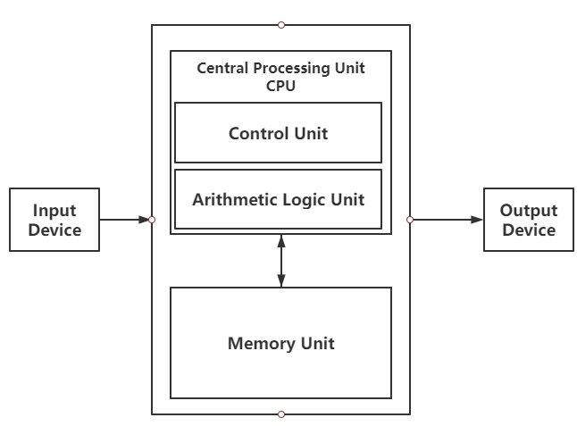

## 计算机的基本组成

### CPU,Memory,Motherboard

* 计算机的基本硬件系统由CPU，内存(memory)，主板(Motherboard)三大件组成。

* CPU是计算机最重要的核心配件，全名是中央处理器(Central Processing Unit)，负责获取程序指令，对指令进行译码并加以执行。

* 内存主要用来加载数据，比如编写的程序，打开的浏览器，运行的游戏，都需要加载到内存里才可以运行。

* 存放在内存里的数据需要被CPU读取，CPU计算完以后，还需要把数据写回到内存里。但是CPU不能直接插到内存上，所以需要一个中间桥梁——主板。
* 将CPU和内存都插在主板上，通过**芯片组（Chip set）和总线（Bus）**解决CPU和内存之间的通信问题。
* 芯片组控制数据传输的流转，总线是实际数据传输的高速公路。总线速度决定了数据能传输多快。

### I/O设备

输入(input)和输出(output)设备也是必不可少的，比如键盘，鼠标。

如果是个人电脑，显示器，喇叭也是必不可少的，这样我们才能看到计算机输出的各种图像，视频，文字等。

如果你用计算机玩游戏，做图形渲染，或者跑深度学习应用，需要买一张**显卡（Graphics Card）**插在主板上，显卡有另外一个处理器——**GPU（Graphics Processing Unit， 图形处理器）**。

I/O设备通过主板上的**南桥（South Bridge）**芯片组，来控制和CPU之间的通信。

### 冯·诺依曼体系结构

**冯·诺依曼体系结构**也叫作**存储程序计算机**，其中暗含两个概念，一个是**可编程**计算机，一个是**存储**计算机。

什么是**不可编程**，计算机是由各种门电路组合而成的，然后通过组装出一个固定的电路板，来完成一个特定的计算程序。如果需要修改功能，就要重新组装电路，这样的话，计算机就是不可编程。最常见的就是计算器。

如何从不可编程变为可编程？可以将计算机设计成一个巨大的插线板，通过不同的插线口或者接口的位置插入线路，来实现不同的功能。这其实是一个过渡阶段，编写好的程序不能存储下来供下一次使用，所以就需要存储程序计算机。

冯·诺依曼所设想的计算机组成结构。

1. 包含算术逻辑单元（Arithmetic Logic Unit, ALU）和处理器寄存器（Processor Register）的处理器单元（Processing Unit），用来完成各种算术和逻辑运算。有些人也会称之为运算器。
2. 包含指令寄存器（Instruction Register）和程序计数器（Program Counter）的控制器单元（Control Unit），用来控制程序的流程，分支，跳转。
3. 一般来说上面所述的运算器+控制器就组成了我们所说的CPU。
4. 包含可以存储数据（Data）和指令（Instruction）的内存，可以是磁带，现在通常就是硬盘。
5. 接下来就是I/O设备。鼠标，键盘，显示器，网络等都属于I/O设备。

### 总结

现在任何一个计算机的基本组成，都是有运算器，控制器，存储器，输入设备，输出设备组成。而所有的计算机程序，也都可以抽象成从输入设备中输入信息，通过运算器和控制器来执行存储在存储器里的程序，最终把结果输出到输出设备中。

### 参考资料

[First Draft of a Report on the EDVAC](https://en.wikipedia.org/wiki/First_Draft_of_a_Report_on_the_EDVAC)

