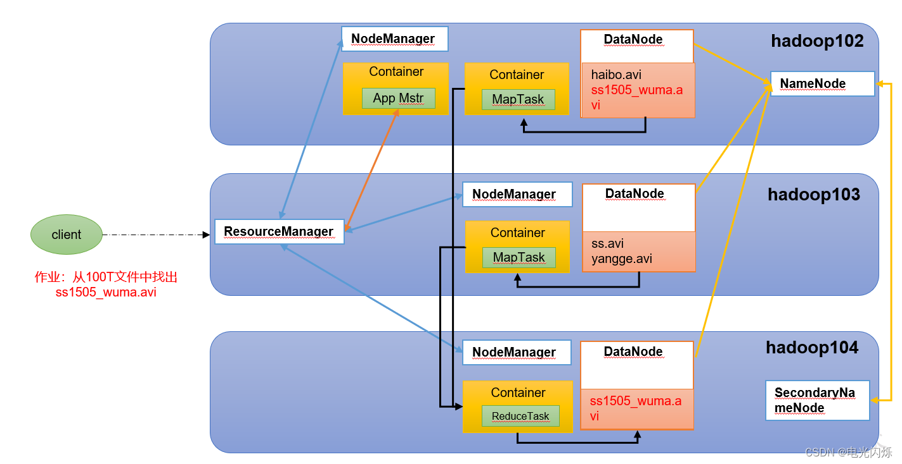

# Hadoop

## Hadoop是什么

* Hadoop是一个由Apache基金会所开发的分布式系统基础架构。
* 主要解决，海量数据的存储和海量数据的分析计算问题。
* 广义上来说，Hadoop通常是指一个更广泛的概念——Hadoop生态圈。

## 大数据的特点

* 卷（Volume）-卷表示卷，即以高速率增长的数据量，即以PB为单位的数据量
* 速度（Velocity）–速度是数据增长的速度。社交媒体在增长数据的速度中起着重要作用。
* 多样性（Variety）–多样性是指不同的数据类型，即各种数据格式，例如文本，音频，视频等。
* 准确性（Veracity）–准确性是指可用数据的不确定性。由于大量数据带来不完整和不一致，因此会出现准确性。
* 价值（Value）–价值是指将数据转化为价值。通过将访问的大数据转化为价值，企业可以产生收入。

## Hadoop特点

* 高可靠性：Hadoop底层维护多个数据副本，所以即使Hadoop某个计算元素或存储出现故障，也不会导致数据的丢失。
* 高扩展性：在集群间分配任务数据，可方便的扩展数以千计的节点。
* 高效性：在MapReduce的思想下，Hadoop是并行工作的，以加快任务处理速度。
* 高容错性：能够自动将失败的任务重新分配。

## Hadoop基本组件

* HDFS
* Map-Reduce
* YARN

### HDFS组件概述

* Hadoop Distributed File System，简称HDFS，是一个分布式文件系统。
* NameNode: 存储文件的元数据，如文件名，文件目录结构，文件属性（生成时间、副本数、文件权限），以及每个文件的块列表和块所在的DataNode等。
* DataNode: 在本地文件系统存储文件块数据，以及块数据的校验和。
* Secondary NameNode: 每隔一段时间对NameNode元数据备份。

### Yarn组件概述

* Yet Another Resource Negotiator 简称YARN ，另一种资源协调者，是Hadoop 的资源管理器。
* ResourceManager：整个集群资源（内存、CPU等）的老大
* NodeManager: 单个节点服务器资源老大
* ApplicationMaster: 单个任务运行的老大
* Container: 容器，相当一台独立的服务器，里面封装了任务运行所需要的资源，如内存、CPU、磁盘、网络等。

### Map-Reduce组件概述

* MapReduce将计算过程分为两个阶段：Map和Reduce
  * Map阶段并行处理输入数据
  * Reduce阶段对Map结果进行汇总

### HDFS、YARN、MapReduce三者关系

1. 有一个client（可以代码调用，一些页面访问入口等）,向集群提交一个任务，比如查询某某文件。
2. client提交完任务之后，YARN中的ResourceManger找一个节点,开启一个Container,然后把任务放到Container中，任务叫App Mstr,App Mstr向ResourceManger申请，任务开启所需资源。ResourceManger寻找哪些节点有资源，App Mstr开启Map Task,相当于Map阶段。每一个Map Task独立运行，最终把结果汇总写入磁盘HDFS上。