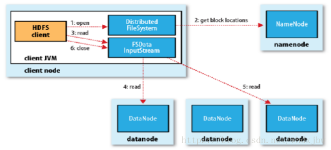
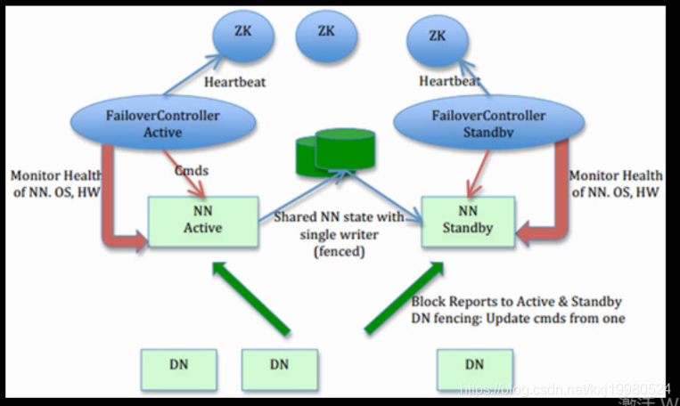
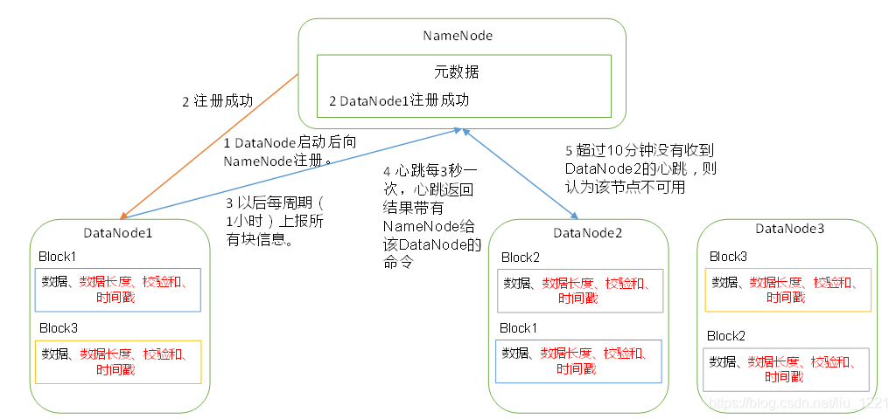

# HDFS

## Introduction

* HDFS是hadoop自带的分布式文件系统，即Hadoop Distributed File System。
* HDFS具有高容错性，部署成本低等特性。
* HDFS提供了对应用数据的高吞吐量访问，适用于大量数据集的应用。
* HDFS放宽了对POXIS的要求，采用流式的数据访问方式。
* HDFS 最初是作为 Apache Nutch 网络搜索引擎项目的基础设施而构建的。
* HDFS现在是Apache Hadoop的主要项目。

## Advantage

* **高容错性**：硬件故障是常态而不是例外。 一个 HDFS 实例可能由数百或数千台服务器组成，每台服务器都会存储一部分数据。 事实上，有大量组件并且每个组件都有很大的故障概率，这意味着 HDFS 的某些组件总是无法正常工作。 因此，故障检测和快速、自动恢复是 HDFS 的核心架构目标。由于 HDFS 采用数据的多副本方案，所以部分硬件的损坏不会导致全部数据的丢失。
* **流式数据访问**：HDFS 更适合批处理而不是用户交互使用，适合一次写入，多次读取。HDFS 设计的重点是支持高吞吐量的数据访问， 而不是低延迟的数据访问。
* **大数据集**：HDFS 适合于大文件的存储，文档的大小应该是是 GB 到 TB 级别的。
* **简单一致性模型**：HDFS 应用程序需要对文件进行一次写入多次读取的访问模型。 文件一旦创建、写入和关闭，除了追加和截断外，无需更改。 支持将内容附加到文件的末尾，但不能在任意点更新。 这种假设简化了数据一致性问题并实现了高吞吐量数据访问。 MapReduce 应用程序或网络爬虫应用程序与此模型完美契合。
* **移动计算比移动数据更容易**：如果应用程序请求的计算在它所操作的数据附近执行，它会更有效率。 当数据集的大小很大时尤其如此。 这最大限度地减少了网络拥塞并增加了系统的整体吞吐量。 假设通常将计算迁移到数据所在的位置，而不是将数据移动到应用程序运行的位置。 HDFS 为应用程序提供了接口，使它们更接近数据所在的位置。
* **跨异构硬件和软件平台的可移植性**：HDFS是使用Java开发的，任何支持java的服务器上都可以部署HDFS，所以HDFS 具有良好的跨平台移植性，这使得其他大数据计算框架都将其作为数据持久化存储的首选方案。

### Disadvantages

* 不适合低延时数据访问，比如毫秒级的存储数据，是做不到的。
* 无法高效的对大量小文件进行存储。存储大量小文件的话，它会占用NameNode大量的内存来存储文件目录和块信息。这样是不可取的，因为NameNode的内存总是有限的。小文件存储的寻址时间会超过读取时间，它违反了HDFS的设计目标。
* 不支持并发写入、文件随机修改。一个文件只能有一个写，不允许多个线程同时写；仅支持数据append，不支持文件的随机修改

## Architecture


HDFS具有主/从架构，分为管理节点和工作节点。HDFS集群由单个NameNode（管理节点），和多个DataNode（工作节点）构成。

HDFS 公开了一个文件系统命名空间，并允许将用户数据存储在文件中。 在内部，一个文件被分成一个或多个块，这些块存储在一组 DataNode 中。

NameNode主要负责管理文件系统的namespace以及管理Client对文件系统的访问。NameNode 执行文件系统命名空间操作，如打开、关闭和重命名文件和目录。 它还确定块到 DataNode 的映射。

DataNode主要负责管理连接到它们运行的节点的存储，负责处理来自文件系统客户端的读写请求，根据NameNode的指令执行块的创建、删除和复制。

## Basic Concept

### Block

HDFS为了支持高效的处理数据，引入了数据块的概念，默认大小128MB（1.X的版本默认是64MB）。HDFS上的文件也被划分为块大小的多个分块（Chunk），作为独立的存储单元。HDFS中小于一个块大小的文件，不会占据整个块的空间（例如，当一个1MB的文件存储在一个128MB的块中，文件只使用1MB的存储空间，而不是128MB）。

引入数据块带来好处：

1. 一个文件的大小可以大于网络中任意一个磁盘的容量，文件的所有块并不需要存储在同一个磁盘里，因此他们可以利用集群上的任意一个磁盘进行存储。
2. 使用抽象块而非整个文件作为存储单元，大大简化了存储子系统的设计。由于块的大小是固定的，因此计算单个磁盘能存储多少个块就相对容易，便于存储管理。此外，块不需要处理文件的元数据（权限等），消除了对元数据的顾虑。
3. 适用于数据备份，提高数据容错力，提高可用性。使用Data Replication。

为什么块的大小不能设置的过大也不能过小（为什么块的大小为128MB?）：

1. HDFS的块比磁盘的块大，其目的是为了最小化寻址开销。
2. 如果块过大，从磁盘传输数据时间会明显大于定位这个块开始位置所需的时间，导致程序在处理这块数据时很慢。
3. 如果块过小，会增加寻址时间，程序会一直寻找块开始的位置。

总结：

传输一个由多个块组成的大文件的时间取决于磁盘传输速率。

### NameNode & DataNode

**NameNode**是HDFS的管理节点，主要负责的内容有：

1. 管理HDFS的命名空间。
2. 维护文件系统树以及整棵树内所有的文件和目录。
3. 记录每个文件中各个Block所在的DataNode信息。
4. 处理客户端对文件的请求。
5. 配置副本策略。

集群中单一Namenode的结构大大简化了系统的架构。Namenode是所有HDFS元数据的仲裁者和管理者，这样，用户数据永远不会流过Namenode。

**DataNode**是HDFS的工作节点，主要负责的内容有：

1. 存储并检索数据块，受Client或者NameNode调度，进行数据块的创建、删除和复制。
2. 定期向NameNode发送它们所存储的数据块的列表。

没有DataNode，文件系统不会崩溃，文件系统只是无法存储文件，也不会丢失数据。没有NameNode，文件系统会崩溃，文件系统上的所有文件将丢失（无法读出，因为无法定位元数据块的位置，也就无法根据DataNode的块来重构文件）。所以对NameNode实现容错是非常重要的，Hadoop提供了两种机制：

1. 备份组成文件系统元数据持久状态的文件。Hadoop可以通过配置使NameNode在多个FS上保存元数据的持久状态，这些写操作是实时同步的，并且是原子操作。
2. Secondary NameNode：并非NameNode的热备。当NameNode挂掉的时候，它并不能马上替换NameNode并提供服务。其主要作用是定期合并Fsimage和Edits，并推送给NameNode。

### File System Namespace

HDFS支持传统的层次型文件组织结构。用户或者应用程序可以创建目录，然后将文件保存在这些目录里。文件系统名字空间的层次结构和大多数现有的文件系统类似：用户可以创建、删除、移动或重命名文件。当前，HDFS不支持用户磁盘配额和访问权限控制，也不支持硬链接和软链接。但是HDFS架构并不妨碍实现这些特性。

NameNode负责维护文件系统的名字空间，任何对文件系统名字空间或属性的修改都将被NameNode记录下来。应用程序可以设置HDFS保存的文件的副本数目。文件副本的数目称为文件的副本系数，这个信息也是由NameNode保存的。

### Block Cache

1. 通常DataNode从磁盘中读取块，但对于访问频繁的文件，其对应的块可能被显式地缓存在DataNode的内存中，以堆外块内存的形式存在。

2. Spark,MapReduce通过在缓存块的DataNode上运行任务，可以利用块缓存的优势提高读操作的性能。

3. 用户或者应用程序可以通过在Cache Pool中增加一个Cache Directive来告诉NameNode需要缓存哪些文件以及存多久。
4. Cache Pool用于管理缓存权限和资源使用。

## HDFS Federation

从整个HDFS系统架构上看，NameNode是其中最重要、最复杂也是最容易出现问题的地方，而且一旦NameNode出现故障，整个Hadoop集群就将处于不可服务的状态，同时随着数据规模和集群规模地持续增长，很多小量级时被隐藏的问题逐渐暴露出来，比如内存将成为系统横向扩展的瓶颈


HDFS 有两个主要层：

* 命名空间（Namespace）
  * 由目录、文件和块组成。
  * 它支持所有与命名空间相关的文件系统操作，如创建、删除、修改和列出文件和目录。
* 块存储服务（Block Storage），它有两个部分：
  * 块管理（在 Namenode 中执行）
    * 通过处理注册和定期心跳来提供 Datanode 集群成员资格。
    * 处理块报告并维护块的位置。
    * 支持创建、删除、修改、获取区块位置等区块相关操作。
    * 管理副本放置、复制不足的块的块复制，并删除复制过度的块。
  * 存储 - 由 Datanodes 通过在本地文件系统上存储块并允许读/写访问来提供。

Namespace管理的元数据除内存常驻外，也会周期Flush到持久化设备上FsImage文件；BlocksMap元数据只在内存中存在；当NameNode发生重启，首先从持久化设备中读取FsImage构建Namespace，之后根据DataNode的汇报信息重新构造BlocksMap。这两部分数据结构是占据了NameNode大部分JVM Heap空间。除了对文件系统本身元数据的管理之外，NameNode还需要维护整个集群的机架及DataNode的信息等信息。为了解决内存限制，单点故障等问题，Hadoop在2.X的发行版中引入Federation，允许HDFS添加多个NameNode，实现横向扩展。


在Federation环境下，每个NameNode维护一个Namespace Volume，由Namespace的元数据和一个Block Pool组成，Block Pool包含该Namespace下文件的所有Block。

Namespace Volume相互独立，两两互不通信，每个Namespace都可以为自己的Block Pool生成Block ID。即使其中一个NameNode挂了也不会影响其他NameNode维护的Namespace的可用性。当这个Namespace/NameNode被删除，其对应的Block Pool也会被删除。

Datanodes 被所有 Namenodes 用作块的公共存储。每个 Datanode 都向集群中的所有 Namenode 注册。Datanodes 定期发送心跳和块报告。它们还处理来自 Namenodes 的命令。

用户可以通过ViewFileSystem和viewfs://URI进行配置和管理。

* 扩展性：NameNode内存使用和元数据量正相关。随着集群规模和业务的发展，即使经过小文件合并与数据压缩，仍然无法阻止内存会成为HDFS横向扩展的瓶颈。
* 可用性：NameNode可以横向扩展，Namespace之间相互独立，即使其中一个NameNode挂了，也不会影响其他NameNode维护的Namespace的可用性。
* 性能：文件系统吞吐量不受单个 Namenode 的限制。向集群添加更多 Namenode 可扩展文件系统读/写吞吐量。
* 隔离性：单个 Namenode 在多用户环境中不提供隔离。例如，实验性应用程序可能会使 Namenode 过载并减慢生产关键应用程序的速度。通过使用多个 Namenode，可以将不同类别的应用程序和用户隔离到不同的命名空间。

## Data Replication

HDFS为了实现容错，所有数据块都会有副本，每个文件的数据块大小和副本数都是可配置的，副本数默认是3，应用程序可以指定某个文件的副本数。副本数可以在文件创建的时候指定，也可以在之后改变。副本如何存放是HDFS可靠性和性能的关键，副本存放策略是HDFS区分于其他大部分分布式文件系统的重要特性。HDFS采用一种称为机架感知(rack-aware)的策略来改进数据的可靠性、可用性和网络带宽的利用率。

### Rack Awareness & Data Replication Policies

大型HDFS实例一般运行在跨越多个机架的计算机组成的集群上，不同机架上的两台机器之间的通讯需要经过交换机。在大多数情况下，同一个机架内的两台机器间的带宽会比不同机架的两台机器间的带宽大。

通过一个机架感知的过程，Namenode可以确定每个Datanode所属的机架id。一个简单但不是最优的策略就是将副本存放在不同的机架上，这样可以有效防止当整个机架失效时数据的丢失，并且允许读数据的时候充分利用多个机架的带宽。这种策略设置可以将副本均匀分布在集群中，有利于当组件失效情况下的负载均衡。但是，因为这种策略的一个写操作需要传输数据块到多个机架，这增加了写的代价。

HDFS一个优化的存放策略是将一个副本存放在本地机架的节点上，一个副本放在同一机架的另一个节点上，最后一个副本放在不同机架的节点上。这种策略减少了机架间的数据传输，这就提高了写操作的效率。机架的错误远远比节点的错误少，所以这个策略不会影响到数据的可靠性和可用性。于此同时，因为数据块只放在两个（不是三个）不同的机架上，所以此策略减少了读取数据时需要的网络传输总带宽。在这种策略下，副本并不是均匀分布在不同的机架上。三分之一的副本在一个节点上，三分之二的副本在一个机架上，其他副本均匀分布在剩下的机架中，这一策略在不损害数据可靠性和读取性能的情况下改进了写的性能。

### Replica Selection

为了降低整体的带宽消耗和读取延时，HDFS会尽量让读取程序读取离它最近的副本。

如果在读取程序的同一个机架上有一个副本，那么就读取该副本。

如果一个HDFS集群跨越多个数据中心，那么客户端也将首先读本地数据中心的副本。

最近节点距离计算：两个节点到达最近的共同祖先的距离总和。

### Block Placement Policies

如上所述，当复制因子为3时，HDFS的放置策略是，如果写入者在数据节点上，则将一个副本放在本地机器上，否则在与写入者相同机架的随机数据节点上，另一个节点上的副本在不同的（远程）机架中，最后一个在同一远程机架中的不同节点上。如果复制因子大于 3，则随机确定第 4 个及以下副本的放置，同时保持每个机架的副本数量低于上限（基本上是 (replicas - 1) / racks + 2）。除此之外，HDFS 还支持 4 种不同的可插入块放置策略。用户可以根据他们的基础设施和用例选择策略。默认情况下，HDFS 支持 BlockPlacementPolicyDefault。

### Save Mode

Namenode启动后会进入一个称为安全模式的特殊状态。处于安全模式的Namenode是不会进行数据块的复制的。Namenode从所有的 Datanode接收心跳信号和块状态报告。块状态报告包括了某个Datanode所有的数据块列表。每个数据块都有一个指定的最小副本数。当Namenode检测确认某个数据块的副本数目达到这个最小值，那么该数据块就会被认为是副本安全(safely replicated)的；在一定百分比（这个参数可配置）的数据块被Namenode检测确认是安全之后（加上一个额外的30秒等待时间），Namenode将退出安全模式状态。接下来它会确定还有哪些数据块的副本没有达到指定数目，并将这些数据块复制到其他Datanode上。

## Data Streaming

本小节的重点主要是学习一下HDFS的读写流程，在此之前还是需要明白block, packet, chunk等概念

* block: 上面已经介绍过了，文件上传前需要分块，这个块就是block，一般为128MB，当然你可以去改，不顾不推荐。因为块太小：寻址时间占比过高。块太大：Map任务数太少，作业执行速度变慢。它是最大的一个单位。
* packet: 第二大的单位，它是client端向DataNode，或DataNode的PipLine之间传数据的基本单位，默认64KB。
* chunk: 最小的单位，它是client向DataNode，或DataNode的PipLine之间进行数据校验的基本单位，默认512Byte，因为用作校验，故每个chunk需要带有4Byte的校验位。所以实际每个chunk写入packet的大小为516Byte。由此可见真实数据与校验值数据的比值约为128 : 1。（即64*1024 / 512）

在client端向DataNode传数据的时候，HDFSOutputStream会有一个chunk buff，写满一个chunk后，会计算校验和并写入当前的chunk。之后再把带有校验和的chunk写入packet，当一个packet写满后，packet会进入dataQueue队列，其他的DataNode就是从这个dataQueue获取client端上传的数据并存储的。同时一个DataNode成功存储一个packet后之后会返回一个ack packet，放入ack Queue中。

### Write


如图所示，写流程为：

1. HDFS Client会调用DistributedFileSystem对象的create方法
2. DistributedFileSystem向NameNode发送一个RPC请求，NameNode会去做各种各样的检验，比如目标文件是否存在，是否有权限写入等等，如果检验通过，NameNode就会创建一个文件，否则会抛出异常。
3. DistributedFileSystem返回一个FSDataOutputStream对象给客户端用于写数据。FSDataOutputStream封装了一个DFSOutputStream对象负责客户端跟DataNode以及NameNode的通信。
4. DFSOutputStream将数据分成一个个packet(默认大小是64kb)，并写入数据队列。DataStreamer会处理数据队列，并请求NameNode返回一组DataNode List，用于构成DataNode Pipeline，DataStreamer将数据包发送给管线中的第一个DataNode，第一个DataNode将接收到的数据发送给第二个DataNode，第二个发送给第三个，依此类推下去。
5. DFSOutputStream还维护着一个数据包队列来确认数据包是否成功写入，这个队列成为ack队列。
6. 当一个Block传输完成之后，HDFS会再次请求NameNode传输。
7. 当客户端完成了数据的传输，调用数据流的close方法。该方法将数据队列中的剩余数据包写到DataNode的管线并等待管线的确认。
8. 客户端收到管线中所有正常DataNode的确认消息后，通知NameNode文件写完了。
9. 客户端完成数据的写入后，对数据流调用close方法。该操作将剩余的所有数据包写入DataNode管线，并在联系到NameNode且发送文件写入完成信号之前，等待确认。

如果写入DataNode发生故障：

1. 关闭管线，把确认队列中的所有包都添加回数据队列的最前端，以保证故障节点下游的DataNode不会漏掉任何一个数据包。

2. 为存储在另一正常DataNode的当前数据块指定一个新的标志，并将该标志传送给NameNode，以便故障DataNode在恢复后可以删除存储的部分数据块。
3. 如果在数据写入期间DataNode发生故障，待确认消息队列迟迟得不到确认消息，这时会有一个超时时间，超过这个时间，从管线中删除故障数据节点并且把余下的数据块写入管线中另外两个正常的DataNode（也就是这两个节点组成新的管线并且blockID的值要发生变化，另外注意正常的节点中包括之前上传的部分小的64K文件，所以需要对其就行一个统计，确认我现在数到第几个包了，避免重复提交）。NameNode在检测到副本数量不足时，会在另一个节点上创建新的副本。
4. 后续的数据块继续正常接受处理。
5. 在一个块被写入期间可能会有多个DataNode同时发生故障，但非常少见。只要设置了`dfs.replication.min`的副本数（默认为1），写操作就会成功，并且这个块可以在集群中异步复制，直到达到其目标副本数（`dfs.replication`默认值为3）。

NameNode已经知道文件由哪些块组成，所以它在返回成功前只需要等待数据块进行最小量的复制。

注意：如果在数据写入期间DataNode发生故障，待确认消息队列迟迟得不到确认消息，这时会有一个超时时间，超过这个时间

文件写文件的时候只有一个客户端能写，保证数据上传成功。

### Read



1. HDFS Client调用DistributedFileSystem对象的open()方法来打开希望读取的文件。
2. DistributedFileSystem向NameNode发送一个RPC请求，通过查询元数据，找到每个block所在的DataNode地址，并将这些信息返回给客户端。
3. 客户端通过NameNode返回的信息调用FSDataInputStream对象，FSDataInputStream里封装一个DFSInputStream对象，读取最适合的副本节点（本地→同机架→数据中心）。然后反复调用read()方法，将数据从DataNode传输到Client。
4. 下载完成block后，客户端会通过DataNode存储的校验和来确保文件的完整性，DFSInputStream会关闭与该DataNode的连接，然后寻找下一个块的最佳DataNode(重复步骤3)。
4. Client从流中读取数据时，块是按照打开DFSInputstream与DataNode新建连接的顺序读取的。它也会根据需要询问NameNode来检索下一批数据块的DataNode的位置。一旦客户端完成读取，就对FSDataInputstream调用close()方法。

读取发生故障时：

1. DFSInputStream与DataNode通信时遇到错误，会尝试从这个块的另一个最近的DataNode读取数据，并且保证以后不会重复读取改DataNode上的后续块。
2. DFSInputStream如果发生校验不通过或者从DataNode发来的数据不完整，有损坏的块，DFSInputStream会试图从其他DataNode读取其副本，也会将被损坏的块通知给NameNode。

## NameNode & Secondary NameNode

### FsImage & Edits

在HDFS中，FsImage 和Edits是NameNode两个非常重要的文件。

NameNode的存储目录树的信息，而目录树的信息则存放在FsImage 文件中，当NameNode启动的时候会首先读取整个FsImage文件，将信息装载到内存中。Edits文件存储日志信息，在NameNode上所有对目录的操作，增加，删除，修改等都会保存到Edits文件中，并不会同步到FsImage中，当NameNode关闭的时候，也不会将FsImage 和Edits进行合并。
所以当NameNode启动的时候，首先装载FsImage文件，然后按照Edits中的记录执行一遍所有记录的操作，最后把信息的目录树写入FsImage中，并删掉Edits文件，重新启用新的Edits文件。

### Secondary NameNode

没有NameNode，文件系统将无法使用，如果运行NameNode服务的机器毁坏，文件系统上所有的文件将会丢失，所以NameNode的容错就会非常重要。

另外，如果重启了NameNode也会花费很长的时间，因为有很多Edits需要与FsImage合并。

最后，如果长时间添加数据到Edits中，会导致文件过大，效率降低，而且一旦断电，恢复元数据需要的时间过长。因此，需要定期进行 FsImage 和 Edits 的合并，如果这个操作由NameNode节点完成，又会效率过低。

因此，引入一个新的节点Secondary Namenode，专门用于 FsImage 和 Edits 的合并。


1. 第一阶段：NameNode启动
    （1）第一次启动NameNode格式化后，创建Fsimage和Edits文件。如果不是第一次启动，直接加载编辑日志和镜像文件到内存。
    （2）客户端对元数据进行增删改的请求。
    （3）NameNode记录操作日志。
    （4）NameNode在内存中对元数据进行增删改。
2. 第二阶段：Secondary NameNode工作
    （1）Secondary NameNode询问NameNode是否需要CheckPoint。直接带回NameNode是否检查结果。
    （2）Secondary NameNode请求执行CheckPoint。
    （3）NameNode滚动正在写的Edits日志。
    （4）将滚动前的编辑日志和镜像文件拷贝到Secondary NameNode。
    （5）Secondary NameNode加载编辑日志和镜像文件到内存，并合并。
    （6）生成新的镜像文件fsimage.chkpoint。
    （7）拷贝fsimage.chkpoint到NameNode。
    （8）NameNode将fsimage.chkpoint重新命名成fsimage。

### Checkpoint

（1）通常情况下，SecondaryNameNode每隔一小时执行一次。
 [hdfs-default.xml]

```xml
<property>
  <name>dfs.namenode.checkpoint.period</name>
  <value>3600</value>
</property>
```

（2）一分钟检查一次操作次数，当操作次数达到1百万时，SecondaryNameNode执行一次。

```xml
<property>
  <name>dfs.namenode.checkpoint.txns</name>
  <value>1000000</value>
<description>操作动作次数</description>
</property>

<property>
  <name>dfs.namenode.checkpoint.check.period</name>
  <value>60</value>
<description> 1分钟检查一次操作次数</description>
</property >
```

### NameNode Failover

Namenode故障后，可以采用如下两种方法恢复数据。

1. 将Secondary NameNode中数据拷贝到Namenode存储数据的目录

   * `kill -9 <NameNode_PID>`
   * 删除NameNode存储的数据
   * 拷贝Secondary NameNode中数据到原NameNode存储数据目录
   * 重新启动NameNode，`sbin/hadoop-daemon.sh start namenode`

2. 使用-importCheckpoint选项启动Namenode守护进程，从而将Secondary NameNode中数据拷贝到Namenode目录中。

   * 修改 hdfs-site.xml

     ```xml
     <property>
      <name>dfs.namenode.checkpoint.period</name>
      <value>120</value>
     </property>
     <property>
      <name>dfs.namenode.name.dir</name>
      <value>/opt/module/hadoop-3.3.1/data/tmp/dfs/name</value>
     </property>
     ```

   * `kill -9 <NameNode_PID>`

   * 删除NameNode存储的数据

   * 如果 SecondaryNameNode不和NameNode在一个主机节点上，需要将SecondaryNameNode存储数据的目录拷贝到NameNode存储数据的平级目录，并删除in_use.lock文件

   * 执行`bin/hdfs namenode -importCheckpoint`导入检查点数据

   * 执行`sbin/hadoop-daemon.sh start namenode`，启动NameNode

### Safe Mode

**概述：**

安全模式是hadoop的一种保护机制，用于保证集群中的数据块的安全性。

Namenode启动时，首先将映像文件（fsimage）载入内存，并执行编辑日志（edits）中的各项操作。一旦在内存中成功建立文件系统元数据的映像，则创建一个新的fsimage文件和一个空的编辑日志。此时，namenode开始监听datanode请求。但是此刻，namenode运行在安全模式，即namenode的文件系统对于客户端来说是只读的。

系统中的数据块的位置并不是由namenode维护的，而是以块列表的形式存储在datanode中。在系统的正常操作期间，namenode会在内存中保留所有块位置的映射信息。在安全模式下，各个datanode会向namenode发送最新的块列表信息，namenode了解到足够多的块位置信息之后，即可高效运行文件系统。

如果满足“最小副本条件”，namenode会在30秒钟之后就退出安全模式。所谓的最小副本条件指的是在整个文件系统中99.9%的块满足最小副本级别（默认值：dfs.replication.min=1）。在启动一个刚刚格式化的HDFS集群时，因为系统中还没有任何块，所以namenode不会进入安全模式。

**基本语法：**

集群处于安全模式，不能执行重要操作（写操作）。集群启动完成后，自动退出安全模式。

1. `bin/hdfs dfsadmin -safemode get`      （功能描述：查看安全模式状态）
2. `bin/hdfs dfsadmin -safemode enter`    （功能描述：进入安全模式状态）
3. `bin/hdfs dfsadmin -safemode leave`    （功能描述：离开安全模式状态）
4. `bin/hdfs dfsadmin -safemode wait` （功能描述：等待安全模式状态）

## NameNode HA With QJM

### NameNode HA Architecture

NameNode 保存了整个 HDFS 的元数据信息，一旦 NameNode 挂掉，整个 HDFS 就无法访问。为了提高HDFS的高可用性，在 Hadoop2.0 中，HDFS NameNode支持了高可用架构。



从上图中，我们可以看出 NameNode 的高可用架构主要分为下面几个部分：

Active NameNode 和 Standby NameNode：两台 NameNode 形成互备，一台处于 Active 状态，为主 NameNode，另外一台处于 Standby 状态，为备 NameNode，只有主 NameNode 才能对外提供读写服务。

主备切换控制器 ZKFailoverController，简称ZKFC：ZKFailoverController 作为独立的进程运行，对 NameNode 的主备切换进行总体控制。ZKFC主要负责：

1. 对NameNodes的Health Monitoring。ZKFC 使用健康检查命令定期 ping 其本地 NameNode。 只要 NameNode 及时响应健康状态，ZKFC 就认为该节点是健康的。 如果节点崩溃、冻结或以其他方式进入不健康状态，健康监视器会将其标记为不健康。
2. ZK Session管理：当本地 NameNode 健康时，ZKFC 在 ZooKeeper 中保持一个会话打开。 如果本地 NameNode 处于活动状态，它还持有一个特殊的“锁”znode。 此锁使用 ZooKeeper 对“临时”节点的支持； 如果会话过期，锁节点将被自动删除。
3. ZK选主：如果本地 NameNode 是健康的，且 ZKFC 发现没有其它的节点当前持有 znode 锁，它将为自己获取该锁。如果成功，则它已经赢得了选择，并负责运行故障转移进程以使它的本地 NameNode 为 Active。故障转移进程与前面描述的手动故障转移相似，首先如果必要保护之前的现役 NameNode，然后本地 NameNode 转换为 Active 状态。

Zookeeper 集群：为主备切换控制器提供主备选举支持。

共享存储系统：共享存储系统是实现 NameNode 的高可用最为关键的部分，共享存储系统保存了 NameNode 在运行过程中所产生的 HDFS 的元数据。主 NameNode 和NameNode 通过共享存储系统实现元数据同步。在进行主备切换的时候，新的主 NameNode 在确认元数据完全同步之后才能继续对外提供服务，主要有JournalNode 。

DataNode 节点：除了通过共享存储系统共享 HDFS 的元数据信息之外，主 NameNode 和备 NameNode 还需要共享 HDFS 的数据块和 DataNode 之间的映射关系。DataNode 会同时向主 NameNode 和备 NameNode 上报数据块的位置信息。

### Automatic Failover

1. 故障检测：集群中的每台 NameNode 机器都在 ZooKeeper 中维护一个持久会话。 如果机器崩溃，ZooKeeper 会话将过期，通知其他 NameNode 应该触发故障转移。
2. 选出Active NameNode：ZooKeeper 提供了一种简单的机制来专门选择一个NameNode为Active NameNode。 如果当前活动的 NameNode 崩溃，另一个节点可能会在 ZooKeeper 中获得一个特殊的排他锁，表明它应该成为下一个活动的。

## DataNode

### DataNode工作机制



1. 一个数据块在DataNode上以文件形式存储在磁盘上，包括两个文件，一个是数据本身，一个是元数据包括数据块的长度，块数据的校验和，以及时间戳。

2. DataNode启动后向NameNode注册，通过后，周期性（1小时）的向NameNode上报所有的块信息。

3. 心跳是每3秒一次，心跳返回结果带有NameNode给该DataNode的命令如复制块数据到另一台机器，或删除某个数据块。如果超过10分钟没有收到某个DataNode的心跳，则认为该节点不可用。

4. 集群运行中可以安全加入和退出一些机器。

### 数据完整性


如下是DataNode节点保证数据完整性的方法。

1. 当DataNode读取Block的时候，它会计算CheckSum。
2. 如果计算后的CheckSum，与Block创建时值不一样，说明Block已经损坏。
3. Client读取其他DataNode上的Block。
4. 常见的校验算法 crc（32），md5（128），sha1（160）
5. DataNode在其文件创建后周期验证CheckSum。

## Shell

https://hadoop.apache.org/docs/stable/hadoop-project-dist/hadoop-common/FileSystemShell.html

https://hadoop.apache.org/docs/stable/hadoop-project-dist/hadoop-hdfs/HDFSCommands.html#dfsadmin

## Java API

```java
import org.apache.hadoop.conf.Configuration;
import org.apache.hadoop.fs.*;
import org.apache.hadoop.fs.permission.FsAction;
import org.apache.hadoop.fs.permission.FsPermission;
import org.apache.hadoop.io.IOUtils;
import org.apache.hadoop.util.Progressable;
import org.junit.After;
import org.junit.Before;
import org.junit.Test;

import java.io.*;
import java.net.URI;
import java.net.URISyntaxException;

/**
 * HDFS常用API
 */
public class HdfsTest {

    private static final String HDFS_PATH = "hdfs://192.168.0.106:8020";
    private static final String HDFS_USER = "root";
    private static FileSystem fileSystem;


    /**
     * 获取fileSystem
     */
    @Before
    public void prepare() {
        try {
            Configuration configuration = new Configuration();
            // 这里我启动的是单节点的Hadoop,副本系数可以设置为1,不设置的话默认值为3
            configuration.set("dfs.replication", "1");
            fileSystem = FileSystem.get(new URI(HDFS_PATH), configuration, HDFS_USER);
        } catch (IOException e) {
            e.printStackTrace();
        } catch (InterruptedException e) {
            e.printStackTrace();
        } catch (URISyntaxException e) {
            e.printStackTrace();
        }
    }


    /**
     * 创建目录,支持递归创建
     */
    @Test
    public void mkDir() throws Exception {
        fileSystem.mkdirs(new Path("/hdfs-api/test0/"));
    }


    /**
     * 创建具有指定权限的目录
     */
    @Test
    public void mkDirWithPermission() throws Exception {
        fileSystem.mkdirs(new Path("/hdfs-api/test1/"),
                new FsPermission(FsAction.READ_WRITE, FsAction.READ, FsAction.READ));
    }

    /**
     * 创建文件,并写入内容
     */
    @Test
    public void create() throws Exception {
        // 如果文件存在，默认会覆盖, 可以通过第二个参数进行控制。第三个参数可以控制使用缓冲区的大小
        FSDataOutputStream out = fileSystem.create(new Path("/hdfs-api/test/a.txt"),
                true, 4096);
        out.write("hello hadoop!".getBytes());
        out.write("hello spark!".getBytes());
        out.write("hello flink!".getBytes());
        // 强制将缓冲区中内容刷出
        out.flush();
        out.close();
    }


    /**
     * 判断文件是否存在
     */
    @Test
    public void exist() throws Exception {
        boolean exists = fileSystem.exists(new Path("/hdfs-api/test/a.txt"));
        System.out.println(exists);
    }


    /**
     * 查看文件内容
     */
    @Test
    public void readToString() throws Exception {
        FSDataInputStream inputStream = fileSystem.open(new Path("/hdfs-api/test/a.txt"));
        String context = inputStreamToString(inputStream, "utf-8");
        System.out.println(context);
    }


    /**
     * 文件重命名
     */
    @Test
    public void rename() throws Exception {
        Path oldPath = new Path("/hdfs-api/test/a.txt");
        Path newPath = new Path("/hdfs-api/test/b.txt");
        boolean result = fileSystem.rename(oldPath, newPath);
        System.out.println(result);
    }


    /**
     * 删除文件
     */
    @Test
    public void delete() throws Exception {
        /*
         *  第二个参数代表是否递归删除
         *    +  如果path是一个目录且递归删除为true, 则删除该目录及其中所有文件;
         *    +  如果path是一个目录但递归删除为false,则会则抛出异常。
         */
        boolean result = fileSystem.delete(new Path("/hdfs-api/test/b.txt"), true);
        System.out.println(result);
    }


    /**
     * 上传文件到HDFS
     */
    @Test
    public void copyFromLocalFile() throws Exception {
        // 如果指定的是目录，则会把目录及其中的文件都复制到指定目录下
        Path src = new Path("D:\\BigData-Notes\\notes\\installation");
        Path dst = new Path("/hdfs-api/test/");
        fileSystem.copyFromLocalFile(src, dst);
    }

    /**
     * 上传文件到HDFS
     */
    @Test
    public void copyFromLocalBigFile() throws Exception {

        File file = new File("D:\\kafka.tgz");
        final float fileSize = file.length();
        InputStream in = new BufferedInputStream(new FileInputStream(file));

        FSDataOutputStream out = fileSystem.create(new Path("/hdfs-api/test/kafka5.tgz"),
                new Progressable() {
                    long fileCount = 0;

                    public void progress() {
                        fileCount++;
                        // progress方法每上传大约64KB的数据后就会被调用一次
                        System.out.println("文件上传总进度：" + (fileCount * 64 * 1024 / fileSize) * 100 + " %");
                    }
                });

        IOUtils.copyBytes(in, out, 4096);

    }

    /**
     * 从HDFS上下载文件
     */
    @Test
    public void copyToLocalFile() throws Exception {
        Path src = new Path("/hdfs-api/test/kafka.tgz");
        Path dst = new Path("D:\\app\\");
        /*
         * 第一个参数控制下载完成后是否删除源文件,默认是true,即删除;
         * 最后一个参数表示是否将RawLocalFileSystem用作本地文件系统;
         * RawLocalFileSystem默认为false,通常情况下可以不设置,
         * 但如果你在执行时候抛出NullPointerException异常,则代表你的文件系统与程序可能存在不兼容的情况(window下常见),
         * 此时可以将RawLocalFileSystem设置为true
         */
        fileSystem.copyToLocalFile(false, src, dst, true);
    }


    /**
     * 查看指定目录下所有文件的信息
     */
    @Test
    public void listFiles() throws Exception {
        FileStatus[] statuses = fileSystem.listStatus(new Path("/hdfs-api"));
        for (FileStatus fileStatus : statuses) {
            //fileStatus的toString方法被重写过，直接打印可以看到所有信息
            System.out.println(fileStatus.toString());
        }
    }


    /**
     * 递归查看指定目录下所有文件的信息
     */
    @Test
    public void listFilesRecursive() throws Exception {
        RemoteIterator<LocatedFileStatus> files = fileSystem.listFiles(new Path("/hbase"), true);
        while (files.hasNext()) {
            System.out.println(files.next());
        }
    }


    /**
     * 查看文件块信息
     */
    @Test
    public void getFileBlockLocations() throws Exception {

        FileStatus fileStatus = fileSystem.getFileStatus(new Path("/hdfs-api/test/kafka.tgz"));
        BlockLocation[] blocks = fileSystem.getFileBlockLocations(fileStatus, 0, fileStatus.getLen());
        for (BlockLocation block : blocks) {
            System.out.println(block);
        }
    }


    /**
     * 测试结束后,释放fileSystem
     */
    @After
    public void destroy() {
        fileSystem = null;
    }


    /**
     * 把输入流转换为指定编码的字符
     *
     * @param inputStream 输入流
     * @param encode      指定编码类型
     */
    private static String inputStreamToString(InputStream inputStream, String encode) {
        try {
            if (encode == null || ("".equals(encode))) {
                encode = "utf-8";
            }
            BufferedReader reader = new BufferedReader(new InputStreamReader(inputStream, encode));
            StringBuilder builder = new StringBuilder();
            String str = "";
            while ((str = reader.readLine()) != null) {
                builder.append(str).append("\n");
            }
            return builder.toString();
        } catch (IOException e) {
            e.printStackTrace();
        }
        return null;
    }
}

```

## Related Documentation

[Hadoop权威指南-第三章](https://book.douban.com/subject/26359169/)

[HDFS官网](https://hadoop.apache.org/docs/stable/hadoop-project-dist/hadoop-hdfs/HdfsUserGuide.html)

[BigData-Notes](https://github.com/heibaiying/BigData-Notes)

[美团对HDFS的应用](https://tech.meituan.com/2017/04/14/hdfs-federation.html)

[尚硅谷大数据](https://www.bilibili.com/video/BV1Qp4y1n7EN)