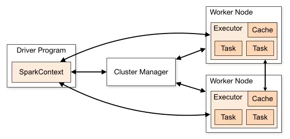
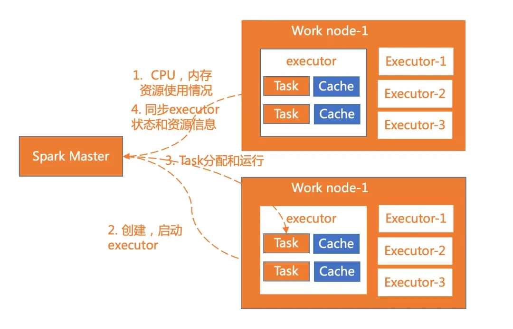
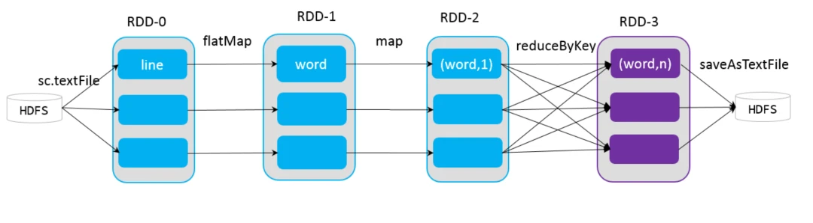
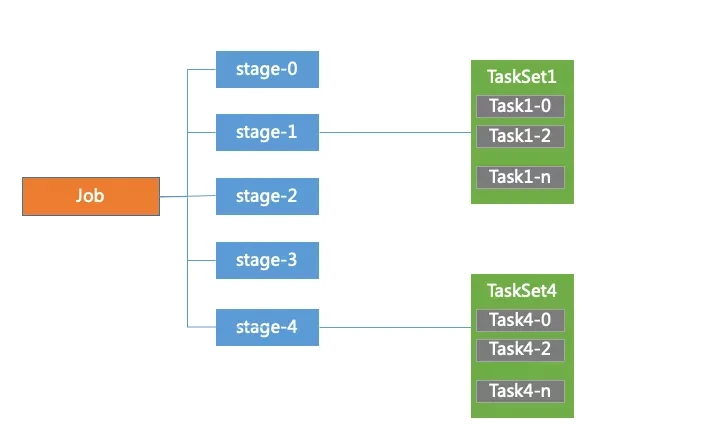
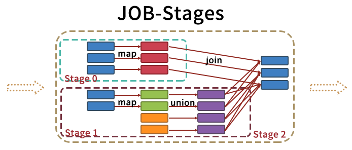
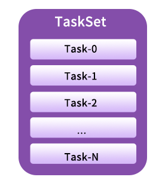
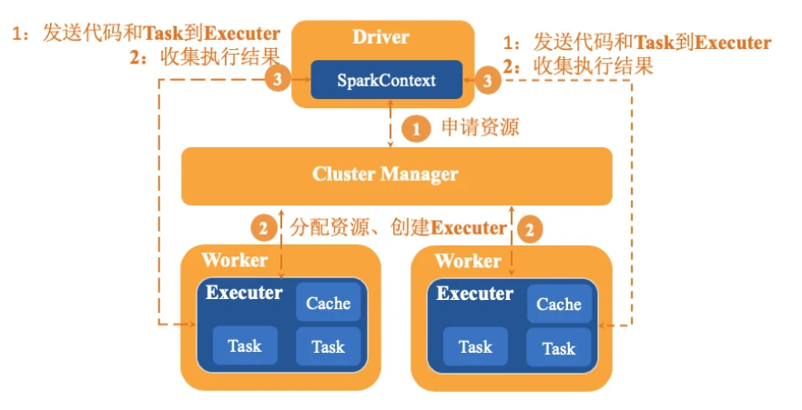
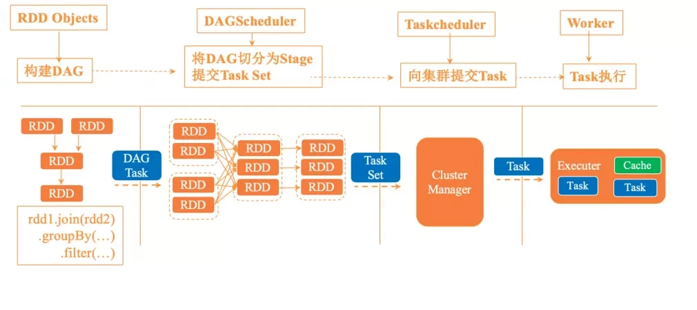
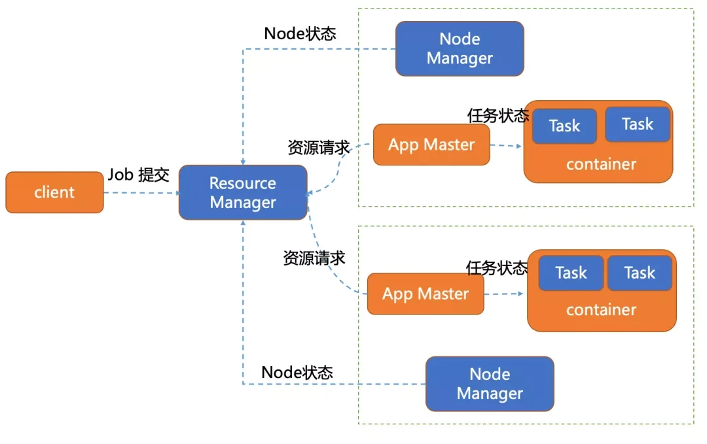
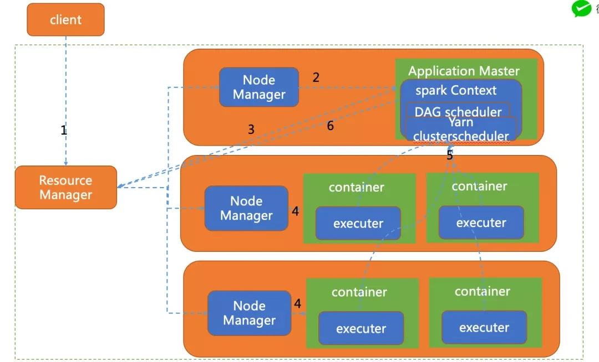

### Spark模块

#### Spark Core

Spark Core 是 Spark 的核心，其包含如下几个部分：

* Spark基础配置
  * SparkConf（配置信息）
  * SparkContext（Spark上下文）
  * SparkRPC（远程调用）
  * ListenerBus（事件总线）
  * MetricsSystem（度量系统）
  * SparkEnv（环境变量）
* 存储系统
  * 内存
  * 磁盘
* 计算层
  * 内存管理
  * 任务管理
  * Task管理
  * shuffle管理
* 调度层
  * DAG调度
  * Task调度

##### Spark基础配置

sparkContext 是 spark 应用程序的入口，spark 应用程序的提交和执行离不开 sparkContext，它隐藏了网络通信，分布式部署，消息通信，存储体系，计算存储等，开发人员只需要通过 sparkContext 等 api 进行开发即可。

sparkRpc 基于 netty 实现，分为异步和同步两种方式。ListenerBus主要用于 sparkContext 组件间的交换，它属于监听者模式，采用异步调用。MetricsSystem主要用于系统的运行监控。

##### spark 存储层

它用于管理 spark 运行中依赖的数据存储方式和存储位置，spark 的存储系统优先考虑在各节点以内存的方式存储数据，内存不足时将数据写入磁盘中，这也是 spark 计算性能高的重要原因。

我们可以灵活的控制数据存储在内存还是磁盘中，同时可以通过远程网络调用将结果输出到远程存储中，比如 hdfs，hbase 等。

##### spark 调度层

spark 调度系统主要由 DAGScheduler 和 TaskScheduler 组成。

DAGScheduler 主要是把一个 Job 根据 RDD 间的依赖关系，划分为多个 Stage，对于划分后的每个 Stage 都抽象为一个或多个 Task 组成的任务集，并交给 TaskScheduler 来进行进一步的任务调度。而 TaskScheduler 负责对每个具体的 Task 进行调度。

具体调度算法有 FIFO，FAIR：

- FIFO 调度：先进先出，这是 Spark 默认的调度模式。
- FAIR 调度：支持将作业分组到池中，并为每个池设置不同的调度权重，任务可以按照权重来决定执行顺序。

#### Spark SQL

spark sql 提供了基于 sql 的数据处理方法，使得分布式的数据集处理变的更加简单，这也是 spark 广泛使用的重要原因。

目前大数据相关计算引擎一个重要的评价指标就是：是否支持 sql，这样才会降低使用者的门槛。spark sql 提供了两种抽象的数据集合 DataFrame 和 DataSet。

DataFrame 是 spark Sql 对结构化数据的抽象，可以简单的理解为 spark 中的表，相比较于 RDD 多了数据的表结构信息(schema).DataFrame = Data + schema

RDD 是分布式对象集合，DataFrame 是分布式 Row 的集合，提供了比 RDD 更丰富的算子，同时提升了数据的执行效率。

DataSet 是数据的分布式集合 ，它具有 RDD 强类型的优点 和 Spark SQL 优化后执行的优点。DataSet 可以由 jvm 对象构建，然后使用 map，filter，flatmap 等操作函数操作。

#### Spark Streaming

这个模块主要是对流数据的处理，支持流数据的可伸缩和容错处理，可以与 Flume 和 Kafka 等已建立的数据源集成。Spark Streaming 的实现，也使用 RDD 抽象的概念，使得在为流数据编写应用程序时更为方便。

### Spark特点

* 计算速度快
  * DAG优化执行
  * RDD内存中高速迭代计算
  * 比MapReduce快100倍
* 易于使用
  * 80多个高级的运算操作
  * 支持丰富的算子
  * 支持多种语言开发
    * java
    * scala
    * python
    * R
* 通用大数据框架
  * Spark批处理
  * Spark SQL
  * Spark Streaming流式数据计算
  * Spark ML Lib机器学习
  * Spark GraphX 图计算
* 支持多种ResourceManager
  * Local
  * Standalone
  * YARN
  * mesos
  * k8s
* Spark生态圈丰富
  * 支持大数据存储支持
    * HDFS
    * Hbase
    * ...
  * 支持流式计算，批量计算-Spark Submit & Spark Streaming
  * 即时查询-Spark SQL
  * 权衡查询-Blink DB
  * 机器学习-ML lib
  * 图计算-GraphX
  * 数学计算-Spark R
  * 自然语言处理
  * 语音识别等

### Spark运行模式

|  运行模式  | 运行类型 |                             说明                             |
| :--------: | :------: | :----------------------------------------------------------: |
|   local    | 本地模式 | 常用于本地开发测试，分为local单线程和local-cluster多线程模式 |
| standalone | 集群模式 | 独立模式，在spark自己的资源调度管理框架上运行，该框架采用master/salve结构 |
|    yarn    | 集群模式 | 在yarn资源管理器框架上运行，由yarn负责资源管理，spark负责任务调度和计算 |
|   mesos    | 集群模式 | 在mesos资源管理器框架上运行，由mesos负责资源管理，spark负责任务调度和计算 |
|    k8s     | 集群模式 |                         在k8s上运行                          |

### Spark核心概念

#### Cluster Manager

集群管理器，它存在于 Master 进程中，主要用来对应用程序申请的资源进行管理，根据其部署模式的不同，可以分为 local，standalone，yarn，mesos 等模式。

#### worker

worker 是 spark 的工作节点，用于执行任务的提交，主要工作职责有下面四点：

- worker 节点通过注册机向 cluster manager 汇报自身的 cpu，内存等信息。
- worker 节点在 spark master 作用下创建并启用 executor，executor 是真正的计算单元。
- spark master 将任务 Task 分配给 worker 节点上的 executor 并执行运用。
- worker 节点同步资源信息和 executor 状态信息给 cluster manager。

在 yarn 模式下运行 worker 节点一般指的是 NodeManager 节点，standalone 模式下运行一般指的是 slave 节点。

#### executor

executor 是真正执行计算任务的组件，它是 application 运行在 worker 上的一个进程。这个进程负责 Task 的运行，它能够将数据保存在内存或磁盘存储中，也能够将结果数据返回给 Driver。

#### Application

application 是 Spark API 编程的应用程序，它包括实现 Driver 功能的代码和在程序中各个 executor 上要执行的代码，一个 application 由多个 job 组成。其中应用程序的入口为用户所定义的 main 方法。

#### Driver

驱动器节点，它是一个运行 Application 中 main 函数并创建 SparkContext 的进程。application 通过 Driver 和 Cluster Manager 及 executor 进行通讯。它可以运行在 application 节点上，也可以由 application 提交给 Cluster Manager，再由 Cluster Manager 安排 worker 进行运行。

Driver 节点也负责提交 Job，并将 Job 转化为 Task，在各个 Executor 进程间协调 Task 的调度。

1. 准备Spark运行环境
2. 与ClusterManager通讯
3. 划分RDD并生成DAG
4. 构建job将每个job拆分成多个task
5. 任务分配和资源监控
6. 与spark中的其他组件进行资源协调
7. 生成并发送Task到Executor

#### sparkContext

sparkContext 是整个 spark 应用程序最关键的一个对象，是 Spark 所有功能的主要入口点。核心作用是初始化 spark 应用程序所需要的组件，同时还负责向 master 程序进行注册等。

#### RDD

它是 Spark 中最重要的一个概念，是弹性分布式数据集，是一种容错的、可以被并行操作的元素集合，是 Spark 对所有数据处理的一种基本抽象。可以通过一系列的算子对 rdd 进行操作，主要分为 Transformation 和 Action 两种操作。

- ‍‍‍‍‍Transformation(转换)：是对已有的 RDD 进行换行生成新的 RDD，对于转换过程采用惰性计算机制，不会立即计算出结果。常用的方法有 map，filter，flatmap 等。
- Action(执行)：对已有对 RDD 对数据执行计算产生结果，并将结果返回 Driver 或者写入到外部存储中。常用到方法有 reduce，collect，saveAsTextFile 等。

#### DAG

DAG 是一个有向无环图，在 Spark 中， 使用 DAG 来描述我们的计算逻辑。主要分为 DAG Scheduler 和 Task Scheduler。

##### DAG Scheduler

DAG Scheduler 是面向 stage 的高层级的调度器，DAG Scheduler 把 DAG 拆分为多个 Task，每组 Task 都是一个 stage，解析时是以 shuffle 为边界进行反向构建的，每当遇见一个 shuffle，spark 就会产生一个新的 stage，接着以 TaskSet 的形式提交给底层的调度器（task scheduler），每个 stage 封装成一个 TaskSet。DAG Scheduler 需要记录 RDD 被存入磁盘物化等动作，同时会需要 Task 寻找最优等调度逻辑，以及监控因 shuffle 跨节点输出导致的失败。

##### Task Scheduler

Task Scheduler 负责每一个具体任务的执行。它的主要职责包括

- 任务集的调度管理；
- 状态结果跟踪；
- 物理资源调度管理；
- 任务执行；
- 获取结果。

#### Job

job 是有多个 stage 构建的并行的计算任务，job 是由 spark 的 action 操作来触发的，在 spark 中一个 job 包含多个 RDD 以及作用在 RDD 的各种操作算子。

#### Stage

DAG Scheduler 会把 DAG 切割成多个相互依赖的 Stage，划分 Stage 的一个依据是 RDD 间的宽窄依赖。

在对 Job 中的所有操作划分 Stage 时，一般会按照倒序进行，即从 Action 开始，遇到窄依赖操作，则划分到同一个执行阶段，遇到宽依赖操作，则划分一个新的执行阶段，且新的阶段为之前阶段的 parent，然后依次类推递归执行。

child Stage 需要等待所有的 parent Stage 执行完之后才可以执行，这时 Stage 之间根据依赖关系构成了一个大粒度的 DAG。在一个 Stage 内，所有的操作以串行的 Pipeline 的方式，由一组 Task 完成计算。

#### TaskSet

TaskSet 可以理解为一种任务，对应一个 stage，是 Task 组成的任务集。一个 TaskSet 中的所有 Task 没有 shuffle 依赖可以并行计算。

#### Task

Task 是 spark 中最独立的计算单元，由 Driver Manager 发送到 executer 执行，通常情况一个 task 处理 spark RDD 一个 partition。Task 分为 ShuffleMapTask 和 ResultTask 两种，位于最后一个 Stage 的 Task 为 ResultTask，其他阶段的属于 ShuffleMapTask。

### Spark作业执行流程

#### Spark作业执行流程

spark 应用程序以进程集合为单位在分布式集群上运行，通过 driver 程序的 main 方法创建 sparkContext 的对象与集群进行交互。具体运行流程如下：

- sparkContext 向 cluster Manager 申请 CPU，内存等计算资源。
- cluster Manager 分配应用程序执行所需要的资源，在 worker 节点创建 executor。
- sparkContext 将程序代码和 task 任务发送到 executor 上进行执行，代码可以是编译成的 jar 包或者 python 文件等。接着 sparkContext 会收集结果到 Driver 端。

#### Spark-RDD迭代过程

* sparkContext 创建 RDD 对象，计算 RDD 间的依赖关系，并组成一个 DAG 有向无环图。
* DAGScheduler 将 DAG 划分为多个 stage，并将 stage 对应的 TaskSet 提交到集群的管理中心，stage 的划分依据是 RDD 中的宽窄依赖，spark 遇见宽依赖就会划分为一个 stage，每个 stage 中包含来一个或多个 task 任务，避免多个 stage 之间消息传递产生的系统开销。
* TaskScheduler 通过集群管理中心为每一个 task 申请资源并将 task 提交到 worker 的节点上进行执行。
* worker 上的 executor 执行具体的任务。

#### Spark On YARN

##### ResourceManager

spark 程序一般是运行在集群上的，spark on yarn 是工作或生产上用的非常多的一种运行模式。

没有 yarn 模式前，每个分布式框架都要跑在一个集群上面，比如说 Hadoop 要跑在一个集群上，Spark 用集群的时候跑在 standalone 上。这样的话整个集群的资源的利用率低，且管理起来比较麻烦。

yarn 是分布式资源管理和任务管理管理，主要由 ResourceManager，NodeManager 和 ApplicationMaster 三个模块组成。

ResourceManager 主要负责集群的资源管理，监控和分配。对于所有的应用它有绝对的控制权和资源管理权限。

NodeManager 负责节点的维护，执行和监控 task 运行状况。会通过心跳的方式向 ResourceManager 汇报自己的资源使用情况。

yarn 资源管理器的每个节点都运行着一个 NodeManager，是 ResourceManager 的代理。如果主节点的 ResourceManager 宕机后，会连接 ResourceManager 的备用节点。

ApplicationMaster 负责具体应用程序的调度和资源的协调，它会与 ResourceManager 协商进行资源申请。ResourceManager 以 container 容器的形式将资源分配给 application 进行运行。同时负责任务的启停。

container 是资源的抽象，它封装着每个节点上的资源信息(cpu,内存，磁盘，网络等)，yarn 将任务分配到 container 上运行，同时该任务只能使用 container 描述的资源，达到各个任务间资源的隔离。

##### 运行模式

spark on yarn 分为两种模式 yarn-client 模式，和 yarn—cluster 模式，一般线上采用的是 yarn-cluster 模式。

**yarn-client 模式**

driver 在客户端本地执行，这种模式可以使得 spark application 和客户端进行交互，因为 driver 在客户端可以通过 webUI 访问 driver 的状态。同时 Driver 会与 yarn 集群中的 Executor 进行大量的通信，会造成客户机网卡流量的大量增加。

**yarn-cluster 模式**

Yarn-Cluster 主要用于生产环境中，因为 Driver 运行在 Yarn 集群中某一台 NodeManager 中，每次提交任务的 Driver 所在的机器都是随机的，不会产生某一台机器网卡流量激增的现象，缺点是任务提交后不能看到日志。只能通过 yarn 查看日志。

client 向 yarn 提交应用程序，包含 ApplicationMaster 程序、启动 ApplicationMaster 的命令、需要在 Executor 中运行的程序等。

ApplicationMaster 程序启动 ApplicationMaster 的命令、需要在 Executor 中运行的程序等。

ApplicationMaster 向 ResourceManager 注册，这样用户可以直接通过 ResourceManage 查看应用程序的运行状态。

ApplicationMaster 申请到资源（也就是 Container）后，便与对应的 NodeManager 通信，启动 Task。

Task 向 ApplicationMaster 汇报运行的状态和进度，以让 ApplicationMaster 随时掌握各个任务的运行状态，从而可以在任务失败时重新启动任务。

应用程序运行完成后，ApplicationMaster 向 ResourceManager 申请注销并关闭自己。

