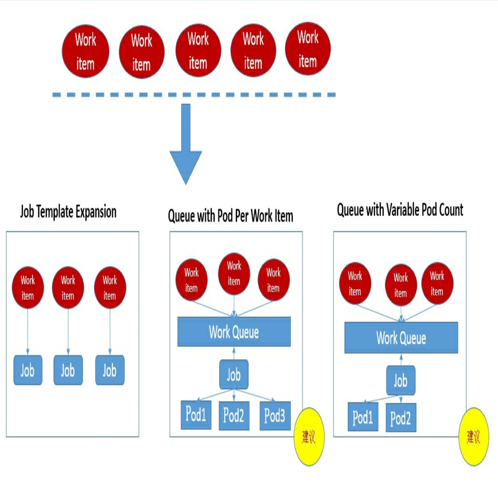

# Pod
## Pod Definition & Usage
## Pod Volume
## Pod ConfigMap
## Pod LifeCycle & Restart Strategy
## Pod HealthChecker & Service Availability
## Pod Scheluder
### Deployment & ReplicaSet
### NodeSelector
beta.kubernetes.io/arch=arm64,
beta.kubernetes.io/os=linux,
kubernetes.io/arch=arm64,
kubernetes.io/hostname=docker-desktop,
kubernetes.io/os=linux,
node-role.kubernetes.io/control-plane=,
node-role.kubernetes.io/master=,
node.kubernetes.io/exclude-from-external-load-balancers=
### NodeAffinity
* RequiredDuringSchedulingIgnoredDuringExecution：必须满足指 定的规则才可以调度Pod到Node上(功能与nodeSelector很像，但是使用 的是不同的语法)，相当于硬限制。
* PreferredDuringSchedulingIgnoredDuringExecution:强调优先满 足指定规则，调度器会尝试调度Pod到Node上，但并不强求，相当于软 限制。多个优先级规则还可以设置权重(weight)值，以定义执行的先 后顺序。

IgnoredDuringExecution的意思是:如果一个Pod所在的节点在Pod运行期间标签发生了变更，不再符合该Pod的节点亲和性需求，则系统将 忽略Node上Label的变化，该Pod能继续在该节点上运行。

NodeAffinity规则设置的注意事项如下：
* 如果同时定义了nodeSelector和nodeAffinity，那么必须两个条件都得到满足，Pod才能最终运行在指定的Node上。
* 如果nodeAffinity指定了多个nodeSelectorTerms，那么其中一个能匹配成功即可。
* 如果在nodeSelectorTerms中有多个matchExpressions，则一个节点必须满足所有matchExpressions才能运行该Pod。

https://kubernetes.io/zh/docs/tasks/configure-pod-container/assign-pods-nodes-using-node-affinity/#schedule-a-Pod-using-required-node-affinity

### PodAffinity
在实际的生产环境中有一类特殊的Pod调度需求:存在某些相互依赖、频繁调用的Pod，它们需要被尽可能地部署在同一个Node节点、机架、机房、网段或者区域(Zone)内，这就是Pod之间的亲和性;反之，出于避免竞争或者容错的需求，我们也可能使某些Pod尽可能地远离某些特定的Pod，这就是Pod之间的反亲和性或者互斥性。

Pod的亲和性被定义于PodSpec的affinity字段的podAffinity子字段中;Pod间的互斥性则被定义于同一层次的podAntiAffinity子字段中。

Pod亲和性的操作符也包括In、NotIn、Exists、 DoesNotExist、Gt、Lt。

原则上，topologyKey可以使用任意合法的标签Key赋值，但是出于性能和安全方面的考虑，对topologyKey有如下限制。
* 在Pod亲和性和RequiredDuringScheduling的Pod互斥性的定义中，不允许使用空的topologyKey。
* 如果Admission controller包含了LimitPodHardAntiAffinityTopology，那么针对RequiredDuringScheduling的Pod互斥性定义就被限制为kubernetes.io/hostname，要使用自定义的topologyKey，就要改写或禁用该控制器。
* 在PreferredDuringScheduling类型的Pod互斥性定义中，空的topologyKey会被解释为kubernetes.io/hostname、failure-domain.beta.kubernetes.io/zone及failure-domain.beta.kubernetes.io/region的 组合。
* 如果不是上述情况，就可以采用任意合法的topologyKey了。

PodAffinity规则设置的注意事项如下。
* 除了设置Label Selector和topologyKey，用户还可以指定Namespace列表进行限制，同样，使用Label Selector对Namespace进行选择。Namespace的定义和Label Selector及topologyKey同级。省略Namespace的设置，表示使用定义了affinity/anti-affinity的Pod所在的命名空间。如果Namespace被设置为空值("")，则表示所有命名空间。
* 在所有关联requiredDuringSchedulingIgnoredDuringExecution的matchExpressions全都满足之后，系统才能将Pod调度到某个Node上。

https://kubernetes.io/zh/docs/concepts/scheduling-eviction/assign-pod-node/
### Taints & Tolerations
Taints让Node拒绝Pod的运行,被标记为Taint的节点就是存在问题的节点，比如磁盘要满、资源不足、存在安全隐患要进行升级维护，希望新的Pod不会被调度过来，但被标记为Taint的节点并非故障节点，仍是有效的工作节点，所以仍需将某些Pod调度到这些节点上时，可以通过使用Toleration属性来实现。
在默认情况下，在Node上设置一个或多个Taint之后，除非Pod明确 声明能够容忍这些污点，否则无法在这些Node上运行。可以用kubectl taint命令为Node设置Taint信息:
```bash
kubectl taint nodes node1 key1=value1:NoSchedule
```

https://kubernetes.io/zh/docs/concepts/scheduling-eviction/taint-and-toleration/
### DaemonSet
查看创建好的DaemonSet和Pod，可以看到在每个Node上都创建了 一个Pod，这种用法适合有这种需求的应用。
* 在每个Node上都运行一个GlusterFS存储或者Ceph存储的 Daemon进程。
* 在每个Node上都运行一个日志采集程序，例如Fluentd或者 Logstach。
* 在每个Node上都运行一个性能监控程序，采集该Node的运行 性能数据，例如Prometheus Node Exporter、collectd、New Relic agent或 者Ganglia gmond等。

DaemonSet调度不同于普通的Pod调度，所以没有用默认的 Kubernetes Scheduler进行调度，而是通过专有的DaemonSet Controller进行调度。但是随着Kubernetes版本的改进和调度特性不断丰富，产生了一些难以解决的矛盾，最主要的两个矛盾如下。
* 普通的Pod是在Pending状态触发调度并被实例化的， DaemonSet Controller并不是在这个状态调度Pod的，这种不一致容易误 导和迷惑用户。
* Pod优先级调度是被Kubernetes Scheduler执行的，而DaemonSet Controller并没有考虑到Pod优先级调度的问题，也产生了不一致的结 果。
### Pod Priority
* Priority:优先级;
* QoS:服务质量等级;
* 系统定义的其他度量指标。
### Job & CronJob

* Job Template Expansion模式:一个Job对象对应一个待处理的 Workitem，有几个Work item就产生几个独立的Job，通常适合Workitem数量少、每个Workitem要处理的数据量比较大的场景，比如有一个100GB的文件作为一个Workitem，总共有10个文件需要处理。
* Queue with Pod Per WorkItem模式:采用一个任务队列存放Workitem，一个Job对象作为消费者去完成这些Workitem，在这种模式下，Job会启动N个Pod，每个Pod都对应一个Work item。
* Queue with Variable Pod Count模式:也是采用一个任务队列存放Workitem，一个Job对象作为消费者去完成这些Workitem，但与上面的模式不同，Job启动的Pod数量是可变的。
* 还有一种被称为Single Job with Static Work Assignment的模式，也是一个Job产生多个Pod，但它采用程序静态方式分配任务项，而不是采用队列模式进行动态分配。
<table>
    <tr>
        <th>
        模式名称
        </th>
        <th>
        是否是一个job
        </th>
        <th>
        pod的数量是否少于workItem
        </th>
        <th>
        App是否要做相应的修改
        </th>
        <th>
        k8s的支持
        </th>
    </tr>
    <tr>
        <td>
        Job Template Expansion
        </td>
        <td>
        ❌
        </td>
        <td>
        ❌
        </td>
        <td>
        ✅
        </td>
        <td>
        ✅
        </td>
    </tr>
    <tr>
        <td>
        Queue with Pod Per WorkItem
        </td>
        <td>
        ✅
        </td>
        <td>
        ❌
        </td>
        <td>
        ✅
        </td>
        <td>
        ✅
        </td>
    </tr>
    <tr>
        <td>
        Queue with Variable Pod Count
        </td>
        <td>
        ✅
        </td>
        <td>
        ❌
        </td>
        <td>
        ❌
        </td>
        <td>
        ✅
        </td>
    </tr>
    <tr>
        <td>
        Single Job with Static Work Assignment
        </td>
        <td>
        ✅
        </td>
        <td>
        ❌
        </td>
        <td>
        ✅
        </td>
        <td>
        ❌
        </td>
    </tr>
</table>

考虑到批处理的并行问题，Kubernetes将Job分以下三种类型。
* Non-parallel Jobs:通常一个Job只启动一个Pod，除非Pod异常，才会重启该Pod，一旦此Pod正常结束，Job将结束。
* Parallel Jobs with a fixed completion count:并行Job会启动多个Pod，此时需要设定Job的.spec.completions参数为一个正数，当正常结束的Pod数量达至此参数设定的值后，Job结束。此外，Job 的.spec.parallelism参数用来控制并行度，即同时启动几个Job来处理 Work item。
* Parallel Jobs with a work queue:任务队列方式的并行Job需要一个独立的Queue，Work item都在一个Queue中存放，不能设置Job的.spec.completions参数，此时Job有以下特性。
* 每个Pod都能独立判断和决定是否还有任务项需要处理。
* 如果某个Pod正常结束，则Job不会再启动新的Pod。
* 如果一个Pod成功结束，则此时应该不存在其他Pod还在工作的 情况，它们应该都处于即将结束、退出的状态。
* 如果所有Pod都结束了，且至少有一个Pod成功结束，则整个 Job成功结束。

cronjob: cron表达式，其中每个域都可出现的字符如下。
* Minutes:可出现“，”“-”“*”“/”这4个字符，有效范围为0~59的 整数。
* Hours:可出现“，”“-”“*”“/”这4个字符，有效范围为0~23的整 数。
* DayofMonth:可出现“，”“-”“*”“/”“?”“L”“W”“C”这8个字符， 有效范围为1~31的整数。
* Month:可出现“，”“-”“*”“/”这4个字符，有效范围为1~12的 整数或JAN~DEC。
* DayofWeek:可出现“，”“-”“*”“/”“?”“L”“C”“#”这8个字符， 有效范围为1~7的整数或SUN~SA T。1表示星期天，2表示星期一，以此类推。

### StatefulSet
## Pod RollingUpdate
## Pod HPA
## Pod Init Container
在很多应用场景中，应用在启动之前都需要进行如下初始化操作。
* 等待其他关联组件正确运行(例如数据库或某个后台服务)。
* 基于环境变量或配置模板生成配置文件。
* 从远程数据库获取本地所需配置，或者将自身注册到某个中央数据库中。
* 下载相关依赖包，或者对系统进行一些预配置操作。

init container与应用容器的区别如下。

(1)init container的运行方式与应用容器不同，它们必须先于应用容器执行完成，当设置了多个init container时，将按顺序逐个运行，并且只有前一个init container运行成功后才能运行后一个init container。在所有init container都成功运行后，Kubernetes才会初始化Pod的各种信息，并开始创建和运行应用容器。

(2)在init container的定义中也可以设置资源限制、Volume的使用和安全策略，等等。但资源限制的设置与应用容器略有不同。
* 如果多个init container都定义了资源请求/资源限制，则取最大 的值作为所有init container的资源请求值/资源限制值。
* Pod的有效(effective)资源请求值/资源限制值取以下二者中的较大值:
    1. 所有应用容器的资源请求值/资源限制值之和;
    2. init container的有效资源请求值/资源限制值。
* 调度算法将基于Pod的有效资源请求值/资源限制值进行计算， 也就是说init container可以为初始化操作预留系统资源，即使后续应用容器无须使用这些资源。
* Pod的有效QoS等级适用于init container和应用容器。 
* 资源配额和限制将根据Pod的有效资源请求值/资源限制值计算生效。
* Pod级别的cgroup将基于Pod的有效资源请求/限制，与调度机制 一致。

(3)init container不能设置readinessProbe探针，因为必须在它们成 功运行后才能继续运行在Pod中定义的普通容器。在Pod重新启动时，init container将会重新运行，常见的Pod重启场景如下。
* init container的镜像被更新时，init container将会重新运行，导 致Pod重启仅更新应用容器的镜像只会使得应用容器被重启。
* Pod的infrastructure容器更新时，Pod将会重启。
* 若Pod中的所有应用容器都终止了，并且RestartPolicy=Always，则Pod会重启。