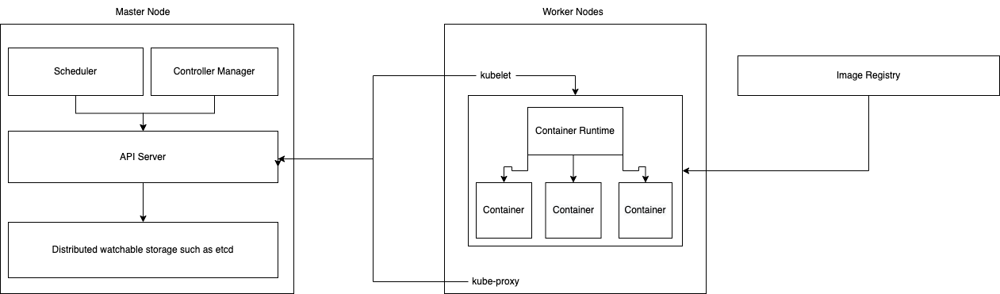

## kubernetes概述
常见的缩写手法“K8s”则是将“ubernete”八个字母缩写为“8”而来。
Kubernetes 是一个可移植的，可扩展的开源平台，用于管理容器化的工作负载和服务，方便了声明式配置和自动化。它拥有一个庞大且快速增长的生态系统。
## kubernetes架构

k8s的架构主要有master节点和worker节点组成。其中，master节点是节点的控制节点，每个Kubernetes集群里需要有一个Master节点来负责真个集群的管理和控制。Master节点通常会占据一个独立的服务器。

Master节点上运行着以下一组关键进程：
* kubernetes API Server(kube-apiserver)：提供了HTTP Rest接口的关键服务进程，是Kubernetes里所有资源的增、删、改、查等操作的唯一入口，也是集群控制的入口进程；
* kubernetes Controller Manager(kube-controller-manager)：Kubernetes里所有资源对象的自动化控制中心，可以理解为资源对象的“大总管”；
* kubernetes Scheduler(kube-scheduler)：负责资源调度（Pod调度）的进程，相当于公交公司的“的调度室”；
* etcd ：用于保存集群所有的网络配置和对象的状态信息。整个kubernetes系统中一共有两个服务需要用到etcd用来协同和存储配置，分别是：
    * 网络插件flannel、对于其它网络插件也需要用到etcd存储网络的配置信息
    * kubernetes本身，包括各种对象的状态和元信息配置

Node是kubernetes集群的工作节点，可以是物理机也可以是虚拟机，较早也成为Minion。Node节点才是Kubernetes集群中的工作附在节点，每个Node都会被Master分配一些工作附在（Docker容器），当某个Node宕机时，其上的工作负载会被Master自动转移到其他节点上去。

每个Node节点上都运行着以下一组关键进程：

* kubelet：负责Pod对应的容器的创建、启停等任务，同时与Master节点密切协作，实现集群管理的基本功能；
* kube-proxy：实现Kubernetes Service的通行与负载均衡机制的重要组件；
* Docker Engine（docker）：Docker引擎，负责本机的容器创建和管理工作。

Node节点可以在运行期间动态增加到Kubernetes集群中，前提是这个节点上已经正确安装、配置和启动了上述关键进程，在默认情况下kubelet会向Master注册自己，这也是Kubernetes推荐的Node管理方式，服务注册。kubelet进程会定时向Master节点会报自身情况，如果该Node被纳入集群管理范围。因此，Master可以通过获取Node情况来实现高效的负载均衡。如规定时间不上报信息，则会被Master认为是失联，该Node被标记为不可用。

## kubernetes术语概述
### Pod
### Service
### ReplicaSet
### Deployment
### StatefulSet
### ConfigMap
### Volume
### Job