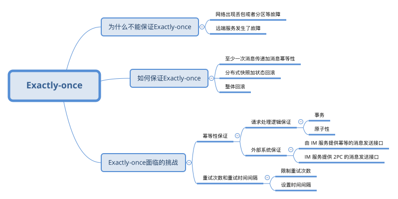

# 重试幂等

## 背景

在电商微服务系统中，可能会遇到发送一个购买请求，由于请求超时，结果返回购买失败，有可能是因为后端的处理逻辑还在处理，但是由于处理时间过长，导致请求超时，返回失败的同时，后端逻辑还在处理中，当你重试再发一次购买请求时，可能发现两笔支付成功的订单。

在请求的响应结果为“请求超时”的时候，我们不知道这个请求是否已经被远端的服务执行了，进一步来说就是请求的消息，是否精确一次发送到远端服务的问题，即 Exactly-once。

## 为什么不能保证Exactly-once

* 网络出现丢包或者分区等故障
* 远端服务发生了故障
* 如果我们认为这是一个临时的故障，对请求进行重试，那么可能会出现多次执行的情况，即 At-least-once，如果不进行重试，就可能会出现一次都没有执行的情况，即 At-most-once

## 如何保证Exactly-once

* 至少一次消息传递加消息幂等性
  * 调用方在调用RPC 接口返回网络层错误，比如请求超时以及网络地址不可达等，对于这样的情况，调用方就进行重试，直到响应结果为成功或业务错误等非网络层错误。
  * 确保远端服务对同一个购买请求处理一次和多次的结果是完全相同的，对于这样的接口，我们称之为幂等。
  * 生成一个唯一的 ID ，然后在请求中带上这个唯一的 ID ，在首次调用和重试的时候，这个唯一的 ID 都保持不变。
* 分布式快照加状态回滚
  * 在整个分布式系统运行的过程中，定期对整个系统的状态做快照，在系统运行时，不论系统的哪个地方出现故障，就将整个系统回滚到上一个快照状态，然后再重放上一个快照状态之后的情况，直到所有的消息都被正常处理。
  * 主要应用场景是例如 Flink 之类的流式计算。因为在流式计算中，系统状态的存储也是系统设计的一部分，我们可以在系统设计的时候，就考虑支持快照和回滚功能。并且，在流式计算中，消息来源一般都是 Kafka 之类的消息系统，这样对消息进行重放就非常方便了。
* 整体重做
  * 如果系统出现故障，就将整个任务的状态删除，然后再进行重做。
  * 一般的使用场景为批处理任务的情况，比如 MapReduce 之类的批处理计算引擎。

## Exactly-once的最佳实践

* 重试次数限制+重试间隔时间
* 幂等性保证
  * 请求处理逻辑保证幂等性。
  * 外部系统
    * 由 IM 服务提供幂等的消息发送接口
    * IM 服务提供 2PC 的消息发送接口，2pc

`UPDATE table SET balance = balance + 5 WHERE UID = 用户 ID ；`

1. 在数据库中查询用户的余额：SELECT balance FROM table WHERE UID = 用户 ID ；
2. 在内存中计算用户的余额：balance = balance + 5 ，假设计算结果为 10 。
3. 更新用户的余额到数据库：UPDATE table SET balance = 10 WHERE UID = 用户 ID ；

在上面的操作中，虽然对数据库的两个操作都是幂等的，但是整体的操作却不是幂等的，因为第 2 步的操作不是幂等的，上面的改写只是将这个计算操作，从数据库中迁移到内存中，并不会改变这个请求的幂等性。

# 总结

