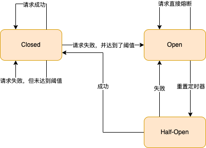

# 雪崩

## 为什么会出现雪崩

* 服务的处理能力开始出现过载：服务过载是指服务器只能处理一定 QPS 的请求，当发往该服务器的 QPS 超出后（也有可能是因为bug），由于资源不够等原因，会出现超时、内存增加等各种异常情况，使服务的请求处理能力进一步降低，过载情况更加严重。
* 服务由于资源耗尽而不可用：服务严重过载后，会出现大量请求的积压，这会导致服务消耗更多的内存、 CPU 、线程和文件描述符等资源，待这些资源被消耗尽后，服务将出现严重超时和崩溃等异常情况，最终对外表现为不可用。
* 正反馈循环就形成了，故障沿着调用链路逆向传播，导致整个系统出现雪崩。

想要避免系统雪崩，要么通过快速减少系统负载，即熔断、降级、限流等快速失败和降级机制；要么通过快速增加系统的服务能力来避免雪崩的发生，即弹性扩容机制。

## 熔断机制

其实对于熔断机制，我们并不陌生。在日常生活中，电路保险丝的熔断就是我们最常见的熔断机制，它指的是在电路系统中，当电路超过负荷运行时，保险丝会自动断开，从而保证电路中的电器不受损害。

计算机的熔断机制则略有不同，在熔断机制的模式下，服务调用方需要为每一个调用对象，可以是服务、实例和接口，维护一个状态机，在这个状态机中有三种状态。

* 闭合状态 ( Closed )
* 断开状态 ( Open )
* 半打开状态 ( Half-Open )

我们将服务由于过载原因导致的错误比例，作为熔断器断开的阈值

### 熔断机制的关键点

#### 粒度控制

| 粒度控制   | 选择建议                                                     |
| ---------- | ------------------------------------------------------------ |
| 服务       | 熔断整个服务，粒度非常大，熔断敏感度低，并且误伤范围大，不建议使用 |
| 实例       | 熔断某个服务实例，粒度大，熔断敏感度低，并且误伤范围大，不建议使用 |
| 接口       | 熔断服务的某个接口，粒度比较小，熔断效果比较好               |
| 实例的接口 | 熔断某个服务实例的某个接口，粒度小，熔断效果好，建议使用     |

#### 错误类型

* 系统被动对外表现出来的过载错误，一般来说，如果一个接口过载了，那么它的响应时间就会变长，熔断器捕获到的错误类型就是“响应超时”之类的超时错误。
* 系统主动对外表现出来的过载错误，对于这种情况，一般是请求的流量触发了限流等机制返回的错误码，这个是我们在程序开发过程中主动设计的。

#### 过载与存活的区别

判断一个服务是否过载，最好的方式是依据请求在队列中的平均等待时间来计算服务的负载。之所以不选择请求的平均处理时间，是为了去除下游服务调用的影响，有时处理时间的增加并不代表当前的服务过载了，而是代表请求依赖的下游服务过载了，并且请求的处理时间增加到一定程度，当前服务的资源也会逐渐耗尽，最终反映在等待时间的增加上。

但是在熔断场景中，我们对服务的过载判断进行了简化，直接通过服务接口请求的结果来进行判断。

定期Ping，判断机器是否存活

用于探活的、逻辑非常简单的接口，之后定期请求这个接口，如果超过一定时间不能请求成功，则认为该服务不存活了。

#### 熔断与重试的关系

它们之间是相互独立的，不需要相互干扰

#### 熔断机制的适应范围

所以只要是过载问题的场景，我们都可以考虑利用熔断机制来解决，不论是分布式系统中服务之间的调用，还是服务与数据库之间等其他场景的调用。

## 限流

### 为什么需要限流

* 熔断的处理方式不够优雅：熔断需要先过载，然后在处理。
* 熔断机制是最后底线：熔断可以解决雪崩问题，但是它应该作为系统稳定性保障的最后一道防线。
* 在快速失败的时候，需要能考虑调用方的重要程度：
* 在多租户的情况下，不能让一个租户的问题影响到其他的租户：

### 如何实现限流

#### 限流算法

##### 固定窗口和滑动窗口

固定窗口就是定义一个“固定”的统计周期，比如 10 秒、30 秒或者 1 分钟，然后在每个周期里，统计当前周期中被接收到的请求数量，经过计数器累加后，如果超过设定的阈值就触发限流，直到进入下一个周期后，计数器清零，流量接收再恢复正常状态。

滑动窗口就是固定窗口的优化，它对固定窗口做了进一步切分，将统计周期的粒度切分得更细，比如 1 分钟的固定窗口，切分为 60 个 1 秒的滑动窗口，然后统计的时间范围随着时间的推移同步后移。

固定窗口的问题：

1. 抗抖动性差：因为统计周期变小，每个周期的阈值也会变小，一个小的流量抖动就会导致限流的发生，所以系统的抗抖动能力就变得更差了。
2. 那么这 20 ms 的时间内会出现 200 次调用，这就超过了我们预期的 2 秒内不能超过 100 次请求的目的了

滑动窗口的问题：

1. 滑动窗口和固定窗口一样面临抗抖动性差的问题

##### 漏桶和令牌桶

“漏桶”就像一个漏斗，进来的水量就像访问流量一样，而出去的水量就像是我们的系统处理请求一样。当访问流量过大时，这个漏斗中就会积水，如果水太多了就会溢出。

相对于滑动窗口和固定窗口来说，漏桶有两个改进点

1. 增加了一个桶来缓存请求，在流量突增的时候，可以先缓存起来，直到超过桶的容量才触发限流；2.
2. 对出口的流量上限做了限制，使上游流量的抖动不会扩散到下游服务。

这两个改进大大提高了系统的抗抖动能力，使漏桶有了流量整形的能力。

但是，漏桶提供流量整形能力有一定的代价，超过漏桶流出速率的请求，需要先在漏桶中排队等待，其中流出速率是漏桶限流的防线，一般会设置得相对保守，可是这样就无法完全利用系统的性能，就增加了请求的排队时间。

令牌桶算法的核心是固定“进口”速率，限流器在一个一定容量的桶内，按照一定的速率放入 Token ，然后在处理程序去处理请求的时候，需要拿到 Token 才能处理；如果拿不到，就进行限流。因此，当大量的流量进入时，只要令牌的生成速度大于等于请求被处理的速度，那么此时系统处理能力就是极限的。

“令牌桶”算法相对于“漏桶”，虽然提高了系统的资源利用率，但是却放弃了一定的流量整形能力，也就是当请求流量突增的时候，上游流量的抖动可能会扩散到下游服务。

#### 单节点限流

* 限流机制作用的位置是客户端还是服务端，即选择客户端限流还是服务端限流
* 如果触发限流后，我们应该直接抛弃请求还是阻塞等待，即否决式限流和阻塞式限流

### 分布式限流

* 集中式限流
  * Redis，令牌桶算法，每一次请求都需要先访问外部的限流器获取令牌
  * 限流器会成为系统的性能瓶颈，如果在系统的 QPS 非常高的情况下，限流器的压力是非常大的
  * 限流器的故障将会影响所有接入限流器的服务
  * 增加了调用的时延
* 将分布式限流进行本地化处理
* 我们来讨论一个折中的方案，这个方案建立在集中式限流的基础上，为了解决每次请求都需要，通过网络访问限流器获取令牌的问题，客户端只有在令牌数不足时，才会通过限流器获取令牌，并且一次获取一批令牌。这个方案的令牌是由集中式限流器来生成的，但是具体限流是在本地化处理的，所以在限流的性能和精确性之间，就有了一个比较好的平衡。

### 限流机制的关键问题

#### 如何确定限流的阈值

* 经验
* 压测

#### 限流可能会引入脆弱性

## 降级

### 为什么需要降级

在分布式系统中，熔断、限流和降级是保障系统稳定性的三板斧，缺一不可，并且在保障系统的稳定性方面，降级有着熔断和限流所没有的优点，因此它们之间相互配合和补充，能够最大限度地保障系统的稳定性水平。

* 降级机制能从全局角度对资源进行调配，通过牺牲非核心服务来保障核心服务的稳定性。
* 降级可以提高系统的用户体验性和可用性。降级可以和熔断、限流机制配合使用。

这里一定要注意，降级在和熔断、限流机制配合使用时，一定要评估降级逻辑的性能，千万不能因为降级逻辑，再次导致系统雪崩。

### 如何实现降级

#### 手动降级

手动降级是指在分布式系统中提前设置好降级开关，然后通过类似配置中心的集中式降级平台，来管理降级开关的配置信息，在系统需要降级的时候，通过降级平台手动启动降级开关，对系统进行降级处理。

手动降级由人工操作，有可控性强的优点，但是一般来说，一个分布式系统中，会有成百上千的服务和成千上万的实例，如果在出现故障的时候，一个接口、一个服务地去手动启动降级开关是非常低效的。通过对降级分级，算是一个不错的解决思路，具体方案如下

| 服务级别 | 定义                                                         | 例子                |
| -------- | ------------------------------------------------------------ | ------------------- |
| P0       | 一般指的是核心业务依赖的服务                                 | 账号，支付等服务    |
| P1       | 非核心业务依赖的服务，用户有感知； 内部核心的支撑服务   | 评论，关注服务等    |
| P2       | 非核心业务依赖的服务，用户无感知； 内部非核心的支撑服务。 | SLA，客户端崩溃报警 |
| P3       | 下线很久的业务服务。                                         |                     |

假设 P0 为核心业务，其他的为非核心业务，我们可以简单地将降级分为以下 3 个级别。

* 一级降级：会对 P1、P2、P3 的服务同时进行降级。
* 二级降级：会对 P2、P3 的服务同时进行降级。
* 三级降级：会对 P3 的服务同时进行降级。

#### 自动降级

### 降级机制的关键问题

#### 配置信息下发的问题

在系统出现故障的时候，有可能会出现降级配置无法正常下发的情况，这时我们将不能启动降级策略。我们可以考虑，由服务直接暴露出修改降级配置的 HTTP 接口，在必要的时候，可以手动通过 HTTP 接口，来启动服务的降级逻辑。

#### 熔断、限流和降级之间的关系

在分布式系统中，熔断、限流和降级是保障系统稳定性的三板斧，经常一起出现，很容易导致混淆，所以，下面我们就对熔断、限流和降级机制之间的关系进行比较和总结：

1. 首先，因为熔断机制是系统稳定性保障的最后一道防线，并且它是自适应的，所以我们应该在系统全局默认启用；
2. 其次，限流是用来保障被限流服务稳定性的，所以我们建议，一般在系统的核心链路和核心服务上，默认启用限流机制；
3. 最后，降级是通过牺牲被降级的接口或者服务，来保障其他的接口和服务正常运行的，所以我们可以通过降级直接停用非核心服务，然后对于核心接口和服务，在必要的时候，可以提供一个“ B 计划”。

## 扩容

### 为什么需要扩容

熔断、限流和降级都是一种静态思维模式，当系统过载了，就通过各种方式来放弃一部分请求，降低系统负载，从而让系统恢复正常。我们在降级这节课中也提到过，从更广义上来讲，熔断和限流都是降级的一种特殊情况，都在做丢车保帅的事情。

而扩容则是一种动态的思维模式，当系统过载了，就增加资源让系统重新恢复正常，而不是对系统进行降级处理，所以扩容是一种无损的系统过载恢复手段。

这是一个投入产出比（ ROI ）的问题，是通过有损降级恢复系统，导致用户的体验和可用性，以及用户口碑、品牌等方面的损失，与扩容资源投入的价值之间的比较。

### 如何实现扩容

#### 过载判断

问题

* 初始满载指标测量的工作量大：服务非常多，并且还会快速增长，需要持续测量每一个服务的满载指标。服务的满载指标是会变的：

* 服务持续迭代，并且会运行在不相同的硬件上，导致满载指标是不稳定的。

而上述的 2 个问题，对于物理机器和 K8S 上的 Pod 这样的节点来说，都是非常容易解决的。

* 初始满载指标是硬件指标，不需要测量，可以直接从操作系统中准确获取，比如 CPU 32 核，内存 64G 等。一般为了避免出现过载情况，我们会相对保守，将满载指标按硬件指标的百分比来设置，比如 60% 之类的。
* 满载指标是硬件的指标，是不会变的。

#### 自动扩容

一个是水平扩容，即通过增加服务的实例数量对系统进行扩容；另一个是垂直扩容，即通过升级服务部署节点的资源对系统进行扩容。

在 K8S 中，Horizontal Pod Autoscaler（ HPA ）对应水平扩展，Vertical Pod Autoscaler（ VPA ）对应垂直扩展。

# 总结