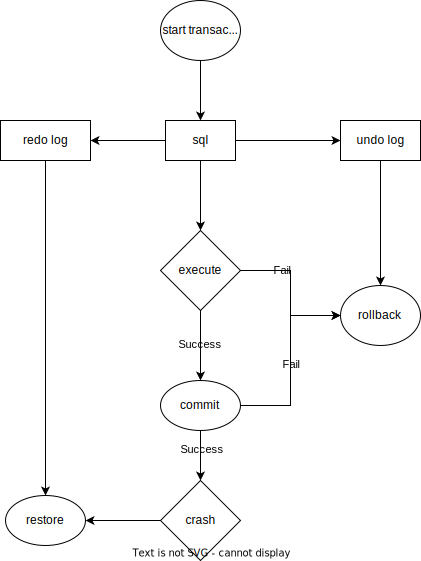

# 分布式存储-事务

事务可以看成是一个或者多个操作的组合操作，并且它对这个组合操作提供一个保证，如果这个组合操作之前的数据是一致的（即正确的），那么操作之后的数据也应该是一致的。

四个特性：

* 原子性（A）：一个事务所有的操作，要么全部执行，要么就一个都不执行，即 all-or nothing。它可以让事务在出现故障等原因，导致不能全部执行成功时，将已经执行的部分操作，回滚到事务前的状态。
* 一致性（C）：一个事务能够正确地将数据从一个一致性的状态，变换到另一个一致性的状态。
* 隔离性（I）：如果多个事务并发执行，那么执行结果和一个一个串行执行是一样的。它可以使事务在执行时，不会受到其他事务的影响。不过在实践中，由于考虑到性能的问题，一般都使用较弱一点的保证，我们在后续的课程中会专门讨论。
* 持久性（D）：如果一个事务已经提交，不论什么原因，它产生的结果都是永久存在的，它保证了事务的结果不会丢失。

## 原子性

首先，是整体的不可分割性。一个原子操作的所有操作，要么全部执行，要么就一个都不执行，即 all-or-nothing 。

其次，是线程安全的。原子操作自带了线程安全的保证，即最严格的隔离级别的可串行化，所以我们在编程的时候，就不需要对原子操作加锁，来保护它的临界区了。

你会发现事务中对原子性的定义，只保留了原子操作的不可分割性，并没有关注可串行化的隔离性。其实这也很好理解，主要是基于性能的考虑，如果事务的原子性同时定义了不可分割性和可串行化的隔离性，那么对数据库性能的影响将会非常大，因为数据库需要频繁地操作，相对于内存来说非常慢的磁盘，而可串行化地去操作磁盘，在很多业务场景下的性能是我们不可以接受的。

因此，在事务的定义中，就将原子操作的不可分割性和隔离性，分别定义出了两个特性，即原子性和隔离性。

### 单节点事务

对于单节点事务，一般是在存储引擎上，通过 Undo Log 、 Redo Log 和 Commit 记录来实现。

先写入 Undo Log 和 Redo Log ，然后再写入 Commit 记录。其中事务的提交或中止由 Commit 记录来决定，如果在写入 Commit 记录之前发生崩溃，那么事务就需要中止，通过  Undo Log 回滚已执行的操作；如果事务已经写入了 Commit 记录，就表明事务已经安全提交，后面发生了崩溃的话，就要等待系统重启后，通过 Redo Log 恢复事务，然后再提交。

Redo Log 保证了事务的持久性， Undo Log 保证了事务的原子性，而写入 Commit 记录了事务的提交点。

### 分布式事务

2PC

* 选择一个协调者，这个协调者可以是分布式事务的参与节点，也可以是一个单独的进程。

* 阶段 1
  * 协调者发送事务请求（Prepare）到所有的参与节点，并询问它们是否可以提交。
  * 如果所有的参与节点都回复“是”，那么接下来协调者在阶段 2 发出提交（Commit）请求。
  * 如果任何的参与节点都回复“否”，那么接下来协调者在阶段 2 发出放弃（Rollback）请求。

* 阶段 2

  * 依据阶段 1 返回的结果，决定事务最终是提交（Commit）还是放弃（Rollback）。

* 缺点

  * 单点问题:事务管理器在整个流程中扮演的角色很关键，如果其宕机，比如在第一阶段已经完成，在第二阶段正准备提交的时候事务管理器宕机，资源管理器就会一直阻塞，导致数据库无法使用。
  * 同步阻塞:在准备就绪之后，资源管理器中的资源一直处于阻塞，直到提交完成，释放资源。
  * 数据不一致:两阶段提交协议虽然为分布式数据强一致性所设计，但仍然存在数据不一致性的可能，比如在第二阶段中，假设协调者发出了事务commit的通知，但是因为网络问题该通知仅被一部分参与者所收到并执行了commit操作，其余的参与者则因为没有收到通知一直处于阻塞状态，这时候就产生了数据的不一致性。

  

## 隔离性

如果多个事务并发执行时，事务之间不应该出现相互影响的情况，它其实就是数据库的并发控制。

五种隔离级别：

* 读未提交（Read Uncommitted）
* 读已提交（Read Committed）
* 可重复读（Repeatable Read）
* 串行化（Serializable）
* 快照隔离级别（Snapshot Isolation）

异常情况

* 脏写（Dirty Write）
* 脏读（Dirty Read）
* 不可重复读（Nonrepeatable read）/ 读倾斜（Read Skew）
* 丢失更新（Loss of Update）
* 幻读（Phantom Read）
* 写倾斜（Write Skew）

| 隔离级别/异常情况  | 读未提交 | 读已提交 | 可重复读 | 快照 | 串行化 |
| ------------------ | -------- | -------- | -------- | ---- | ------ |
| 脏写               | ❌        | ❌        | ❌        | ❌    | ❌      |
| 脏读               |          | ❌        | ❌        | ❌    | ❌      |
| 不可重复读、读倾斜 |          |          | ❌        | ❌    | ❌      |
| 丢失更新           |          |          | ❌        | ❌    | ❌      |
| 幻读               |          |          |          | ❌    | ❌      |
| 写倾斜             |          |          |          |      | ❌      |

## 持久性

首先，要保障事务在系统宕机情况下的持久性，必须保证事务的操作结果能够立即保存到硬盘之类的非易失性存储中，但是不论是 SATA 硬盘还是 SSD 硬盘，对于这一类随机读写操作都会面临严重的性能问题，目前我们主要是通过重做日志（RedoLog）或预写日志（Write Ahead Log），将随机读写转化为顺序读写来提高事务的性能。

其次，要保障事务在磁盘故障情况下的持久性，必须将数据复制到多块磁盘上，这节课我们介绍了两种思路：一是通过磁盘阵列，从磁盘内部复制数据来解决；另一种是通过外部的数据复制来解决。

其中，磁盘阵列的多块硬盘的地理位置通常都是在一起的，地震、火灾和洪水等自然灾害，可能会导致整个磁盘阵列同时毁坏；而外部的数据复制方法需要保证数据的强一致性，它会面临性能和可用性的问题，这里我们主要通过 Raft 或者 Paxos 之类的共识算法来解决。

## 一致性

事务的一致性需要通过多副本数据强一致性，事务原子性、隔离性和持久性的一起协作，以及数据库层和应用层的约束检测等各方面来保障，它不单单是事务层面的一致性问题。