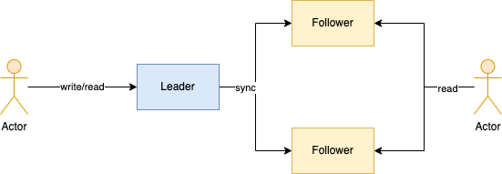
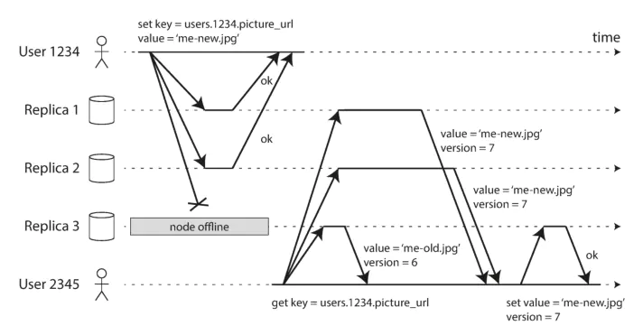
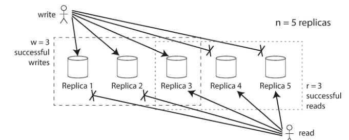

# 副本复制

分布式存储服务高可用，保证数据不丢失。接受故障随时可能出现的事实，通过冗余的方法让系统在故障发生时，也能够正常提供服务。

## 主从复制

同步复制还是异步复制

* 同步复制：Leader接受客户端的写请求，等Leader把数据都同步给了Follwer，才会收到写请求成功的通知。
  * 所有主、从副本都有最新的数据版本，它们都能对外提供读服务，并且数据都是正确的，即系统的数据是强一致性的。
  * 由于主、从副本分别运行在不同的机器上，可能出现网络延迟、中断和机器故障的情况。因此数据从主副本复制到从副本的时延就变得不可预测，可能数秒或者数十秒，甚至写入失败。
* 异步复制：Leader接受客户端的写请求，只需要Leader写入成功就会收到写请求成功的通知，Leader异步将数据变更同步给Follower。
  * 数据的更新操作不依赖从副本，所以不受网络和从副本机器故障的影响，写入性能和系统可用性会大大提高。
  * 当主副本突然故障时，主副本上写入成功，但是还没有复制到从副本的变更就会丢失，这种情况在数据正确性要求高的场景里是不可以接受的。
  * 我们可能会通过从副本读到老版本的数据，在正确性要求高的场景下，就不能通过从副本来提供读服务了。

| 复制方式 | 优点                                                         | 缺点                                                         | CAP  |
| -------- | ------------------------------------------------------------ | ------------------------------------------------------------ | ---- |
| 同步复制 | 1.主从数据强一致性 2.主副本故障数据不会丢失 3.从副本可以对外提供读服务 | 1.写性能低 2.可用性低                                   | CP   |
| 异步复制 | 1.写性能高 2.可用性高                                   | 1.主从数据最终一致性 2.主副本故障可能会造成数据丢失 3.在数据一致性要求高的场景下，从副本不能对外提供读服务 | AP   |

1. 混合的复制方式
2. 水平分片和主从复制的组合方式，也是当前分布式存储系统中非常流行的数据复制方案。
   * **系统中的每一台机器都可以负责一部分主副本**，提升了系统的写入性能和可用性。
   * 主从复制的副本数量不再和机器数量强绑定。

## 多主复制

解决所有的写请求都需要经过主副本所在的数据中心，容灾能力和网络时延的问题。

为了提供更好的容灾能力，数据的多个副本应该分布得足够远，分布在多个机房或者多个城市中。

在多数据中心提供就近读写的应用场景之外，多主复制还有在线文档和在线日历之类的客户端本地修改场景。

多主复制的主副本之间，大多采用异步模式.

### 冲突解决

#### 避免冲突

既然冲突是多个主副本同时修改了一个数据，或者破坏了数据的唯一性约束导致的，那么我们就对数据进行分片，让不同的主数据负责不同的数据分片。会造成两个问题：

* 一个修改操作可能会修改多个分片数据，这样我们就没有办法通过分片来隔离修改了
* 由于就近接入和故障等原因，我们会将出现故障的主副本流量切换到其他的主副本，这时也会出现写入冲突的情况

#### 写时解决冲突

* 预定义解决冲突
* 自定义解决冲突

#### 读时解决冲突

* 用户解决冲突
* 自定义解决冲突

多个主副本之间的复制拓扑结构问题：

环形拓扑

星型拓扑

全部拓扑

## 无主复制

无主复制又称为去中心复制，只不过在关系数据库出现并且主导后，由于要确保各副本写入顺序的一致性，主从复制开始流行起来，无主复制被大家慢慢遗忘了。

### 写入数据库时节点崩溃

加入客户端同时向三个数据节点发出写入请求，其中两个正常节点执行了写入操作，崩溃的一个没有响应。这时客户端认为写入操作成功了，当崩溃节点复原之后，原有崩溃节点会丢失掉一部分数据，对外提供读服务可能会返回旧数据（在有主节点的架构中，可以通过故障转移来实现主节点的切换）。为了避免这种情况，在读请求时需要把请求同时发送到多个数据节点，根据数据版本号来判断数据新旧。

Dynamo模式如何处理故障期间的数据丢失问题呢？

1. 读修复  当读请求同时发送到所有节点时，客户端可以通过响应判断出各个数据节点的数据是不是存在旧数据的情况。对于存在旧数据的数据节点发送数据更新的请求。这种方式大多被用在读操作频繁的场景下。
2. 反熵处理  某些数据库的解决方案是用定期执行的后台进程扫描各个节点的差异数据。由于不存在主节点，所以需要按照版本号比较大量数据并进行更新操作，数据更新有较大的延时。

#### 读写Quorum算法

在上面图示例子中，读/写都要求至少两个节点返回成功才认为操作成功。推广开来，对于n个数据节点，当写操作有至少w个节点成功时认为成功，当读操作有至少r个节点成功时认为成功，存在**x+t>n**，保证读操作可以读到最新数据。（图示例子中，n=3,w=2,r=2）
 常规配置是把n设置成一个奇数，w=r=(n+1)/2。实际情况可以根据读写请求的分布情况来配置不同的w和r值大小（比如对于读多写少的情况配置较大的w较小的r）。
 对于Quorum算法，有下面推论：

- w<n时，写操作允许节点不可用

- r<n时，读操作允许节点不可用

- 对于w+r>n的情况，允许最多w+r-n个节点不可用

  

可能出现的问题：

- 并发写入时发生冲突，如果按照最后写入获胜的话可能会丢失数据
- 读写操作并发进行时不保证读到最新数据
- 写入操作失败时可能需要多个节点进行数据回滚操作

### Sloppy Quorum和数据回传

客户端有时无法与所有数据节点连接，这是处理读写操作时有两种策略：

1. 由于无法连接所有节点，当无法达到w或者r节点要求时报错
2. 接受写操作，无法达到w和r要求时写到其他数据节点上

这里有一个临时数据节点的概念：在发生网络分区时，复制临时存储应对读写请求，在网络状况恢复之后再把数据回传给原有节点。
 Sloppy Quorum降低了写操作对于w节点的要求，提升了写操作的成功率，但是也不保证读操作能够读到最新数据。
 Sloppy Quorum并不是严格意义上的Quorum，更像是一种持久化保证，保证数据已经被持久化了w份，需要在数据回传完成之后才能保证读到最新数据。

# 总结

| 维度     | 主从复制(同步)       | 主从复制(异步)         | 多主复制(异步)       | 无主复制                                |
| -------- | -------------------- | ---------------------- | -------------------- | --------------------------------------- |
| 可用性   | 可用性低             | 可用性高               | 能容忍数据中心故障   | Sloppy Quorum机制下，少量节点正常就可用 |
| 一致性   | 主从强一致性         | 主从最终一致性         | 多主之间最终一致性   | 可能存在不一致的情况                    |
| 应用场景 | 强一致性的场景       | 能容忍最终一致性的场景 | 多数据中心           | 高可用，低一致性                        |
| 具体应用 | mysql,kafka, MangoDB | Redis，kafka, MangoDB  | mysql,kafka, MangoDB | Cassandra                               |

