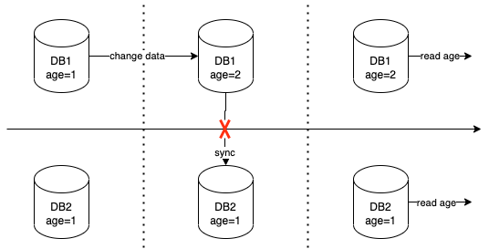

# CAP基本概念

CAP理论作为分布式系统的基石，应该是每个入门分布式系统的人都应该学习的内容。

CAP理论是2000年7月，加州大学伯克利分校的Eric Brewer教授在ACM PODC会议上提出CAP猜想。

2 年以后，来自麻省理工学院的 Seth Gilbert 和 Nancy Lynch 从理论上证明了 Eric Brewer 教授的 CAP 猜想是成立的。

CAP理论分别指的是

* **Consistency：**一致性
* **Availability：**可用性
* **Partition tolerance：**分区容错性

CAP理论告诉我们，一个分布式系统不可能同时满足一致性、可用性和分区容错性这三个基本需求，最多只能同时满足其中的两个。‘


一致性和可用性的争论主要表现为ACID和BASE之间的争论

BASE：可用性优先、数据一致性其次

ACID(原子性、一致性、隔离性、持久性)：优先数据一致性，在必要的时候，可以放弃系统可用性

## 一致性

一致性指的是`all nodes see the same data at the same time`，即所有节点在同一时间的数据完全一致。

一致性级别

* 强一致性(Strong Consistency)又被称为线性一致性(Linearizable Consistency)。
* 序列一致性(Sequential Consistency)。
* 最终一致性(Eventual Consistency)。

在数据一致性方面，虽然我们无法实现强一致性，但是我们也不要全部放弃，可以努力去实现更高的一致性级别，为系统的服务提供更好的抽象。

## 可用性

可用性指`Reads and writes always succeed`，即服务在正常响应时间内一直可用，要求系统提供的服务必须处于**100%可用**的状态，对于用户的每一个操作请求，系统总能够在**有限的时间内返回结果**

但是，在我们的日常工作中，几乎没有见过 100% 可用的服务。可用性指标是在 0 到 100% 之间连续分布的，在我们的系统选择了 CP 模型的时候，对于可用性（ A ），我们永远无法达到 100%，但是按业务要求不断优化，是我们努力的目标。

例如，如果按照CAP理论来划分，**etcd**属于CP模型，而在 etcd 系统的实现中，如果网络没有出现分区，整个系统是100%可用的；就算网络出现分区了，也不会有整个 etcd 系统都不可用的情况。在这时，超过半数 etcd 实例所在的网络分区一侧，系统是正常可用的，虽然网络分区的另一侧是不可用的，但是整个 etcd 系统的可用性依然可能超过 50%。

## 分区容错性

分区指的是**网络分区**，在整个分布式系统中，因为各种网络原因，系统被分隔成多个单独的部分，可能会出现很多异常情况，如网络丢包导致网络不通的情况，节点宕机导致网络不通的情况。

分区容错性指`the system continues to operate despite arbitrary message loss or failure of part of the system`，即分布式系统在遇到某节点或网络分区故障的时候，仍然能够对外提供满足一致性或可用性的服务。

由于我们面对的就是一个不可靠的网络和有一定概率宕机的设备，在分布式系统中，**分区容错性是一个必选项**。

在分布式系统中，如果我们的设计放弃分区容错性，就相当于我们认为节点之间的网络通信永远是好的，那么我们对节点之间的远程调用的结果，就不需要处理超时、网络地址不可达等网络层错误了。但是这样一来，看似是简化了系统设计，实际却忽视了超时等网络错误的情况。当它们出现后，系统的行为就是未定义的了，可能会出现崩溃，或者是脏数据的问题。

如果在网络不出现分区的时候，我们将数据强一致性和 100% 的可用性都选择，等到网络出现分区的时候，系统再选择放弃部分的可用性或者降低数据一致性的级别。这样做其实是可行的，它实际是将 CAP 理论的选择，推迟到出现网络分区的时候，而不是系统一启动就进行 CAP 的选择。这样可以大大提高系统的可用性和数据一致性，并且系统依然能容忍网络分区。

## 为什么不能同时满足

对于CAP理论中，分布式系统要保障整体的服务，因此（Partition tolerance）分区容错性必然存在。那么为什么CA不能同时存在？因为分区之间的通信可能通信失败。



1. 从图中可以看出，数据库有两个节点，两个节点中age都等于1。

2. 此时写请求发送给DB1，将age的值改成2，但由于网络分区出现了异常，同步到DB2的时候同步失败了。
3. 最后有个读请求，从DB1中能读取到正确的值，但是DB2则会返回不一致的数据。

如果为了保证一致性，则需要读取的时候阻塞等待，直到故障恢复后DB1的数据同步到了DB2的时候。

如果为了可用性，则需要返回的数据是age=1。

# 案例

## 案例1-论证Kafka是AP模型还是CP模型

Kafka的开发人员申明Kafka是CA系统，Kafka设计是运行在一个数据中心，网络分区问题基本不会发生，所以是CA系统。

其实，Kafka提供了一些配置，用户可以根据具体的业务需求，进行不同的配置，使得Kafka满足AP或者CP，或者它们之间的一种平衡。
比如下面这种配置，就保证强一致性，使得Kafka满足CP。

```properties
replication.factor = 3
min.insync.replicas = 3
acks = all
```

而下面的配置，就主要保证可用性，使得Kafka满足AP。

```properties
replication.factor = 3
min.insync.replicas = 3
acks = 1
```

还有一种配置是公认比较推荐的一种配置，使得Kafka满足的是一种介于AP和CP之间的一种平衡状态。

```properties
replication.factor = 3
min.insync.replicas = 2
acks = all
```

对于这种配置，其实Kafka不光可以容忍一个节点宕机，同时也可以容忍这个节点和其它节点产生网络分区，它们都可以看成是Kafka的容错（Fault tolerance）机制。

## 案例2-论证Google的Spanner是AP模型还是CP模型

Spanner 是一个全球分布式数据库，但是 Google 却宣称 Spanner 是一个 CA 系统。它运行在 Google 的内部网络中，并且拥有大量冗余的网络链路、处理相关故障的架构规划、以及非常细致的运维，以此来确保系统的可用性超过了 99.999%。虽然不能达到 100%，但是对于使用者来说，和可用性 100% 几乎没有任何区别，所以 Spanner 就是一个 CA 系统。

但是在网络出现分区的时候，Spanner 会选择一致性而不是可用性，就变成CP模型。

# 总结

从上述两个案例可以看出，对于 CAP 理论，我们不会简单地三选二或者二选一。对于 AP 模型的系统，我们会努力去提升数据一致性的级别，而对于 CP 模型的系统，我们会努力去提升系统可用性的级别。

由于系统分区的情况非常少见，我们可以在网络不出现分区的时候，将 A 和 C 都选择上；在网络出现分区的时候，再选择放弃部分的可用性，或者降低数据一致性的级别，通过推迟 CAP 选择来提高系统的可用性和数据一致性。
