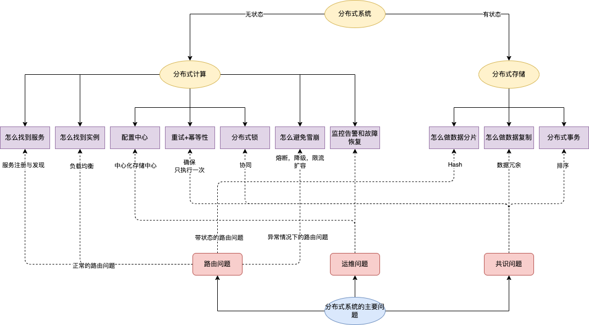

# 什么是分布式系统

分布式系统是由一组通过网络进行通信、为了完成共同的任务而协调工作的计算机节点组成的系统。分布式系统的出现是为了用廉价的、普通的机器完成单个计算机无法完成的计算、存储任务。其目的是**利用更多的机器，处理更多的数据**。

# 分布式系统解决了什么问题

1. 单机性能瓶颈导致的成本问题。由于摩尔定律失效，廉价PC机性能的瓶颈无法继续突破，小型机和大型机确实能提高单机性能，但是成本太高，
2. 进入了互联网时代，用户量和数据量爆炸性的增大，单机已经无法满足计算和存储的需求。
3. 服务高可用的要求，对于互联网的产品来说，都要求7 * 24小时提供服务，无法容忍停止服务等故障，需要提供高可用服务。
4. 如果一个大规模的软件系统是一个单体系统，那么大量的开发人员就只能将一个大规模软件，整体进行编译，测试和发布，这样一来开发语言和生态都比较单一，系统的迭代效率就会非常低。

总结：

在互联网时代，单机系统无法解决成本，效率和高可用问题。

# 分布式系统如何解决单机系统面临的问题

将一些廉价的PC机(partition)通过网络连接起来，共同完成工作，并且在系统中提供冗余(replica)来解决高可用问题。

# 分布式系统内部如何协调服务节点

## 分布式计算（无状态）

1. 如何找到服务

   在分布式系统内部，会有不同的服务，一般来说可以通过**服务注册与发现**机制来实现，同时还需要了解**CAP理论**。

2. 如何找到服务实例

   在找到服务以后，如果说同一个服务的实例是完全相等的（无状态），那么**负载均衡策略(轮询，权重，Hash，一致性Hash，FAIR等各种策略)**来实现就行。

3. 如何管理配置

   在分布式系统内部，会有不同的服务和对应的服务实例，如何实现服务实例的自动扩容和所容，一般来说通过一个中心化存储的**配置中心**来实现的。

4. 不同服务之间如何协同

   在分布式系统中一个请求可能会调用不同的服务，想要实现协同，需要通过一个跨进程与机器的**分布式锁**来实现。

5. 如何保证请求只执行一次

   在分布式系统各个模块之间通过网络进行连接，如果出现网络抖动，会导致模块之间的调用失败，可能会出发重试策略，导致程序可能没有执行也有可能执行多次。一般来说，功能实现能确保**幂等性**就能保证请求一次和请求多次的结果是一致的。

6. 如何避免雪崩

   系统雪崩是指由于正反馈循序导致不断扩大规则的故障。一般来说，避免雪崩的思路有两种：**1. 快速失败和降级（熔断，降级，限流等）2. 弹性扩容机制。**

7. 如何实现监控告警和故障恢复

   对于一个分布式系统来说，如果我们不能清楚地了解内部的状态，那么系统的稳定性是没有办法保证的。

   一般来说需要做**调用链追踪，故障模拟的混沌工程以及相关的监控和告警机制**

## 分布式存储（有状态）

1. CAP，ACID，BASE三个主题理论。

   英文版：https://www.infoq.com/articles/cap-twelve-years-later-how-the-rules-have-changed/

   中文版：https://www.infoq.cn/article/cap-twelve-years-later-how-the-rules-have-changed/

2. 如何做数据分片

   单机上存储所有数据是不现实的，一般来说会通过**Hash和Region分片**等策略来实现数据分片，将数据存放在不同的机器节点上。

3. 如何做到数据高可用

   数据冗余，主要方案有：**中心化方案（主从复制，一致性协议，如Raft和Paxos等）和去中心化方案（Quorum和Vector Clock）**。需要了解这两个方案的优缺点和应用场景，已经对外表现出来的**数据一致性级别（线性一致性，顺序一致性，最终一致性等）**。

4. 分布式事务

   首先需要**对并发事务进行排序**。这样在事务冲突的时候，能够确认哪个事务提交成功，哪个事务提交事务失败了。

   在单机系统中，可以简单的通过时间戳+序号的方式实现。但是在分布式系统中，各个机器上的时间不可能完全同步，单机上的序号也没有全局意义，所以在分布式系统中不能通过时间戳+序号的方式实现。

## 总结

* **路由问题：**解决分布式系统内部各服务和实例之间的通信。
  * 怎么找到服务
  * 怎么找到服务实例
  * 怎么做数据分片（带状态的服务路由问题）
  * 怎么避免雪崩涉及的熔断，降级，快速失败等（异常情况下的路由问题）
* **共识问题：**协调分布式内部各个服务和实例
  * 怎么做分布式锁
  * 重试+幂等性
  * 怎么做分布式事务
  * 怎么做数据复制
* **运维问题：**分布式系统相对于单体系统来说是非常碎片化的，需要一系列的自动化运维工具和平台来解决问题。
  * 怎么做配置管理
  * 怎么做监控告警和故障恢复

# 目前主流的分布式系统

1. HDFS/FastDFS/GFS等分布式文件系统
2. Kafka和Pulsar等分布式消息队列
3. Redis Cluster和Codis等分布式缓存
4. MySQL分库分表等传统关系型数据库的分布式方案
5. MongoDB/HBase等NoSQL数据库
6. TiDB等NewSQL
7. 一些微服务框架(kubernetes)

# 总结

