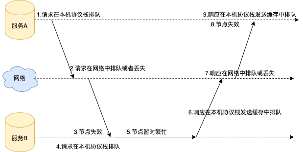
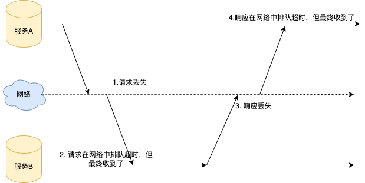
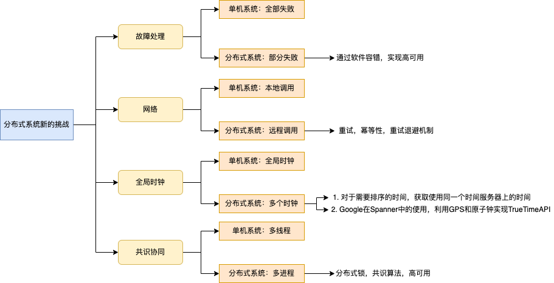

# 分布式系统设计和原则

单体系统是以单进程的形式运行在一个计算机节点上，而分布式系统是以多进程的形式运行在多个计算机节点上，二者的本质差别就导致了分布式系统面临着四个方面的新问题，分别是：**故障处理**、**异步网络**、**时钟同步**和**共识协同**。

## 故障处理

单体系统中如果硬件出现故障，对于一个确定的输入，计算机也会直接出现无法启动或崩溃的情况，而不是给出一个模棱两可或不正确的结果。如果给出了一个错误的结果，并且写入到了数据库中这种情况，它的代码逻辑是正确的，那么想要识别出来，再运行处理的成本就非常大了。

分布式系统由多个计算机节点组成，虽然每一个计算机节点都是全部失败的模型，但是如果系统中的某些节点出现宕机或者网络故障，整个分布式系统就会出现部分失败的情况，也就是说单机计算机系统这个确定性的全部失败的模型，在分布式系统中就无效了。

在分布式系统中，故障处理是软件设计的一个重要组成部分。我们需要时刻谨记节点宕机、网络分区等各种问题出现时，系统应该怎么正确处理，比如分布式系统在设计的时候，每一个组件都必须是高可用的。

## 异步网络

在单机系统中，系统各个组件之间的调用方式非常简单，直接本地调用即可。但是在分布式系统中，不同的组件运行在不同的机器上，通过本地调用是不可行的，我们只能通过网络来进行调用，即远程调用。虽然两个调用的差别只在于远程调用多依赖了网络这个通道，但是这却给系统带来了非常大的复杂性，其实主要原因还是网络本身的复杂性所导致的。

**服务A远程调用服务B可能会出现的情况**：

在这样的情况下，通常的做法是采用**超时机制**，请求方在发起请求后，**设置一个超时时间**，这样能确保请求方在超时时间内，一定能得到一个响应。如果在超时时间内，请求方得到了明确的响应，不论这个响应是被调用服务回复的，还是网络地址不可达等网络错误，调用方都可以根据响应结果一一来处理。

**响应超时的情况**

在分布式系统的设计中，我们要充分考虑通过网络进行远程调用导致的不确定性，比如在响应超时的情况下增加**重试机制**，确保请求能最少执行一次。在重试的时候增加**幂等**的机制，确保请求只被精确处理一次，并且对重试机制增加**退避策略**，确保系统不会因为重试导致雪崩。

## 时钟同步

计算机系统通过网络定期获得时间服务器的时间，来调整本地时间，即网络时间协议（NTP）

公式：

**本地时间 = 时间服务器的返回时间 + 时间服务器响应的网络时延**

但是通过NTP同步，也不能获取到正确的时间，因为网络会有延迟，可能误差都是在几十毫秒的范围内。

时间的作用：

1. 记录事件发生的时间，这是一个绝对时间，是让我们来阅读和理解的
2. 记录事件之间的发生顺序，这是一个相对时间

我们一定要谨记系统中各个节点的本地时钟是存在误差的，不能依赖各自的时钟对事件进行排序。

这个问题的解决思路有两个，一个是回到单机系统的全局时钟的模式，所有节点对于需要排序的事件时间，不使用本地时钟的时间，而是去请求同一个时间服务器获得事件的发生时间，然后依据这个时间进行排序；另一个是 Google 在 Spanner 中使用的，通过 GPS 和原子钟实现 TrueTime API 来解决。

## 共识协同

对于分布式系统来说，我们需要处理的是一个跨机器的多进程同步问题。我们可以选择一个服务来做同步操作的管理者（我们称为同步服务），在多个进程间需要同步时，就到同步服务来请求一个锁，获得锁的进程就可以操作，其他的进程就必须等待。在做分布式系统设计的时候，我们必须要考虑到故障的存在，所以同步服务不能只有一个实例，它需要多个实例来保障它的高可用。其实，这是一个共识问题，需要分布式系统中参与同步的进程之间能达成共识，目前我们是通过 Paxos 或者 Raft 这样的共识算法来解决问题的

# 总结

