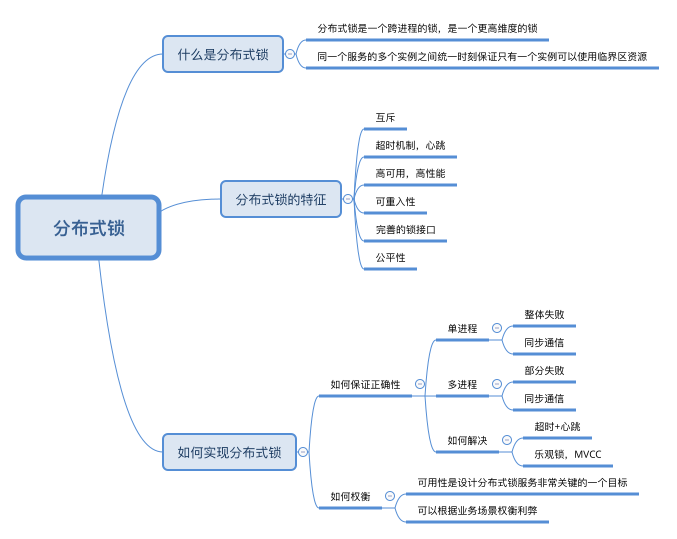

# 为什么需要分布式锁

目前同一个服务的所有实例都是对等的，只能每一个实例都运行。如果将这个服务运行的实例修改为一个，虽然能解决刚才讨论的问题，但是这个实例就变成了一个单点，会面临性能瓶颈和单点故障的风险。那么多个实例在同一时刻只能有一个实例运行，它就是一个典型的分布式锁的场景。

分布式锁保证在同一时间内，临界区只能由一个进程来执行，而只有持有锁的线程或进程才能执行临界区的代码。

分布式锁是一个跨进程的锁，是一个更高维度的锁。我们在进程内部碰到的临界区问题，在分布式系统中依然存在，我们需要通过分布式锁，来解决分布式系统中的多进程的临界区问题。

# 怎么实现分布式锁

对于单进程的并发场景，可以使用编程语言及相应的类库提供的锁，如 Java 中的 synchronized 语法以及 ReentrantLock 类等，避免并发问题。

对于多进程的并发场景，就不能使用单进程的那一套思路了。一般都是将锁的信息统一存放在存储服务里，即锁服务中，其他的服务再通过网络去访问锁服务来修改状态信息，最后进行加锁和解锁。

分布式锁需要具备以下特征：

- **互斥性**。互斥是锁的基本特征，同一时刻锁只能被一个线程持有，执行临界区操作。
- **超时释放**。通过超时释放，可以避免死锁，防止不必要的线程等待和资源浪费，类似于 MySQL 的 InnoDB 引擎中的 innodblockwait_timeout 参数配置。
- **可重入性**。一个线程在持有锁的情况可以对其再次请求加锁，防止锁在线程执行完临界区操作之前释放。
- **高性能和高可用**。加锁和释放锁的过程性能开销要尽可能的低，同时也要保证高可用，防止分布式锁意外失效。
- **完备的锁接口。**可以继承java Lock接口，类似有阻塞和非阻塞的API。
- **公平性。**在锁被释放后，优先将锁的使用权分发给等待时间最长的请求。

# 分布式锁的挑战

## 如何保证分布式锁的正确性

我们在使用分布式锁的情况下，是否有办法做到，不论出现怎样的异常情况，都能保证分布式锁互斥语义的正确性呢？

单进程内，如果其中一个线程获取到了锁，只要它不释放，就只有它能操作临界区的资源。如果它崩溃了，也会整体失败，不会出现死锁的问题。

多进程内，如果其中一个进程获取到了锁，只要它不释放，就只有它能操作临界区的资源。但如果它崩溃了，就会导致部分失败，导致死锁的情况。

如何解决？

一般情况都是通过加上心跳和超时机制。但是这可能会导致锁服务给客户端颁发了锁，但是因为响应超时，客户端以为自己没有获取锁的情况发生。这样一来，依然会在一定程度上，影响锁的互斥语义的正确性，并且会在某些场景下，影响系统的可用性。

也可以通过乐观锁实现，MVCC

分布式锁的设计，应该多关注高可用与性能，以及怎么提高正确性，而不是追求绝对的正确性。

## 分布式锁高可用，高性能，正确性的权衡

一般来说，一个分布式锁服务，它的正确性要求越高，性能可能就会越低。

对于高可用的问题，我认为它是在设计分布式锁时，需要考虑的关键因素。我们必须提供非常高的 SLA ，因为分布式锁是一个非常底层的服务组件，是整个分布式系统的基石之一。

对于高性能的问题，这是一个由业务场景来决定的因素，我们需要通过业务场景，来决定提供什么性能的分布式锁服务。一般来说，我们可以在成本可接受的范围内，提供性能最好的分布式锁服务。

# 总结

