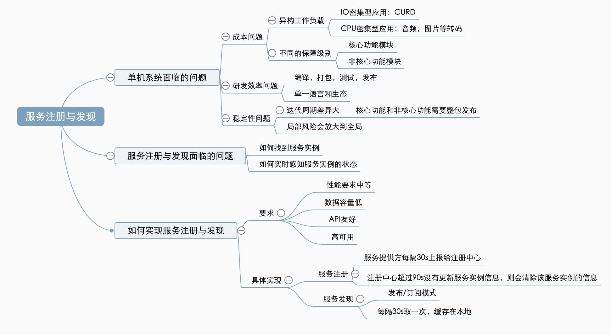

# 什么是服务注册与发现

**服务注册**，就是将提供某个服务的模块信息(通常是这个服务的ip和端口)注册到1个公共的组件上去（比如: zookeeper/consul）。

**服务发现**，就是新注册的这个服务模块能够及时的被其他调用者发现。不管是服务新增和服务删减都能实现自动发现。

# 为什么需要服务注册与发现

在早期时代，基本都是单体架构，但随着用户量和数据量的激增，单体架构会遇到很多问题，可能会遇到CPU，内存，磁盘等报警，只能通过增加机器的配置暂时先解决这些问题。

单体架构面临的问题：

* 成本问题
  * 异构工作负载：如果能够将不同类型的应用模块分开部署，可以节省机器的成本。
    * CPU密集型应用：音频，图片，文档等转码工作。
    * IO密集型应用：CRUD功能模块。
  * 不同保障级别：不同业务等级的保障级别是不一样的。
    * 核心功能模块需要保证资源充足。
    * 非核心功能模块，保障的资源可以相对少一些。
* 研发效率问题
  * 串行的编译、测试和发布：单体应用又被称为巨石应用，要打包都要整包进行编译，测试和发布。
  * 单一的研发语言和生态
* 稳定性问题
  * 局部风险会放大到全局：单体应用包含了大部分功能模块，如果一个非核心的功能模块崩溃了会影响整个系统。
  * 业务迭代周期差异大：一般底层核心功能迭代周期会比较长，上层的功能模块迭代周期会相对来说比较短，但由于是单体应用，发布都需要整包发布。

经过仔细分析，我们会发现上面三个方面的本质问题，都是因为我们的业务是一个单体应用，不能按资源类型进行分别扩容，不能按功能或者服务进行小范围的部署，也不能按业务的需求来选择更适合的研发语言和生态等，所以我们决定按资源和业务等维度对单体服务进行拆分。

# 服务注册与发现遇到的问题

1. 现在我们尝试着将单体应用里的功能模块进行拆分，拆分为多个服务后，怎么调用其他服务的函数呢？

2. 我们可以通过REST API或者RPC进行调用，但是通过 REST API 或者 RPC 都需要知道被调用服务的 IP 和 Port。所以，我们还需要解决一个问题：如果服务 A 需要调用服务 B，那么服务 A 怎么获取被调用服务 B 的 IP 和 Port 呢？

3. 最容易想到的是配置 IP 和 Port 列表，但是如果服务A、C、D、E 等非常多的服务，都需要调用服务 B，那么这些服务都需要维护服务 B 的 IP 和 Port 列表。每一次当服务 B 增加、删除一个实例，或者一个实例的 IP 和 Port 发生改变时，所有调用服务 B 的服务都需要更新配置，这是一个非常繁杂并且容易出错的工作，那么怎么避免这个问题呢？
4. 我们可以将配置 IP 和 Port 列表的方式修改为配置域名和 Port，那这样只需要配置一个域名和port，通过DNS解析获得所有服务 B 的 IP 列表。但如果服务B的某个实例崩溃，网络不通了，由于我们不能实时感知服务实例的状态变更，依然获得该实例的 IP，从而导致访问错误。那这个问题又该如何解决？

经过前面的讨论，我们可以得出服务注册发现需要解决的两个关键问题：

* **统一的中介存储**：调用方在唯一的地方获得被调用服务的所有实例的信息。
* **状态更新与通知**：服务实例的信息能够及时更新并且通知到服务调用方。

# 如何实现服务注册与发现

## 如何选择中介存储

我认为这个存储需要有以下几个特点：

**高可用**：因为服务注册发现是整个分布式系统的基石，如果它出现问题，整个分布式系统将不可用。

**性能要求中等**：只要设计得当，整体的性能要求还是可控的，不过需要注意的是性能要求会随分布式系统的实例数量变多而提高。

**数据容量要求低**：因为主要是存储实例的 IP 和 Port 等元数据，单个实例存储的数据量非常小。

**API 友好程度**：是否能很好支持服务注册发现场景的“发布 / 订阅”模式，将被调用服务实例的 IP 和 Port 信息同步给调用方。

| 存储系统  | 可用性            | 性能 | 数据容量 | API  |
| --------- | ----------------- | ---- | -------- | ---- |
| MySQL     | 低，主从复制      | ✅    | ✅        | 低   |
| Redis     | 低，Redis Cluster | ✅    | ✅        | 低   |
| etcd      | 高，CP            | ✅    | ✅        | 高   |
| zookeeper | 高，CP            | ✅    | ✅        | 高   |
| Eureka    | 高，AP            | ✅    | ✅        | 高   |
|           |                   |      |          |      |

## 如何实现服务状态的更新与通知

**服务注册**：服务提供者每个实例都会向注册中心注册服务，并且每隔一段时间（例如30s）会主动给注册中心暴露自己的ip和port，注册中心会更新服务列表。同时，服务提供方会告诉注册中心，服务信息的有效期，比如90s。如果服务提供方的某个实例挂了，超过90s未向注册中心发送更新信息的请求，注册中心会默认这个实例已经挂了，并清除这个服务实例，保证最终一致性。

**服务发现**：服务的调用方通过注册中心监听被调用服务的状态变更信息。这里可以采用“发布 / 订阅”模式，也可以采用轮询模式，比如每 30 秒去注册中心获取一次。所以这里的数据同步也是最终一致性的。

# 总结

