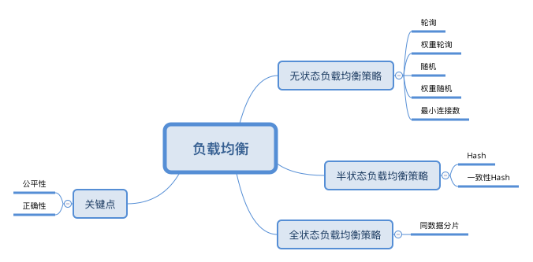

# 负载均衡

在[服务注册与发现](./服务注册与发现.md)一节中，介绍了分布式系统如何找到服务，但为了实现服务的高可用，每个服务都有可能会有很多实例，这时你将面临一个新的问题，那就是调用方应该将请求，发向被调用服务的哪一个服务实例呢？负载均衡就能够解决。

负载均衡是高可用网络基础架构的关键组件，通常用于将工作负载分布到多个服务器来提高网站、应用、数据库或其他服务的性能和可靠性。

负载均衡就是一个服务实例的调度器，它将发送给被调用服务的每一个请求，按一定的策略分配给后端实例组中的一个实例，确保能**高效、正确**地提供服务。

负载均衡如何保证高效的提供服务，我需要负载均衡器需要考虑到各个实例性能差异的情况，让每一个实例都能充分发挥它的能力，不要出现一些实例负载比较高，而另一些实例的负载却非常低的情况，这样会造成资源浪费，体现公平性。

如何正确的提供服务，需要确保外部对后端服务的请求，一定能被路由到可以提供正确服务的实例上。如果后端实例是有状态的，比如需要利用本地缓存和存储来处理请求的，我们就需要考虑每个请求携带的状态，然后依据状态信息，将请求正确路由到后端的实例上。

## 无状态负载均衡

它指的是参与负载均衡的后端实例是无状态的，所有的后端实例都是对等的，一个请求不论发向哪一个实例，都会得到相同的并且正确的处理结果，所以无状态的负载均衡策略不需要关心请求的状态。

负载均衡策略

* **轮询(Round Robin):**为第一个请求选择列表中的第一个服务器，然后按顺序向下移动列表直到结尾，然后循环。适用于请求的工作负载和实例的处理能力差异都较小的情况。
* **权重轮询(Weight polling):**例如两个服务实例A，B，A的性能比B的差，我们可以设置20%的请求发往A，80%的请求发往B。我们可以利用它解决实例的处理能力差异的问题，认为它的公平性比轮询策略要好。
* **随机(random)：**根据实例列表随机选择一个进行访问。
* **公平(fair)：**fair算法可以根据页面大小和加载时间长短智能地进行负载均衡，也就是根据后端服务器的响应时间 来分配请求，响应时间短的优先分配。
* **权重随机(Weight Random)：**与权重轮询一样，权重随机也根据后端机器的配置，系统的负载分配不同的权重。不同的是，它是按照权重随机请求后端服务器，而非顺序。
* **最小连接数(Least Connections):**优先选择连接数最少的服务器，在普遍会话较长的情况下推荐使用。

## 半状态负载均衡

负载均衡策略利用请求的状态信息进行路由，但是仅仅进行简单的规则处理，比如 Hash 运算加求模来路由请求，它不保证路由的正确性，这个正确性由后端实例来保证。

负载均衡策略

* **Hash:**将请求的状态信息，按一定的 Hash 算法固定分配到一个实例上。公平性方面，在不考虑 Hash 算法均匀性的情况下，Hash 策略会按 Hash 值按模等分，它和轮询策略类似，不能解决请求的工作负载和实例的处理能力差异的问题。Hash 的负载均衡策略中，最大的一个问题是基于机器数量求模，如果机器数量发生变化，请求和实例的分配关系机会将全部变化，这会影响它的正确性

* **一致性Hash：**

  * 公式1:
    $$
    iNode = hash(Node ID) mod {2^{32}}
    $$

  * 公式2:
    $$
    iRequest = hash(Request ID) mod {2^{32}}
    $$

  * 一致性 Hash 和 Hash 策略最大的区别在于，一致性 Hash 是对固定值
    $$
    2 ^ {32}
    $$
    求模，不会随着机器数量的变化而变化，所以对于同一个 Request ID ， iRequest 是始终稳定不变的，这样就解决了 Hash 的策略在实例数量发送变化后，几乎所有的分配关系都会发生变化的问题。

  * 一致性 Hash 策略让每一个实例都生成多个虚拟实例，使分配更加均衡；对于实例之间性能差异的问题，一致性 Hash 策略通过让实例生成虚拟实例的数量，与该实例的权重成正比的策略来解决。

具体算法讲解可以参考：

https://developer.huawei.com/consumer/cn/forum/topic/0203810951415790238?fid=0101592429757310384

## 全状态负载均衡

负载均衡策略不仅利用请求的状态信息进行路由，并且在后端实例有状态的情况下，依然会保证路由的正确性。

全状态的负载均衡一般以路由服务的形式存在，在路由服务里面，都会存储后端实例 ID 和状态信息的索引，在进行请求路由的时候，路由服务从请求的状态信息中获得索引的标识，通过查询索引获得后端实例的 ID，然后再进行路由。

数据分片=全状态负载均衡

# 总结

