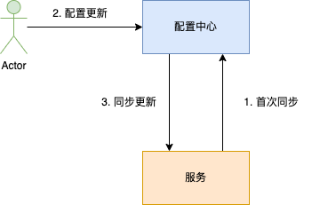
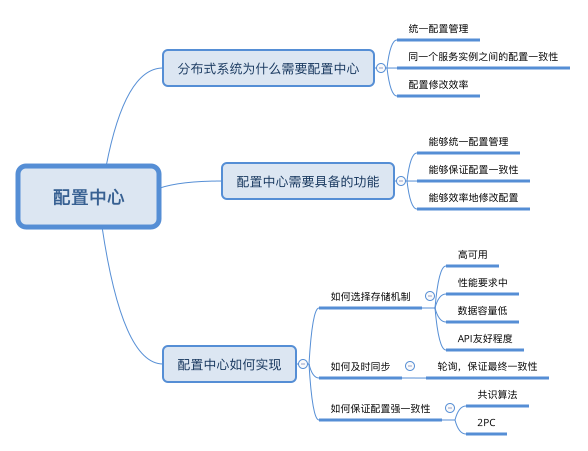

# 配置中心

在[分布式系统介绍](./分布式系统介绍.md)一节中介绍了分布式面临的挑战，其中就有管理配置，因为随着服务和服务实例越来越多，每个服务都有不同的配置，如果需要修改，会发现效率越来越低了。

在单体架构中，配置是包含在程序中的， 与代码一起打包编译发布的，每次修改可能都需要重新打包编译。

分布式架构中，如果还是继续采用单体架构的方式管理配置，会出现以下的问题。

* **缺乏整体的配置管理平台，会使配置管理的效率变得很低**：在分布式系统中，如果将配置信息视为代码的一部分，会导致不同服务的配置文件，出现在不同的代码仓库中。当我们需要检索和查看多个服务的配置时，需要在一个个代码仓库中查找，效率会非常低。
* **导致实例之间的配置出现不一致的情况：**
* **配置即代码的方法会使配置修改的操作，变得非常冗余和低效：**

# 配置中心需要具备哪些功能

针对上述的问题，配置中心需要具备的功能有：

* **能够统一管理分布式系统所有服务的配置信息：**配置中心需要能统一存储和管理整个分布式系统的所有配置文件，能够完成对配置CRUD操作。
* **同一个服务实例之间的配置应该保持一致：**配置中心需要保证一个服务所有的实例，都加载同一份配置文件，而不是每一个实例维护一个配置文件的副本。
* **高效地修改配置，并且能够及时同步给服务：**高效地完成配置的修改、发布和回滚操作。

跟服务注册与发现一样，都需要有**统一存储机制和及时同步机制**

## 如何选择存储中心

存储中心还是跟服务注册中心的要求一致

**高可用**：因为服务注册发现是整个分布式系统的基石，如果它出现问题，整个分布式系统将不可用。

**性能要求中等**：只要设计得当，整体的性能要求还是可控的，不过需要注意的是性能要求会随分布式系统的实例数量变多而提高。

**数据容量要求低**：因为主要是存储实例的 IP 和 Port 等元数据，单个实例存储的数据量非常小。

**API 友好程度**：是否能很好支持服务注册发现场景的“发布 / 订阅”模式，将被调用服务实例的 IP 和 Port 信息同步给调用方。

| 存储系统  | 可用性            | 性能 | 数据容量 | API  |
| --------- | ----------------- | ---- | -------- | ---- |
| MySQL     | 低，主从复制      | ✅    | ✅        | 低   |
| Redis     | 低，Redis Cluster | ✅    | ✅        | 中   |
| etcd      | 高，CP            | ✅    | ✅        | 高   |
| zookeeper | 高，CP            | ✅    | ✅        | 高   |
| Eureka    | 高，AP            | ✅    | ✅        | 高   |
|           |                   |      |          |      |

## 如何做配置信息的同步

也是跟服务注册与发现一样，一般都是通过每隔一段时间轮询去更新配置信息，采用发布/订阅模式更新，配置中心和服务实例之间的配置同步是最终一致性的。

## 如何保证配置强一致性

其实这是一个共识问题，需要所有的 Proxy 实例对数据迁移的配置达成共识后，才能进行迁移。配置信息不能按上面讨论的方式直接通过网络进行同步，而需要通过类似两阶段提交的方式来解决这个问题。

# 总结

