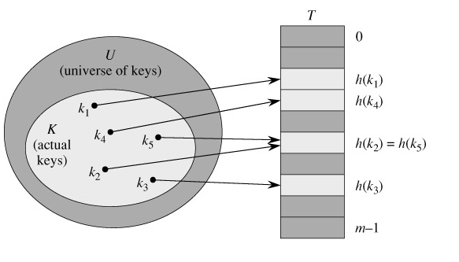
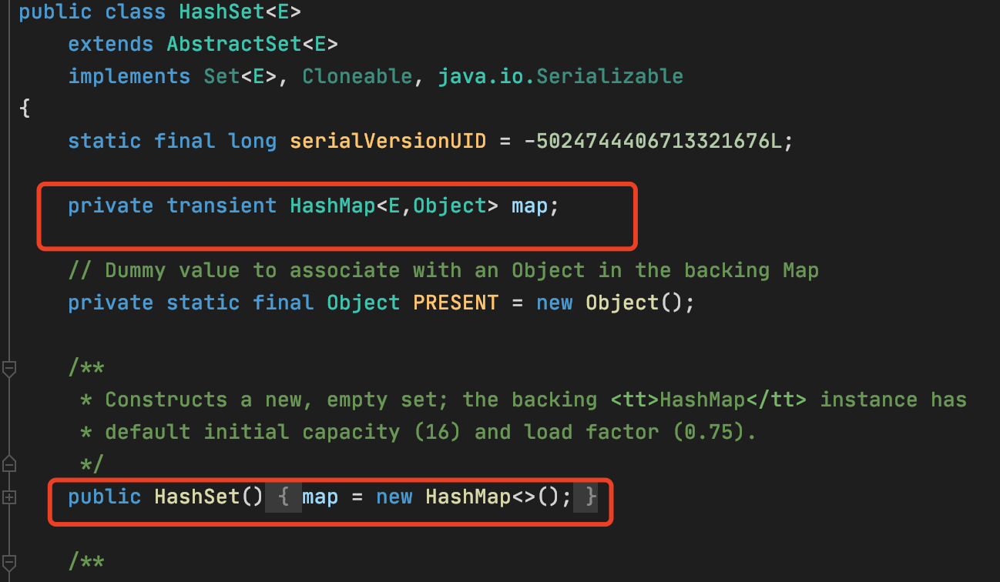

## java.util.HashMap源码分析

我刚开始找工作的时候，刷面试题，刷到最多的，同时确实也是面试官最喜欢的考察的一个知识点就是什么是HashMap，或者与Hashtable的区别等一系列相关的面试题。然而事实上这道题更多的还是考察对HashMap这个数据结构的知识点，那这个数据结构就是hash table。hash table是一个非常重要的数据结构，在日常coding中我们也会经常使用这样的数据结构，java中有HashMap，python中有字典，都是通过hash table实现的，所以学习hash table很重要。

本篇主要从什么是hash table？如何实现一个工业级别的hashtable？以及hashtable的应用场景等方面讨论。

### 什么是hash table？

Hash table是通过一个hash函数来计算数据存储位置的数据结构，是一个键值对类型的数据结构，(key, value)。通常支持如下操作：

* `put(Key Value)`： 插入键值对(key,value)
* `get(key):`如果存在键为key的键值对则返回其value，否则返回空值。
* `delete(key):`删除键为key的键值对。

hash table属于线性表，由一个直接寻址表和一个hash函数组成。hash函数hash(key)将key做为自变量，返回元素的存储下标，也就是直接寻址表的下标。

我们回过头来，回想一下动态数组（列表）的插入，一般情况下咱都是直接调用`list.add(value)`方法实现的，所以都是追加到末尾的一种方式，那如果我们把key按照列表的方式插入，那就是直接插入到末尾，如果我们想要获取key，那也要从头开始遍历一遍，一个个key值比较，时间复杂度是`O(n)`，即使这个key是数字，也插入的时候是有序插入的，使用二分查找算法，也需要`O(logn)`的时间复杂度。那有没有办法再进一步优化`get(key)`的时间复杂度呢？

1. **直接寻址表**

   当关键字的全域u比较小时，直接寻址时一种简单而有效的方法。

   

   假设u的域为[0,9]，那我们就建立一个长度为10的数组T。此时我们需要插入的key有(2,3,5,8)，那我们就直接在下标为2，3，5，8里插入对应的key值即可。如果想获取key = 5的元素，只要返回T(5)的值即可，如果想要删除key = 8的元素，只要将T(8)置为空即可。

   直接寻址表的优点：

   实际上数组的优点就是直接寻址表的优点（其实也是hash table的优点）。

   * 根据key查找的时间复杂度为`O(1)`

   缺点：

   * 当U很大的时候，需要消耗大量的内存，很不实际。如果u的是一个[0, 100W]的域，但是key却只有很少的一部分，就会造成大量的空间被浪费。
   * 如果key不是数字，也不能使用直接寻址表。直接寻址表就是当key = k的时候，咱就直接把对应的value放入T(k)。

2. **散列表**

   直接寻址表是根据关键字k找到槽(k)，并存入对应的对应的值。而散列表是根据关键字k通过一个hash函数(记为h(k))计算出槽的位置。这里的函数h将关键字的全域u映射到散列表的槽位上，那h(k)就是关键字k的散列值。

   假设u的域是[0,6]，一个长度为7的数组。现需要插入的key有（2，14，19，24）。hash(key) = key%7。这样就是2对应的位置就是下标为2的位置，14对应的位置就是下标为0的位置，19对应的位置是下标为5，24对应的位置就是下标为3的位置。

   

3. **Hash函数**

   散列表中关键的第一步就是根据hash函数，找出对应的槽位，那如何设计一个hash函数呢？本小节主要讨论就是如何设计一个hash函数。

   根据维基百科的定义：散列函数（英语：Hash function）又称散列算法、哈希函数，是一种从任何一种数据中创建小的数字“指纹”的方法。散列函数把消息或数据压缩成摘要，使得数据量变小，将数据的格式固定下来。该函数将数据打乱混合，重新创建一个叫做散列值（hash values，hash codes，hash sums，或hashes）的指纹。散列值通常用一个短的随机字母和数字组成的字符串来代表。那对于hash table来说，我们需要通过hash函数找到对应的槽位，所以这里的hash函数需要返回的散列值是一个自然数，即假设hash table的全域是一个自然数集（0，1，2，3，4，。。。。）

   设计hash函数的三个基本要求：

   1. 散列函数计算出来的散列值是一个自然数。
   2. 如果`key1 == key2`,则`hash(key1) == hash(key2)`。
   3. 如果`key1 != key2`,则`hash(key1) != hash(key2)`。

   分享几种常见的hash函数设计方法：

   1. 取模：`h(k) = k mod m`，比如上述案例就是通过取模散列，`h(k) = k % 7`。我们在选取m的值的时候需要注意尽量不要选择2或者靠近2的整数幂的素数。比如我们需要存储大约2000个字符串，散列函数可以设置为`h(k) = k % 701`。
   2. 乘法hash法：`h(k) = floor(m*(A*key%1))`。用关键字k乘上常数A(0<A<1),并提取kA的小数部分，第二步，用m*这个值，再向下取整。
   3. 全域hash法：`h(k) = ((a * key + b) mod p) mod m   a,b = 1,2,....,p-1`

4. **Hash冲突**

   我们知道hash table都有一个全域u，这个全域可以看成是一个数组，数组的存储空间是有限的，然而我们需要存储的内容却是无限的。那这样就有可能会发生这样的情况，就是两个(多个)相同的key可能会被映射到同一个槽里，这种情形我们称之为hash冲突。在讨论hash函数的设计三要素的时候，第三点确实是很难完全保证，但是我们需要尽量保证，然而hash冲突确实无法完全避免，现业界里也是有方案去解决hash冲突的问题。

   解决方案：

   * 开放寻址法：如果hash函数返回的位置上已经有值，则可以向后探查新的位置来存储这个值。

     * 线性探查：如果位置i被占用，则探查`i+1, i+2, ......`，如果发现到数组的最后一位还没找到可以存储的位置，就从下标为0的位置上，继续寻找，直到找到为止。
     * 二次探查：如果位置i被占用，则探查`i+1^2, i-1^2,i+2^2, i-2^2,....`
     * 二度hash：有n个hash函数，当使用第一个hash函数发生冲突时，则尝试使用第二个hash。

     不管采用哪种探测方法，当散列表中空闲位置不多的时候，散列冲突的概率就会大大提高。为了尽可能保证散列表的操作效率，一般情况下，我们会尽可能保证散列表中有一定比例的空闲槽位。我们用**装载因子**来表示空位的多少。

     装载因子的计算公式是：

     `loadFactor = 填入表中的元素个数 / 散列表的长度`

     装载因子越大，说明散列表中的元素越多，空闲位置越少，散列冲突的概率就越大。不仅插入数据的过程要多次寻址或者拉很长的链表，查找的过程也会因此变得很慢。

     优点：

     > 1. 不需要像链表法一样，需要拉很多链表。
     > 2. 散列表中的数据都存储在数组中，可以有效地利用cpu缓存加快查询速度。
     > 3. 序列化简单

     缺点：

     > 1. 删除数据的时候比较麻烦，需要特殊标记已经删除的数据
     > 2. 比起拉链法更浪费内存空间，冲突的代价更高，装载因子的上限不能太大。

     当数据量比较小，装载因子小的时候，适合采用开放寻址法。

   * 拉链法：在散列表中，每个槽会对应一条链表，所有散列值相同的元素我们都放到相同槽位对应的链表中。当插入的时候，我们只需要通过散列函数计算出对应的散列槽位，将其插入到对应链表中即可，所以插入的时间复杂度是o(1)。当查找，删除一个元素的时候，我们同样通过散列函数计算出对应的槽，然后遍历链表查找或者删除，时间复杂度与链表的长度k成正比，也就是o(K)。

     基于链表的散列冲突处理方法比较适合存储大对象，大数据量的散列表，灵活，支持更多的优化策略，比如使用红黑树，跳表等数据结构替换链表。

### 如何实现一个hashtable？

针对散列表，当装载因子过大时，我们也可以进行动态扩容，重新申请一个更大的散列表，将数据搬移到这个新散列表中。每次扩容我们都申请一个原来散列表大小两倍的空间。如果原来散列表的装载因子时0.8，经过扩容以后就是0.4。扩容的时候需要注意，因为散列表的大小变了，数据的存储位置也变了，所以我们需要通过散列函数重新计算每个数据的存储位置。

我们首先来分析一下`java.util.HashMap`的代码实现。

1. **初始化大小**：`HashMap`的默认初始大小时16，也可以自己设置初始大小，如果事先知道大概的数据量大小，可以通过修改初始大小，减少动态扩容的次数，这样会大大提高`HashMap`的性能。

2. **装载因子和动态扩容**：装载因子默认是0.75，当`HashMap`中元素个数超过0.75*capacity(capacity表示散列表的容量)的时候，就会启动扩容，每次扩容都会扩容外原来的两倍大小。

3. **链表法解决冲突**：不管装载因子和散列函数设计的再合理，也免不了会出现链表过长的情况，一旦链表过长还是会影响性能。在`jdk1.8`引入红黑树，当链表的长度默认超过8时，链表就会转换为红黑树，当红黑树的结点个数少于8时，会退化为链表。

4. **hash函数**：

   ```java
   static final int hash(Object key) {
       int h;
       return (key == null) ? 0 : (h = key.hashCode()) ^ (h >>> 16);
   }
   ```

设计一个散列表需要具备哪些特性？

1. 支持快速地查询，插入，删除操作；
2. 内存占用合理，不能浪费过多的内存空间；
3. 性能稳定，极端情况下，散列表的性能也不会退化到无法接受的情况。

如何实现？

1. 设计一个合理的hash函数；
2. 定义装载因子，并且设计动态扩容策略；
3. 选择合适的散列冲突解决方法。

**show me the code:仿java.util.HashMap**

```java
public interface Map<K, V> {

  V put(K k, V v);

  V get(K k);

  Entry[] entry();

  interface Entry<K, V>{
    K getKey();
    V getValue();

    Entry<K, V> next();
  }

}
```

```java
public class HashMap<K, V> implements Map<K, V> {

  // 默认的初始化大小
  private static final int DEFAULT_CAPACITY = 1 << 4;

  // 默认的装载因子
  private static final float DEFAULT_LOAD_FACTOR = 0.75f;

  private Node<K, V>[] table;

  // 实际元素大小
  private int size;

  private int use;

  private int capacity;

  private float loadFactor;

  public HashMap() {
    this(DEFAULT_CAPACITY, DEFAULT_LOAD_FACTOR);
  }

  public HashMap(int capacity, float loadFactor) {
    if (capacity < 0) {
      throw new IllegalArgumentException("Illegal capacity: " + capacity);
    }
    if (loadFactor <= 0 || Float.isNaN(loadFactor)) {
      throw new IllegalArgumentException("Illegal loadFactor: " + loadFactor);
    }
    this.capacity = capacity;
    this.loadFactor = loadFactor;
    table = new Node[capacity];
  }

  @Override
  public V put(K k, V v) {
    V oldValue = null;
    // 判断是否需要扩容?
    if (use >= capacity * loadFactor) {
      resize();
    }
    int index = hash(k);
    if (table[index] == null) { 
      table[index] = new Node<>(k, v, null);
    } else {
      Node<K, V> entry = table[index];
      Node<K, V> e = entry;
      while (e != null) {
        if (k == e.getKey() || k.equals(e.getKey())) {
          oldValue = e.value;
          e.value = v;
          return oldValue;
        }
        e = e.next;
      }
      table[index] = new Node<>(k, v, entry);
    }
    ++use;
    ++size;
    return oldValue;
  }

  private void resize() {
    capacity = capacity << 1;
    Node<K, V>[] newTable = new Node[capacity];
    use = 0;
    size = 0;
    rehash(newTable);
  }

  private void rehash(Node<K, V>[] newTable) {
    List<Node<K, V>> entryList = new ArrayList<Node<K, V>>();
    for (Node<K, V> entry : table) {
      if (entry != null) {
        do {
          entryList.add(entry);
          entry = entry.next;
        } while (entry != null);
      }
    }

    if (newTable.length > 0) {
      table = newTable;
    }

    for (Node<K, V> entry : entryList) {
      put(entry.getKey(), entry.getValue());
    }
  }

  @Override
  public V get(K k) {
    int index = hash(k);
    if (table[index] == null) {
      return null;
    } else {
      Entry<K, V> entry = table[index];
      do {
        if (k == entry.getKey() || k.equals(entry.getKey())) {
          return entry.getValue();
        }
        entry = entry.next();
      } while (entry != null);
    }
    return null;
  }

  @Override
  public Entry[] entry() {
    Node<K, V>[] tmp = new Node[size];
    int j = 0;
    for (int i = 0; i < capacity; i++) {
      if (table[i] != null) {
        tmp[j++] = table[i];
        if(j == size){
          break;
        }
      }
    }
    return tmp;
  }

  private static final int hash(Object key) {
    int h;
    return (key == null) ? 0 : (h = key.hashCode()) ^ (h >>> 16);
  }

  static class Node<K, V> implements Entry<K, V> {

    K key;

    V value;

    Node<K, V> next;

    Node(K key, V value, Node<K, V> next) {
      this.key = key;
      this.value = value;
      this.next = next;
    }

    @Override
    public K getKey() {
      return key;
    }

    @Override
    public V getValue() {
      return value;
    }

    @Override
    public Entry<K, V> next() {
      return next;
    }
  }
}
```

### hashtable的应用场景

1. 利用hashtable减少遍历层数，提高算法的时间复杂度。例如leetcode第一题`two sum`。
2. hashtable可以做为cache或者存储，hashtable + linkedlist可以实现LRU Cache。
3. 可以表示为弱对象。
4. set集合（数据结构），存储键的集合，内部使用hashtable实现。



