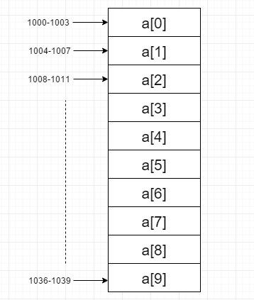
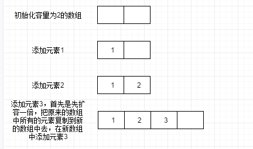

在深入浅出数据结构这一篇中说道：

数据元素的物理存储结构形式有两种：

* **顺序存储结构：**是把数据元素存放在地址连续的存储单元里，其数据间的逻辑关系和物理关系是一致的。实际上就是基于**数组**实现的数据结构
* **链式存储结构：**是把数据元素存放在任意的存储单元里，这组存储单元可以是连续的，也可以是不连续的。数据元素的存储关系并不能反映其逻辑关系，需要用一个指针存放数据元素的地址，通过地址就可以找到相关联数据元素的位置。实际上就是基于**链表**实现的数据结构。

所以数组和链表是实现所有数据结构的基石，是最基本的两种数据结构，需要牢牢掌握。这一篇主要讨论一下数组的相关概念和实现。

## 数组的基本概念

1. **什么是数组**

   数组是一种**线性表**数据结构，它用一组**连续的内存空间**，来存储一组**具有相同类型的数据**。

2. **为什么数组能够实现随机访问，并且随机访问的时间复杂度是`O(1)`**

   根据数组的定义，需要一组连续的内存空间和相同类型的数据。正是因为数组具备两个限制，所有数组才能随机访问，因为数组中的元素能知道其具体所在位点。

   其实可以用一种不太专业的解释来理解，我们知道，所有的数据都是存放在内存中的，如果是一个零散的内存空间，如何知道数据的具体位点呢，数据的位点是杂乱无章的，所以要想能够实现随机访问，首要条件之一就是要一段连续的内存空间。

   那如何理解必须要有相同的数据类型呢？我们以`int`类型的数组为例，我们知道`int`类型的数据在`32`位操作系统占4字节，假设我们执行下面一段代码：

   ```java
   int[] a = new int[10];
   ```

   a数组创建好了以后，分配到了一块连续的内存空间1000~1039，首地址为1000。

   

   首地址为1000，每个元素占四个字节，所以下一个元素的地址就为`（1000 + 4） = 1004`，以此类推。

   有人说，如果其他类型也占4个字节，我这样是不是也照样可以找到我想要的元素呢？如果想要深究的同学，可以自行研究一下，可以看看计算机组成原理相关的知识，这里呢就不深入下去了。

   **注意：**

   **数组是适合查找，但是查找的时间复杂度并不是O(1)。随机访问才是O(1)。随机访问的意思，按照我们常说的，就是根据下标或者索引返回元素。但是要查找或者判断某个元素在该数组中是否存在，即使是已经排好序的数组，利用二分查找法，时间复杂度也是O(logn)**。

3. **为什么下标都是从0开始？**

   当计算机需要随机访问数组中的某个元素的时候，它会如下的公式来计算出实际需要访问数据的内存地址。

   `a[i]_address = base_address + i * data_type_size`,其中`i`为偏移量。在上述数组中，由于类型是int，占4个字节，所以`data_type_size`为4。

   我们可以就这么理解为偏移量，有人说那为什么不写成`a[i]_address = base_address + (i-1) * data_type_size i >= 1`呢？实际上，没有必要过于纠结这个由来，这是coding界约定俗成的规定，所以大家记住即可。

## 静态数组和动态数组

### 静态数组

1. **什么是静态数组？**

   一个静态数组是一个包含n个元素的定长容器，其中的元素是可以索引的，范围从[0, n-1]，其实就是数组的定义。

2. **静态数组的使用场景**

   * 存储和访问顺序数据

   * 临时存储对象

   * 用作IO程序的缓冲区

   * 正向和反向查找表

   * 用于在函数结束时返回多个值

   * 用于在动态规划中缓存子问题的结果

3. **静态数组的特点**

   * 固定长度，不能进行增加，删除元素

   ```java
   int[] a = new int[10];// 不能对a进行插入，添加，删除的操作，只能修改和查找
   ```

4. **静态数组修改和查找的时间复杂度**

   | 操作       | 时间复杂度 | 示例              |
   | ---------- | ---------- | ----------------- |
   | 按索引访问 | `O(1)`     | `a[0]`            |
   | 查找       | `O(n)`     | `for`循环遍历查找 |
   | 修改       | `O(1)`     | `a[2] = 5`        |

### 动态数组

1. **什么是动态数组？**

   动态数组的大小可以扩展和缩小，动态数组不仅支持静态数组的操作，也能支持插入，添加，删除等操作。

2. **动态数组的实现方案**

   * 创建一个具有初始容量的静态数组。

   * 向底层静态数组中添加元素，跟踪元素的个数。

   * 如果继续添加元素会超出容量，那么就创建一个具有两倍容量的新数组，并将原数组的内容拷贝到新数组当中去。

3. 动态数组的时间复杂度

   | 操作       | 时间复杂度 |
   | ---------- | ---------- |
   | 按索引访问 | `O(1)`     |
   | 查找       | `O(n)`     |
   | 修改       | `O(1)`     |
   | 插入       | `O(n)`     |
   | 添加       | `O(1)`     |
   | 删除       | `O(n)`     |

### 动态数组的具体实现

#### 插入

假设一个数组，长度为`n`，现在要在第`k`个位置插入一条元素。正常的逻辑应该是把第`k`个位置腾出来，第`k`个位置往后的元素需要往后移动一位，再将新元素赋值给第`k`个位置，这样呢就保证了新数组和之前的顺序一致。

如果`k`就是最后一位，那么插入的时间复杂度为`o(1)`，不需要移动任何数据。但是如果`k`是第一位，那么插入的时间复杂度为`o(n)`,需要移动所有数据。即最好时间复杂度为`o(1)`,最坏为`o(n)`，平均时间复杂度为`(1+2+…n)/n=O(n)`。




#### 删除

与插入操作类似，我们要删除第`k`个位置的元素，为了保证内存的连续性，也是需要做数据迁移工作的。如果删除数组末尾的数据，则最好情况时间复杂度为 `O(1)`；如果删除开头的数据，则最坏情况时间复杂度为` O(n)`；平均情况时间复杂度也为 `O(n)`。

## 数组越界

```java
int[] a = new int[10];
System.out.print(a[10]); // java.lang.ArrayIndexOutOfBoundsException: 10
```

## 容器与数组

在java中，使用数组作为底层数据结构的容器还是蛮多的，用的最多的就是ArrayList，ArrayList支持动态扩容，将数组的很多操作细节都封装起来了。如果实现知道数据的大小，建议还是指定好ArrayList的大小，毕竟，扩容涉及到申请内存和数据迁移等操作，具有一定的开销。

那么选择容器还是数组呢？

1. ArrayList是无法存储基本数据类型，虽说可以存储包装类型，但是自动装箱和拆箱等操作，是有一定性能消耗的。如果特别关注性能，并且需要使用基本数据类型，建议还是选用数组。
2. 如果数据大小事先知道，并且操作很简单，建议是使用数组。
3. 如果是多维，建议使用数组表示。
4. 在普通的业务开发中，使用容器就已经足够了，省时省力。但是如果开发的是底层框架等，建议还是使用数组。

## 多维数组

二维数组：数据以“先按行，再按列”（或者“先按列，再按行”）的方式依次存储在连续的存储空间中。

对于一个`m * n`的二维数组`arr[i][j]`，其中`i < m,j < n`
它的地址计算公式为`base_address + (i * n + j) * data_type_size`

## 各编程语言实现数组的区别

并非所有的编程语言都严格遵守了数组的定义。

## 动态数组代码实现

```java
/**
 * 动态数组 {@link java.util.ArrayList}
 */
public class DynamicArray<T> implements Iterable<T> {

  /** 数组的实际大小 */
  private int size;
  /** 数组的容量 */
  private int capacity;

  /** 内部维护的数组 */
  private Object[] data;

  /** 默认的数组容量 */
  private static final int DEFAULT_CAPACITY = 2 << 3;

  public DynamicArray() {
    this(DEFAULT_CAPACITY);
  }

  public DynamicArray(int capacity) {
    if (capacity < 0) {
      throw new IllegalArgumentException("Illegal Capacity: " + capacity);
    }
    this.capacity = capacity;
    this.size = 0;
    this.data = new Object[capacity];
  }

  public void add(T t) {
    resize(size + 1);
    data[size] = t;
    size++;
  }

  public void add(int index, T t) {
    checkIndexForAdd(index);
    resize(size + 1);
    System.arraycopy(data, index, data, index + 1, size - index);
    data[index] = t;
    size++;
  }

  public void set(int index, T t) {
    checkIndex(index);
    data[index] = t;
  }

  public T remove(int index) {
    checkIndex(index);
    T t = data(index);
    System.arraycopy(data, index + 1, data, index, size - index - 1);
    data[--size] = null;
    return t;
  }

  public boolean remove(Object o) {
    int i = indexOf(o);
    if (i == -1) {
      return false;
    }
    remove(i);
    return true;
  }

  public T get(int index) {
    checkIndex(index);
    return data(index);
  }

  public void clear() {
    for (int i = 0; i < size; i++) {
      data[i] = null;
    }
    size = 0;
  }

  public int indexOf(Object o) {
    if (o == null) {
      for (int i = 0; i < size; i++) {
        if (data[i] == null) {
          return i;
        }
      }
    } else {
      for (int i = 0; i < size; i++) {
        if (o.equals(data[i])) {
          return i;
        }
      }
    }
    return -1;
  }

  public int size() {
    return size;
  }

  public boolean isEmpty() {
    return size() == 0;
  }

  public boolean contains(T t) {
    return indexOf(t) != -1;
  }

  public Iterator<T> iterator() {
    return new Iterator<T>() {
      private int index = 0;

      public boolean hasNext() {
        return index < size;
      }

      public T next() {
        return data(index++);
      }

      public void remove() {
        throw new UnsupportedOperationException();
      }
    };
  }

  @Override
  public String toString() {
    if (size == 0) {
      return "[]";
    }
    StringBuilder builder = new StringBuilder();
    for (int i = 0; i < size - 1; i++) {
      builder.append(data[i] + ", ");
    }
    builder.append(data[size - 1]);
    return String.format("Size: %d, Data: [%s]", size, builder.toString());
  }

  @SuppressWarnings("unchecked")
  private T data(int index) {
    return (T) data[index];
  }

  private void checkIndex(int index) {
    if (index < 0 || index >= size) {
      throw new ArrayIndexOutOfBoundsException(String.format("Index: %d, Size: %d", index, size));
    }
  }

  private void checkIndexForAdd(int index) {
    if (index < 0 || index > size) {
      throw new ArrayIndexOutOfBoundsException(String.format("Index: %d, Size: %d", index, size));
    }
  }

  private void resize(int length) {
    if (length >= capacity) {
      if (capacity == 0) {
        capacity = 1;
      } else {
        capacity = capacity << 1;
      }
      Object[] newData = new Object[capacity];
      System.arraycopy(data, 0, newData, 0, size);
      data = newData;
    }
  }
}
```