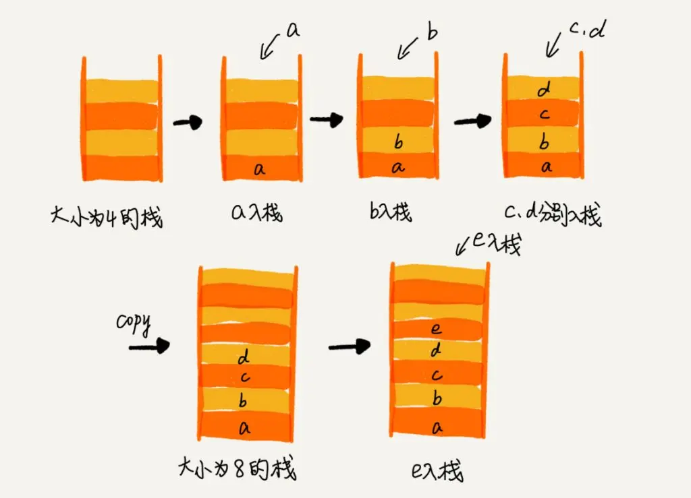

## 什么是栈

喜欢玩羽毛球或者乒乓球的童鞋都知道，都是用羽毛球筒装羽毛球，羽毛球筒的特点就是其中一端是封闭的，另一端是可以置入或者取出羽毛球的。栈就类似于这种球筒，特点也是其中一端是封闭的，另一端是用来操作数据的。

从数据的逻辑结构角度来看，栈也是线性表，其特殊性在于栈的基本操作是线性表操作的子集，它是操作受限的线性表。。

从数据的物理结构角度来看，基于数组实现的栈叫做顺序栈，基于链表实现的栈叫做链式栈。

从操作栈的角度来看，他有两种基本的操作：

1. 压栈（push）：将数据插入到栈顶。
2. 出栈（pop）：将栈顶元素弹出。

栈的特点：先进后出，后进先出。

## 栈的基本操作

### 操作详解



如图所示，可以清晰地看到，只有一个方向可以对栈内的元素进行操作，栈中最下面的一个元素成为栈底。

如果是基于数组实现的栈，一般是数组下标为0的元素作为栈底元素，下标为`length - 1`的元素作为栈顶元素。

如果是基于链表实现的栈，一般是链表的head指针作为栈顶元素。

定义一个栈需要有一个初始的大小，这就是栈的初始容量。当需要放入的元素大于这个容量时，如果是基于数组实现的栈，就需要进行扩容，如果是基于链表实现的栈则不需要。

栈出入元素的操作如下。例如我们初始化一个长度为 10 的数组，并向其中放入元素，根据栈的定义，只能从数组的一端放入元素，我们设定这一端为数组中较大下标的方向。我们放入第 1 个元素，由于栈内没有元素，于是第 1 个元素就落到了数组的第 0 个下标的位置上；接着放入第 2 个元素，第 2 个元素该放入下标为 1 的位置上；以此类推，当放入了 5 个元素时，第 5 个入栈的元素应该在数组的第 4 个下标的位置上。

### 代码实现

#### 定义抽象类型

`Stack.java`

```java
interface Stack<T> extends Iterable<T>{

  // 返回栈中的元素个数
  int size();

  // 检查栈是否为空
  default boolean isEmpty(){
   return size() == 0;
  }

  // 从栈中弹出一个元素
  // 如果栈空就抛出一个异常
  T pop();

  // 查看栈顶元素(并不移除)
  // 如果栈空就抛出一个异常
  T peek();

  // 将一个元素入栈
  void push(T elem);
}
```

#### 基于数组实现的栈

`ArrayStack.java`

```java
public class ArrayStack<T> implements Stack<T>{
  private int size;
  private int capacity;
  private Object[] data;
  private static final int DEFAULT_CAPACITY = 2 << 3;

  public ArrayStack() {
    this(DEFAULT_CAPACITY);
  }

  public ArrayStack(int capacity) {
    this.size = 0;
    this.capacity = capacity;
    this.data = new Object[capacity];
  }

  // 返回栈中的元素个数
  @Override
  public int size() {
    return size;
  }

  // 从栈中弹出一个元素
  // 如果栈空就抛出一个异常
  @Override
  public T pop() {
    if (isEmpty()) {
      throw new EmptyStackException();
    }
    T element = element(--size);
    data[size] = null;
    return element;
  }

  // 查看栈顶元素(并不移除)
  // 如果栈空就抛出一个异常
  @Override
  public T peek() {
    if (isEmpty()) {
      throw new EmptyStackException();
    }
    return element(size - 1);
  }

  // 将一个元素入栈
  @Override
  public void push(T elem) {
    // 扩容
    if (size == capacity) {
      doubleCapacity();
    }
    data[size++] = elem;
  }

  private void doubleCapacity() {
    int newCapacity = capacity << 1;
    Object[] newData = new Object[newCapacity];
    System.arraycopy(data, 0, newData, 0, size);
    data = newData;
  }

  @SuppressWarnings("unchecked")
  private T element(int index) {
    return (T) data[index];
  }

  // 支持以迭代器方式对栈进行遍历
  @Override
  public Iterator<T> iterator() {
    return new Iterator<T>() {
      private int index = size - 1;

      public boolean hasNext() {
        return index >= 0;
      }

      public T next() {
        return element(index--);
      }

      public void remove() {
        throw new UnsupportedOperationException();
      }
    };
  }
}
```

#### 基于链表实现的栈

`ListStack.java`

```java
public class ListStack<T> implements Stack<T> {

  private Node<T> top;

  private int size;

  // 返回栈中的元素个数
  @Override
  public int size() {
    return size;
  }

  // 从栈中弹出一个元素
  // 如果栈空就抛出一个异常
  @Override
  public T pop() {
    if (top == null) {
      throw new EmptyStackException();
    }
    T value = top.data;
    top = top.next;
    size--;
    return value;
  }

  // 查看栈顶元素(并不移除)
  // 如果栈空就抛出一个异常
  @Override
  public T peek() {
    if (top == null) {
      throw new EmptyStackException();
    }
    return top.data;
  }

  // 将一个元素入栈
  @Override
  public void push(T elem) {
    Node<T> newNode = new Node<T>(elem, null);
    if (top != null) {
      newNode.next = top;
    }
    top = newNode;
    size++;
  }

  // 支持以迭代器方式对栈进行遍历
  @Override
  public Iterator<T> iterator() {
    // YOUR CODE HERE
    return new Iterator<T>() {
      private int index = 0;

      @Override
      public boolean hasNext() {
        return index < size;
      }

      @Override
      public T next() {
        return get(index++);
      }
    };
  }

  public T get(int index) {
    checkIndex(index);
    Node<T> p = top;
    int pos = 0;
    while (p != null && index != pos) {
      p = p.next;
      pos++;
    }
    return p.data;
  }

  private void checkIndex(int index) {
    if (index < 0 || index >= size) {
      throw new IndexOutOfBoundsException(String.format("Index: %d, Size: %d", index, size));
    }
  }

  private static class Node<T> {

    private T data;
    private Node<T> next;

    public Node(T data, Node<T> next) {
      this.data = data;
      this.next = next;
    }
  }
}
```

### 复杂度分析

| 操作       | 时间复杂度 |
| ---------- | ---------- |
| 入栈(push) | `O(1)`     |
| 出栈(pop)  | `O(1)`     |
| 查看(peek) | `O(1)`     |

## 栈的应用场景

* 实现文本编辑器的相反(undo)机制。

* 在编译器语法检查中匹配括号。

* 可以建模一堆书或者碟子。

* 递归。
* 函数调用链。

* 深度优先搜索(DFS)算法 。
* 回溯算法。
* 表达式求值，进制转换。
* 浏览器上一页，下一页，歌曲上一首下一首。
* 利用栈实现队列。
* 逆序输出。

**例子：**在编译器语法检查中匹配括号，参考[leetcode](https://leetcode.com/problems/valid-parentheses/)

给定一个只包括` '('，')'，'{'，'}'，'['，']' `的字符串，判断字符串是否有效。

有效字符串需满足：

* 左括号必须用相同类型的右括号闭合。
* 左括号必须以正确的顺序闭合。

注意空字符串可被认为是有效字符串。

```
示例 1:
	输入: "()"
	输出: true

示例 2:
	输入: "()[]{}"
	输出: true

示例 3:
	输入: "(]"
	输出: false
	
示例 4:
	输入: "([)]"
	输出: false
	
示例 5:
	输入: "{[]}"
	输出: true
```

如何使用栈来实现？

有下面几种情况

1. 如果字符串的长度不是偶数，那肯定匹配有问题，成双成对才行。
2. 如果字符串为null，或者字符串是空字符串直接返回true。
3. 每次遇到左括号，那就入栈。如果遇到右括号，那就从栈里取出栈顶元素，跟右括号进行匹配。
   * 如果pop出来的是空的或者不匹配，直接返回false。
   * 栈空了，并且没有左括号了，然而还有字符串，直接返回false。

```java
public class ValidParentheses {

  public boolean isValid(String s) {
    if (null == s || s.isEmpty()) {
      return true;
    }
    int length = s.length();
    if (length % 2 == 1) {
      return false;
    }
    Deque<Character> stack = new ArrayDeque<>();
    char[] chars = s.toCharArray();
    for (char c : chars) {
      switch (c) {
        case '[':
        case '{':
        case '(':
        case '<':
          stack.push(c);
          break;
        case ')':
          if (!stack.isEmpty() && stack.pop() == '(') {
            break;
          } else {
            return false;
          }
        case '}':
          if (!stack.isEmpty() && stack.pop() == '{') {
            break;
          } else {
            return false;
          }
        case ']':
          if (!stack.isEmpty() && stack.pop() == '[') {
            break;
          } else {
            return false;
          }
        case '>':
          if (!stack.isEmpty() && stack.pop() == '<') {
            break;
          } else {
            return false;
          }
      }
    }
    return stack.isEmpty();
  }
}
```