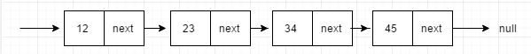
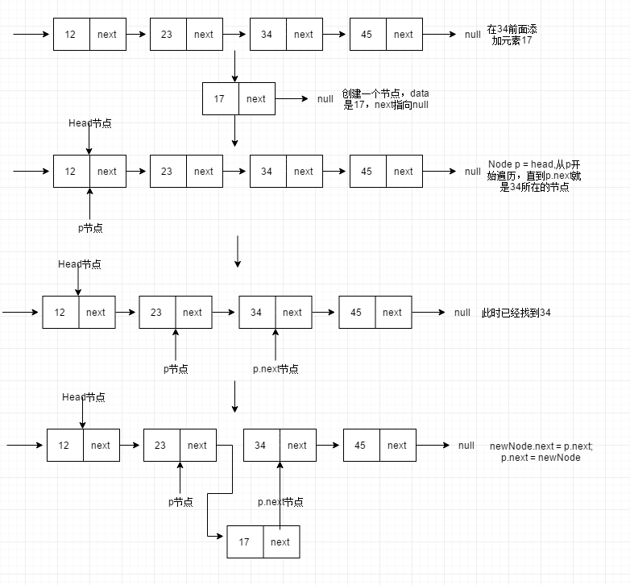
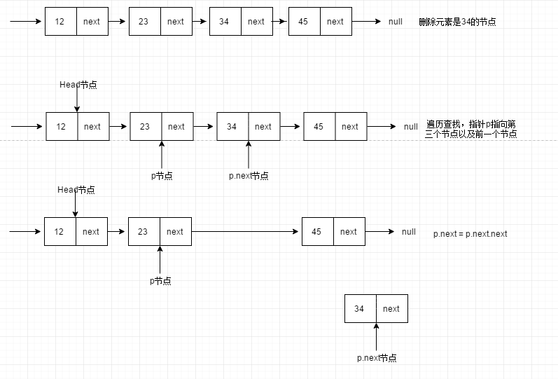
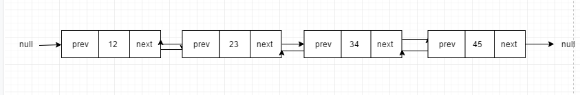
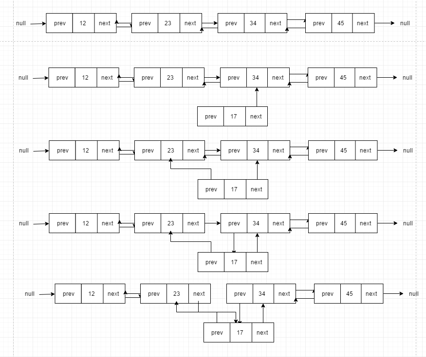
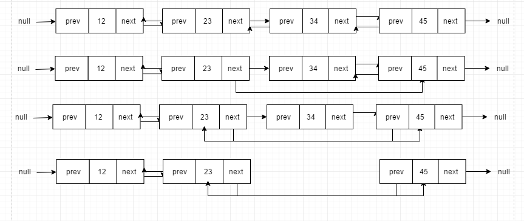
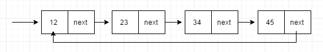

本篇主要是讨论另外一种最基本的数据结构-链表，所有物理结构是由链表组成的，可以称之为链式存储结构。

## 链表的基本概念

### 什么是链表

链表`（Linked list）`是一种常见的基础数据结构，是一种线性表，但是并不会按线性的顺序存储数据，而是在每一个节点里存到下一个节点的指针`(Pointer)`。由于不必须按顺序存储，链表在插入的时候可以达到`O(1)`的复杂度，比另一种线性表顺序表快得多，但是查找一个节点或者访问特定编号的节点则需要`O(n)`的时间，而顺序表相应的时间复杂度分别是`O(logn)`和`O(1)`。

### 链表的分类

#### 单向链表

链表中最简单的一种是单向链表，它包含两个域，一个信息域`(data)`和一个指针域`(next)`。这个链接指向列表中的下一个节点，而最后一个节点则指向一个空值。



一个单向链表的节点被分成两个部分。第一个部分保存或者显示关于节点的信息，第二个部分存储下一个节点的地址。单向链表只可向一个方向遍历。

其中，有两个结点比较特殊。开头的结点，我们称之为头结点，最后的结点，我们称之为尾结点。头结点存储的是内存的首地址值，有了它，我们才可以遍历整个链表。尾结点存储的是null指针，表示下面没有了，不要再遍历下去了。

接下来看看单向链表如何实现插入，删除操作。

**插入操作：**



我们现在要在第三个节点之前（也就是37）添加元素17：

1. 创建一个新的节点17，next首先指向null。
2. 需要创建一个指向Head节点的指针p，遍历链表，直到找到第三个节点以及它的前一个节点，图中所示，就是23节点。
3. 最后指针p是指向23，p.next指向34，这个时候可以插入元素17。
4. 先将新节点的next指针指向p.next，也就是34这个节点。
5. 然后再将p.next指向新节点，也就是17。

**删除操作：**



1. 需要创建一个指向Head节点的指针p，遍历链表，直到找到第三个节点以及它的前一个节点，图中所示，就是23节点。
2. 最后指针p是指向23，p.next指向34。
3. p.next指针指向p.next.next。

**代码实现**

```java
public class SingleLinkedList<T> implements Iterable<T> {

  /** 头结点 */
  private Node<T> head;
  /** 单向链表实际大小 */
  private int size;

  public void add(T t) {
    Node<T> newNode = new Node<>(t);
    if (head == null) {
      head = newNode;
      size++;
      return;
    }
    Node<T> p = head;
    while (p.next != null) {
      p = p.next;
    }
    p.next = newNode;
    size++;
  }

  public void add(int index, T t) {
    Node<T> node = findByIndex(index);
    addBefore(node, t);
  }

  public void addFirst(T t) {
    Node<T> newNode = new Node<>(t);
    if (head == null) {
      head = newNode;
      size++;
      return;
    }
    newNode.next = head;
    head = newNode;
    size++;
  }

  public void addLast(T t) {
    add(t);
  }

  public void addBefore(T data, T value) {
    addBefore(findByItem(data), value);
  }

  public void addAfter(T data, T value) {
    addAfter(findByItem(data), value);
  }

  public void set(int index, T t) {
    Node<T> node = findByIndex(index);
    node.data = t;
  }

  public T remove(int index) {
    Node<T> node = findByIndex(index);
    boolean b = deleteByNode(node);
    if (b) {
      size--;
      return node.data;
    }
    return null;
  }

  public boolean remove(Object o) {
    Node<T> node = findByItem(o);
    boolean b = deleteByNode(node);
    if (b) {
      size--;
    }
    return b;
  }

  public T get(int index) {
    checkIndex(index);
    Node<T> p = head;
    int pos = 0;
    while (p != null && index != pos) {
      p = p.next;
      pos++;
    }
    return p.data;
  }

  public void clear() {
    Node<T> p = head;
    while (p != null) {
      Node<T> q = p.next;
      p.data = null;
      p.next = null;
      p = q;
    }
    size = 0;
  }

  public int indexOf(Object o) {
    Node<T> p = head;
    int index = 0;
    if (o == null) {
      while (p != null && p.data != null) {
        p = p.next;
        index++;
      }
    } else {
      while (p != null && !p.data.equals(o)) {
        p = p.next;
        index++;
      }
    }
    if (p == null) {
      return -1;
    }
    return index;
  }

  public int size() {
    return size;
  }

  public boolean isEmpty() {
    return size() == 0;
  }

  public boolean contains(T t) {
    return indexOf(t) != -1;
  }

  public Iterator<T> iterator() {
    return new Iterator<T>() {
      private int index = 0;

      public boolean hasNext() {
        return index < size;
      }

      public T next() {
        return get(index++);
      }

      public void remove() {
        throw new UnsupportedOperationException();
      }
    };
  }

  @Override
  public String toString() {
    if (size == 0 || head == null) {
      return "[]";
    }
    StringBuilder builder = new StringBuilder();
    Node<T> p = head;
    while (p.next != null) {
      builder.append(p.data).append(", ");
      p = p.next;
    }
    builder.append(p.data);
    return String.format("Size: %d, Data: [%s]", size, builder.toString());
  }

  private void addBefore(Node<T> node, T t) {
    if (node == null) {
      return;
    }
    if (node.equals(head)) {
      addFirst(t);
      return;
    }
    Node<T> p = head;
    while (p != null && !p.next.equals(node)) {
      p = p.next;
    }
    if (p == null) {
      return;
    }
    Node<T> newNode = new Node<>(t);
    newNode.next = node;
    p.next = newNode;
    size++;
  }

  private void addAfter(Node<T> node, T t) {
    if (node == null) {
      return;
    }
    Node<T> newNode = new Node<>(t);
    newNode.next = node.next;
    node.next = newNode;
    size++;
  }

  private Node<T> findByItem(Object item) {
    Node<T> p = head;
    if (item == null) {
      while (p != null && p.data != null) {
        p = p.next;
      }
    } else {
      while (p != null && !p.data.equals(item)) {
        p = p.next;
      }
    }

    return p;
  }

  private Node<T> findByIndex(int index) {
    checkIndex(index);
    Node<T> p = head;
    int pos = 0;
    while (p != null && index != pos) {
      p = p.next;
      pos++;
    }
    return p;
  }

  private boolean deleteByNode(Node node) {
    if (node == null || head == null) {
      return false;
    }
    if (node == head) {
      head = head.next;
      return true;
    }
    Node p = head;
    while (p != null && p.next != node) {
      p = p.next;
    }
    if (p == null) {
      return false;
    }
    p.next = p.next.next;
    return true;
  }

  private void checkIndex(int index) {
    if (index < 0 || index >= size) {
      throw new IndexOutOfBoundsException(String.format("Index: %d, Size: %d", index, size));
    }
  }

  private static class Node<T> {
    private T data;
    private Node<T> next;

    public Node(T data) {
      this(data, null);
    }

    public Node(T data, Node<T> next) {
      this.data = data;
      this.next = next;
    }

    @Override
    public String toString() {
      if (data == null) {
        return "";
      }
      return data.toString();
    }
  }
}
```

#### 双向链表

对比单向链表，双向链表，还需要一个前驱结点指针prev指向前面的结点。



从双向链表的概念图里可以发现，如果存储相同的数据，双向链表需要的内存空间更多。双向链表的诞生，就是典型的空间换时间的设计思想，尽管双向链表的内存多，但是操作的效率高。

**插入操作：**

​	



我们现在要在第三个节点之前（也就是37）添加元素17：

1. 创建一个新的节点17，next首先指向null。
2. 需要创建一个指向Head节点的指针p，遍历链表，直到找到第三个节点以及它的前一个节点，图中所示，就是23节点。
3. 最后指针p是指向23，p.next指向34，这个时候可以插入元素17。
4. 先将新节点的next指针指向p.next，也就是34这个节点。
5. 再将新节点的prev指针指向p，也就是23。
6. 再将p.next.prev指向新节点。
7. 再讲p.next指向新节点。

删除操作：



1. 需要创建一个指向Head节点的指针p，遍历链表，直到找到第三个节点以及它的前一个节点，图中所示，就是23节点。
2. 最后指针p是指向23，p.next指向34。
3. p.next指针指向p.next.next。
4. p.next.next.prev = p。

**代码实现**

```java
public class DoublyLinkedList<T> implements Iterable<T> {

  private Node<T> head;

  private Node<T> tail;

  private int size;

  // 将链表清空，O(n)
  public void clear() {
    Node<T> p = head;
    while (p != null) {
      Node<T> temp = p.next;
      p.next = null;
      p.prev = null;
      p.data = null;
      p = temp;
    }
    head = tail = null;
    size = 0;
  }

  // 返回链表的长度
  public int size() {
    return size;
  }

  // 判断链表是否为空
  public boolean isEmpty() {
    return size() == 0;
  }

  // 向链表的尾部添加一个元素, O(1)
  public void add(T t) {
    addLast(t);
  }

  // 向链表的尾部添加一个元素, O(1)
  public void addLast(T t) {
    if (isEmpty()) {
      head = tail = new Node<>(t, null, null);
      size++;
      return;
    }
    tail.next = new Node<>(t, tail, null);
    tail = tail.next;
    size++;
  }

  // 在链表的头部添加一个元素，O(1)
  public void addFirst(T t) {
    if (isEmpty()) {
      head = tail = new Node<>(t, null, null);
      size++;
      return;
    }
    head.prev = new Node<>(t, null, head);
    head = head.prev;
    size++;
  }

  // 向指定的索引位置添加一个元素
  public void addAt(int index, T data) throws Exception {
    checkIndexForAdd(index);
    if (index == 0) {
      addFirst(data);
      return;
    }
    if (index == size) {
      addLast(data);
      return;
    }
    Node<T> p = head;
    int pos = 0;
    while (p != null && index != pos) {
      p = p.next;
      pos++;
    }
    Node<T> node = new Node<>(data, p, p.next);
    p.next = node;
    p.next.prev = node;
    size++;
  }

  public void addBefore(T item, T value) {
    addBefore(findByItem(item), value);
  }

  public void addAfter(T item, T value) {
    addAfter(findByItem(item), value);
  }

  // 获取第一个节点的值，如果存在的话, O(1)
  public T peekFirst() {
    return isEmpty() ? null : head.data;
  }

  // 获取最后一个节点的值，如果存在的话，O(1)
  public T peekLast() {
    return isEmpty() ? null : tail.data;
  }

  // 移除链表中的头部节点，并返回它的值，O(1)
  public T removeFirst() {
    if (isEmpty()) {
      throw new NoSuchElementException();
    }
    T data = head.data;
    head = head.next;
    --size;
    if (isEmpty()) {
      tail = null;
    } else {
      head.prev = null;
    }
    return data;
  }

  // 移除链表中的最后一个节点，并返回它的值，O(1)
  public T removeLast() {
    if (isEmpty()) {
      throw new NoSuchElementException();
    }
    T data = tail.data;
    tail = tail.prev;
    --size;
    if (isEmpty()) {
      head = null;
    } else {
      tail.next = null;
    }
    return data;
  }

  // 移除链表中的一个指定的节点，O(1)
  // 内部使用
  private T remove(Node<T> node) {
    if (node == null) {
      return null;
    }
    T data = node.data;
    if (node.prev == null) {
      return removeFirst();
    }
    if (node.next == null) {
      return removeLast();
    }
    node.next.prev = node.prev;
    node.prev.next = node.next;
    size--;
    node.data = null;
    node = node.prev = node.next = null;
    return data;
  }

  // 移除指定索引位置的节点，O(n)
  public T removeAt(int index) {
    return remove(findByIndex(index));
  }

  // 在链表中移除指定的对象, O(n)
  public boolean remove(Object obj) {
    Node<T> p = findByItem(obj);
    if (p == null) {
      return false;
    }
    remove(p);
    return true;
  }

  // 查找指定对象在链表中的索引, O(n)
  public int indexOf(Object obj) {
    Node<T> p = head;
    int pos = 0;
    if (obj == null) {
      while (p != null && p.data != null) {
        p = p.next;
        pos++;
      }
    } else {
      while (p != null && !obj.equals(p.data)) {
        p = p.next;
        pos++;
      }
    }
    return pos;
  }

  public int lastIndexOf(Object obj) {
    Node<T> p = tail;
    int pos = size - 1;
    if (obj == null) {
      while (p != null && p.data != null) {
        p = p.prev;
        pos--;
      }
    } else {
      while (p != null && !obj.equals(p.data)) {
        p = p.prev;
        pos--;
      }
    }
    return pos;
  }

  public T get(int index) {
    return findByIndex(index).data;
  }

  // 检查链表中是否包含某个值
  public boolean contains(Object obj) {
    return indexOf(obj) != -1;
  }

  @Override
  public Iterator<T> iterator() {
    return new Iterator<T>() {
      private Node<T> p = head;

      @Override
      public boolean hasNext() {
        return p != null;
      }

      @Override
      public T next() {
        T data = p.data;
        p = p.next;
        return data;
      }

      @Override
      public void remove() {
        throw new UnsupportedOperationException();
      }
    };
  }

  @Override
  public String toString() {
    StringBuilder sb = new StringBuilder();
    sb.append("[ ");
    Node<T> p = head;
    while (p != null) {
      sb.append(p.data);
      if (p.next != null) {
        sb.append(", ");
      }
      p = p.next;
    }
    sb.append(" ]");
    return sb.toString();
  }

  private void checkIndexForAdd(int index) {
    if (index < 0 || index > size) {
      throw new IndexOutOfBoundsException(String.format("Index: %d, Size: ", index, size));
    }
  }

  private void checkIndex(int index) {
    if (index < 0 || index >= size) {
      throw new IndexOutOfBoundsException(String.format("Index: %d, Size: %d", index, size));
    }
  }

  private Node<T> findByIndex(int index) {
    checkIndex(index);
    Node<T> p;
    int pos;
    if (index < (size << 1)) {
      p = head;
      pos = 0;
      while (p != null && pos != index) {
        p = p.next;
        pos++;
      }
    } else {
      p = tail;
      pos = size - 1;
      while (p != null && pos != index) {
        p = p.prev;
        pos--;
      }
    }
    return p;
  }

  private Node<T> findByItem(Object obj) {
    Node<T> p = head;
    if (obj == null) {
      while (p != null && p.data != null) {
        p = p.next;
      }
    } else {
      while (p != null && !obj.equals(p.data)) {
        p = p.next;
      }
    }
    return p;
  }

  private void addBefore(Node<T> node, T value) {
    if (isEmpty() || node == null) {
      return;
    }
    Node<T> p = tail;
    while (p != null && p != node) {
      p = p.prev;
    }
    if (p == null) {
      return;
    }
    if (p.prev == null) {
      addFirst(value);
      return;
    }
    Node<T> newNode = new Node<>(value, null, null);
    newNode.next = p;
    newNode.prev = p.prev;
    p.prev.next = newNode;
    p.prev = newNode;
    size++;
  }

  private void addAfter(Node<T> node, T value) {
    if (head == null || node == null) {
      return;
    }
    Node<T> p = head;
    while (p != null && p != node) {
      p = p.next;
    }
    if (p == null) {
      return;
    }
    if (p.next == null) {
      addLast(value);
      return;
    }
    Node<T> newLink = new Node<>(value, null, null);
    newLink.next = p.next;
    newLink.prev = p;
    p.next.prev = newLink;
    p.next = newLink;
    size++;
  }

  // 内部节点类
  private static class Node<T> {
    private T data; // 数据
    private Node<T> prev, next; // 前向和后向指针

    public Node(T data, Node<T> prev, Node<T> next) {
      this.data = data;
      this.prev = prev;
      this.next = next;
    }

    @Override
    public String toString() {
      if (data == null) {
        return "null";
      }
      return data.toString();
    }
  }
}
```

#### 循环链表

在一个 **循环链表**中, 首节点和末节点被连接在一起。这种方式在单向和双向链表中皆可实现。要转换一个循环链表，你开始于任意一个节点然后沿着列表的任一方向直到返回开始的节点。再来看另一种方法，循环链表可以被视为“无头无尾”。这种列表很利于节约数据存储缓存， 假定你在一个列表中有一个对象并且希望所有其他对象迭代在一个非特殊的排列下。

指向整个列表的指针可以被称作访问指针。



代码实现：

```java
public class CircleLinkedList<E> {
  private int size;

  private Node<E> head;

  public CircleLinkedList() {
    head = new Node<E>(null, head);
    size = 0;
  }

  public void append(E value) {
    if (value == null) {
      throw new NullPointerException("Cannot add null element to the list");
    }
    head.next = new Node<E>(value, head);
    size++;
  }

  public E remove(int pos) {
    if (pos > size || pos < 0) {
      throw new IndexOutOfBoundsException("position cannot be greater than size or negative");
    }
    Node<E> iterator = head.next;
    Node<E> before = head;
    for (int i = 1; i <= pos; i++) {
      iterator = iterator.next;
      before = before.next;
    }
    E saved = iterator.value;
    before.next = iterator.next;
    iterator.next = null;
    iterator.value = null;
    return saved;
  }

  private static class Node<E> {

    Node<E> next;
    E value;

    private Node(E value, Node<E> next) {
      this.value = value;
      this.next = next;
    }
  }
}
```

## 链表vs数组

|            | 动态数组 | 单向链表 | 双向链表 |
| ---------- | -------- | -------- | -------- |
| 查找       | `o(n)`   | `o(n)`   | `o(n)`   |
| 随机访问   | `o(1)`   | NA       | NA       |
| 中部插入   | `o(1)`   | `o(n)`   | `o(n)`   |
| 插入头结点 | `o(n)`   | `o(1)`   | `o(1)`   |
| 插入尾结点 | `o(n)`   | `o(1)`   | `o(1)`   |
| 中部移除   | `o(n)`   | `o(n)`   | `o(n)`   |
| 头部移除   | `o(n)`   | `o(1)`   | `o(1)`   |
| 尾部移除   | `o(1)`   | `o(n)`   | `o(1)`   |

数组是需要申请一个连续的内存空间，可以利用cpu的缓存机制，预读数组中的数据，所以访问效率更高。但是链表不行。

数组的大小固定，如果声明的数组过大，系统没有足够的内存空间申请给它就会报OOM，导致申请失败，但是链表不会。

