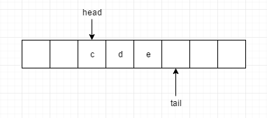
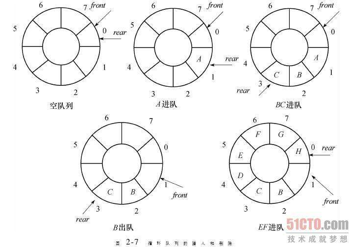

## 什么是队列？

之前探讨过一种先进后出的数据结构-[栈](./栈.md)，那是否有先进先出的数据结构呢？这就是我们本篇需要讨论的另外一种操作受限的数据结构-队列。

队列（queue）是一种操作受限的线性表，只允许在表的一端进行插入操作（**入队enqueue**）而在另一端进行删除（**出队dequeue**）的线性表。进行插入操作的端称为**队尾**，进行删除操作的一端称为**队头**。队列中没有数据元素时称为空队列。

队列的操作是**按照先进先出（first in first out）或后进后出（last in last out）的原则进行的。因此，队列又被称为FIFO表。**

## 队列的分类

### 单向队列（普通队列）

相对于栈比较而言，队列的实现稍微复杂点，栈的实现我们只需要一个栈顶指针就可以了，但是队列需要两个指针，一个是head指针，指向队头，一个是tail指针，指向队尾。tail指针的任务就是寻找空位。


1. 如果我们需要插入`f`字符串，那么我们只需要执行`queue[tail] = f`即可。
2. 此时`head = 0 tail = 6`。
3. 如果我们执行两次出队操作，执行两次`queue[head++] = null`即可。
4. 此时`head = 2 tail = 6`。



### 定义抽象类型

`Queue.java`

```java
public interface Queue<T> extends Iterable<T> {
  void offer(T elem);
  T poll();
  T peek();
  int size();
  boolean isEmpty();
}
```

#### 基于数组实现的队列被称为顺序队列

如何判断队空还是队满？

队空：`tail = queue.length`

队满：`head = tail`

**代码实现**

```java
public class ArrayQueue<T> implements Queue<T> {

  private Object[] data;
  private int head;
  private int tail;
  private int size;
  private int capacity;
  private static final int DEFAULT_CAPACITY = 10;

  public ArrayQueue() {
    this(DEFAULT_CAPACITY);
  }

  public ArrayQueue(int capacity) {
    this.data = new Object[capacity];
    this.head = 0;
    this.tail = 0;
    this.capacity = capacity;
  }

  @Override
  public void offer(T elem) {
    if (tail == capacity) {
      return;
    }
    data[tail++] = elem;
    size++;
  }

  @Override
  public T poll() {
    if (isEmpty()) {
      throw new NoSuchElementException("queue is empty!");
    }
    T t = element(head);
    data[head] = null;
    head++;
    size--;
    return t;
  }

  @Override
  public T peek() {
    if (isEmpty()) {
      throw new NoSuchElementException("queue is empty!");
    }
    T t = element(head);
    return t;
  }

  @Override
  public int size() {
    return size;
  }

  @Override
  public boolean isEmpty() {
    return head == tail;
  }

  @SuppressWarnings("unchecked")
  private T element(int index) {
    return (T) data[index];
  }

  @Override
  public Iterator<T> iterator() {
    return new Iterator<T>() {
      private int index = head;

      @Override
      public boolean hasNext() {
        return index < tail;
      }

      @Override
      public T next() {
        return element(index++);
      }

      @Override
      public void remove() {
        throw new UnsupportedOperationException();
      }
    };
  }
}
```

基于数组实现的队列会有这样一种情况：

例如上述的例子，出队两次之后，`head = 2 tail = 6`，head之前的两个位置就会空着，但是我们队满的判断是`tail == capacity`，所以出队的话，head总要自增，之前的位置就为空，如果此时tail移到最右边，head之前还有位置，此时的队列是不满的，然而要入队的话可能就会导致入队失败，那么我们需要对入队的代码，优化下。


那么我们怎么实现，head前面的位置是空，我们还能执行入队操作呢，对！就是利用数据搬移的技术。代码如下：

```java
// moved是否需要数据搬移
public void enqueue(T elem, boolean moved) {
    if (elem == null) {
      throw new NullPointerException();
    }
    if (isFull()) {
      doubleCapacity();
    }
    if (head != 0 && tail == capacity && moved) {
      System.arraycopy(data, head, data, 0, tail - head);
      for (int i = 0; i < head; i++) {
        data[data.length - i - 1] = null;
      }
      tail -= head;
      head = 0;
    }
    data[tail++] = elem;
    size++;
 }
```

实际上，基于数组实现的队列还有一个问题，就是需要初始化数组大小，如果队满就不能添加元素，所以想要添加元素，我们可以使用动态数组来实现，对内部数组进行扩容，代码如下：

```java
private void doubleCapacity() {
  int newCapacity = capacity << 1;
  if (newCapacity < 0) {
    throw new IllegalStateException("illegal Capacity: " + newCapacity);
  }
  Object[] newData = new Object[newCapacity];
  System.arraycopy(data, head, newData, 0, tail - head);
  data = newData;
}
```

不过还是建议不要扩容，不要使用数组来实现无界队列，想要实现无界队列，可以使用链表。

#### 基于链表实现的队列被称为链式队列

```java
public class LinkedQueue<T> implements Queue<T> {

  private Node<T> head;
  private Node<T> tail;

  private int size;

  @Override
  public void offer(T elem) {
    if (tail == null) {
      Node<T> newNode = new Node<>(elem, null);
      head = newNode;
      tail = newNode;
    } else {
      tail.next = new Node<>(elem, null);
      tail = tail.next;
    }
    size++;
  }

  @Override
  public T poll() {
    if (isEmpty()) {
      throw new NoSuchElementException("queue is empty!");
    }
    T value = head.data;
    head = head.next;
    if (head == null) {
      tail = null;
    }
    size--;
    return value;
  }

  @Override
  public T peek() {
    if (isEmpty()) {
      throw new NoSuchElementException("queue is empty!");
    }
    T value = head.data;
    return value;
  }

  @Override
  public int size() {
    return size;
  }

  @Override
  public boolean isEmpty() {
    return head == null;
  }

  @Override
  public Iterator<T> iterator() {
    return new Iterator<T>() {
      private Node<T> p = head;

      @Override
      public boolean hasNext() {
        return p != null;
      }

      @Override
      public T next() {
        T data = p.data;
        p = p.next;
        return data;
      }
    };
  }

  private static class Node<T> {
    private T data;
    private Node<T> next;

    public Node(T data, Node<T> next) {
      this.data = data;
      this.next = next;
    }
  }
}
```

基于链表实现的队列，从代码中可以看出，链式队列是不需要扩容，不需要数据搬移，也不需要判断队满，这是一个无界队列。这会引发一个问题，如果无限添加数据，有可能这个队列会很大，造成内存溢出或者其他意想不到的错误。

### 循环队列

我们刚才使用数组来实现的队列，当tail = n && head != 0 的时候，执行入队操作，会有数据搬移的操作，这样入队操作就会受到影响，毕竟数据搬移的操作时间复杂度为`O(n)`。想要解决这个问题，我们可以使用链式队列，但是链式队列也有问题，就是可能会产生内存溢出。那有没有更好的方案去实现呢?

之前我们学过循环链表，那队列是否也可以循环起来利用呢？当`tail == capacity && head != 0`的时候，是否可以将`tail = 0`呢？对，就是这样去实现一个循环队列，这样既能解决入队会有数据搬移的操作，也能解决无界问题，实现有界队列。



注意：**循环队列会浪费一个数组的存储空间**。

就为什么循环队列会浪费一个数组的存储空间，谈谈我对此的理解，首先我们按照顺序队列的入队操作来演示一下。

1. 初始化一个容量为8的循环队列，`front=rear=0`；
2. 如果我们按照之前的顺序队列的实现方案来说的话，A进队，我们需要执行`queue[rear] = A;rear++;`
3. 重复步骤2，因此让`BCDEFG`进队，那此时就是`rear = 7`;
4. 此时H进队，`rear=7`的位置确实有个空位，那H进队以后，执行`queue[rear]=H;`。由于是循环队列，所以执行`rear=0`；
5. 由于rear指针的认为是寻找空位，但是`queue[0]`是有元素的，`rear`不能设置为0，所以应该在rear=7的时候就应该判断出此时已经队满，不能让H进队。
6. 其实主要问题是循环队列判断队满的条件是什么？如果不浪费空间，我们应该如何判断呢？`rear=queue.length?`注意这是循环队列，如果仅仅是这么判断是不行的，`front`指针可能会在任意位置。`rear=front=0`也不能表示队满，也有可能队空。这样确实不好判断，如果要判断，我们可能需要引入第三方变量，也是需要一个额外的空间去存储queue的size。那如果浪费一个存储空间呢？此时队空的判断条件依然是`front==rear`，队满的判断条件`(rear + 1)%queue.length = front`

**代码实现：**

```java
public class ArrayCircularQueue<T> implements Queue<T> {

  private Object[] data;
  private int head;
  private int tail;
  private int n;
  private static final int DEFAULT_CAPACITY = 10;

  public ArrayCircularQueue() {
    this(DEFAULT_CAPACITY);
  }

  public ArrayCircularQueue(int capacity) {
    data = new Object[capacity + 1];
    head = 0;
    tail = 0;
    n = capacity + 1;
  }

  @Override
  public void offer(T elem) {
    if (isFull()) {
      throw new RuntimeException("Queue is full");
    }
    data[tail] = elem;
    tail = adjustIndex(tail);
  }

  @Override
  public T poll() {
    if (isEmpty()) {
      throw new RuntimeException("Queue is empty");
    }
    T element = element(head);
    head = adjustIndex(head);
    return element;
  }

  @Override
  public T peek() {
    if (isEmpty()) {
      throw new RuntimeException("Queue is empty");
    }
    return element(head);
  }

  @Override
  public int size() {
    return (tail + n - head) >= n ? tail - head : tail + n - head;
  }

  @Override
  public boolean isEmpty() {
    return tail == head;
  }

  public boolean isFull() {
    return (tail + 1) % n == head;
  }

  @Override
  public Iterator<T> iterator() {
    return new Iterator<T>() {
      private int p = head;

      @Override
      public boolean hasNext() {
        return p != tail;
      }

      @Override
      public T next() {
        return element(p++);
      }
    };
  }

  private int adjustIndex(int index) {
    return (index + 1) % n;
  }

  @SuppressWarnings("unchecked")
  private T element(int index) {
    return (T) data[index];
  }
}
```

### 双端队列

双端队列（deque）是指允许两端都可以进行入队和出队操作的队列，deque 是 “double ended queue” 的简称。那就说明元素可以从队头出队和入队，也可以从队尾出队和入队。

双端队列也是有两种实现方式

1. 基于数组实现的可以参考Java源码`java.util.ArrayDeque`
2. 基于链表实现的可以参考java源码`java.util.LinkedList`

双端循环队列代码示例：

```java
public class ArrayCircularDeque<T> implements Deque<T> {

  private int head;
  private int tail;
  private Object[] data;
  private int n;

  private static final int DEFAULT_CAPACITY = 10;

  public ArrayCircularDeque() {
    this(DEFAULT_CAPACITY);
  }

  public ArrayCircularDeque(int capacity) {
    data = new Object[capacity + 1];
    head = 0;
    tail = 0;
    n = capacity + 1;
  }

  @Override
  public void offerFirst(T t) {
    if (isFull()) {
      throw new RuntimeException("deque is full");
    }
    head = (head - 1 + n) % n;
    data[head] = t;
  }

  @Override
  public void offerLast(T t) {
    if (isFull()) {
      throw new RuntimeException("deque is full");
    }
    data[tail] = t;
    tail = (tail + 1) % n;
  }

  @Override
  public T pollFirst() {
    if (isEmpty()) {
      throw new RuntimeException("deque is empty");
    }
    T elements = elements(head);
    data[head] = null;
    head = (head + 1) % n;
    return elements;
  }

  @Override
  public T pollLast() {
    if (isEmpty()) {
      throw new RuntimeException("deque is empty");
    }
    T elements = elements(tail);
    data[tail] = null;
    tail = (tail - 1 + n) % n;
    return elements;
  }

  @Override
  public T peekFirst() {
    if (isEmpty()) {
      throw new RuntimeException("deque is empty");
    }
    return elements(head);
  }

  @Override
  public T peekLast() {
    if (isEmpty()) {
      throw new RuntimeException("deque is empty");
    }
    return elements((tail - 1 + n) % n);
  }

  @Override
  public void offer(T elem) {
    offerLast(elem);
  }

  @Override
  public T poll() {
    return pollFirst();
  }

  @Override
  public T peek() {
    return peekFirst();
  }

  @Override
  public int size() {
    return (tail + n - head) >= n ? tail - head : tail + n - head;
  }

  @Override
  public boolean isEmpty() {
    return head == tail;
  }

  public boolean isFull() {
    return (tail + 1) % n == head;
  }

  @Override
  public Iterator<T> iterator() {
    return new Iterator<T>() {
      private int p = head;

      @Override
      public boolean hasNext() {
        return p != tail;
      }

      @Override
      public T next() {
        return elements(p++);
      }
    };
  }

  @SuppressWarnings("unchecked")
  private T elements(int index) {
    return (T) data[index];
  }
}
```

### 其余分类

下面的队列的分类举例，应该都属于队列的使用的实际案例，不太属于队列的分类，我觉得归类为实际使用案例会更加贴切一点吧。下面的代码目前不提供手动代码实现，优先级队列可以等我们讨论堆这样一种数据结构的时候，再来详细的讨论。阻塞队列和并发队列等以后学习并发编程的时候再来详细讨论。下面只提供一些概念上的内容，不提供具体代码实现。

#### 优先级队列

优先队列中的每个元素都有各自的优先级，优先级最高的元素最先得到服务；优先级相同的元素按照其在优先队列中的顺序得到服务。优先队列往往用堆来实现。

`java.util.PriorityQueue`

#### 阻塞队列

简单来说，在队列的基础上加上了阻塞操作。队空的时候，不允许出队，阻塞，等有数据才返回。队满的时候，不允许入队，等有空闲位置才能插入。

那么其实这就是一个典型的，**生产者，消费者模型！！！**

这种基于阻塞队列实现的生产者，消费者模型，可以有效地协调生产和消费的速度。当生产者生产的数据速度过快，消费者来不及消费，存储数据的队列很快满了，这个时候生产者就阻塞等待，直到消费者消费了数据。生产者才会被唤醒继续生产。

我们还可以协调生产者消费者的个数，来提高数据的处理效率。

`java.util.concurrent.ArrayBlockingQueue`

#### 并发队列

最简单的方式就是在enqueue,dequeue方法上加锁，但是锁粒度大并发度会比较低，同一时刻仅允许一个存或者取。实际上，基于数组实现的循环队列，利用CAS原子操作，可以实现非常高效的并发队列，这就是循环队列比链式队列应用更加广泛的原因。

`java.util.concurrent.ConcurrentLinkedQueue`

## 队列的应用场景

1. 线程池，java和python中的并发编程里，在线程池中都有队列的身影。

   线程池没有空闲线程时，新的任务请求线程资源时，线程池该如何处理？各种处理策略又是如何实现的呢？我们一般有两种处理策略。第一种是非阻塞的处理方式，直接拒绝任务请求；另一种是阻塞的处理方式，将请求排队，等到有空闲线程时，取出排队的请求继续处理。那如何存储排队的请求呢？我们希望公平地处理每个**排队**的请求，先进者先服务，**所以队列这种数据结构很适合来存储排队请求**。

   我们前面说过，队列有基于链表和基于数组这两种实现方式。这两种实现方式对于排队请求又有什么区别呢？

   基于链表的实现方式，可以实现一个支持无限排队的无界队列（unbounded queue），但是可能会导致过多的请求排队等待，请求处理的响应时间过长。所以，针对响应时间比较敏感的系统，基于链表实现的无限排队的线程池是不合适的。

   而基于数组实现的有界队列（bounded queue），队列的大小有限，所以线程池中排队的请求超过队列大小时，接下来的请求就会被拒绝，这种方式对响应时间敏感的系统来说，就相对更加合理。不过，设置一个合理的队列大小，也是非常有讲究的。队列太大导致等待的请求太多，队列太小会导致无法充分利用系统资源、发挥最大性能。

   除了前面讲到队列应用在线程池请求**排队**的场景之外，队列可以应用在任何有限资源池中，用于**排队**请求，比如数据库连接池等。实际上，对于大部分资源有限的场景，当没有空闲资源时，基本上都可以通过“队列”这种数据结构来实现请求**排队**。

   除了池化资源还有那些排队场景呢？

   * 超市排队结账
   * 肯德基排队取餐
   * Web服务器请求管理

2. 可以用来跟踪最近添加的X个元素。当队列中超过的x个元素，只要将超过的元素从队头中取出，那么剩下的就是最近添加的x个元素。

   * 经典的滑动窗口算法

3. 广度优先搜索(BFS)图遍历

## 队列的复杂度分析

| 操作    | 复杂度                                       |
| ------- | -------------------------------------------- |
| enqueue | `O(1)`  如果涉及到数据搬移，扩容那就是`o(n)` |
| dequeue | `O(1)`                                       |
| peek    | `O(1)`                                       |

## 栈和队列的区别

1. 栈是先进后出，队列是先进先出。
2. 栈主要是两个操作，入栈，出栈。队列主要是两个操作，入队，出队
3. 栈只允许在一端进行操作，队列只允许一端进行删除，另一端插入。

## 总结

* 队列最大的特点就是先进先出，主要的两个操作是入队和出队。

* 用数组实现的叫顺序队列，用链表实现的叫链式队列。
* 在数组实现队列的时候，会有数据搬移操作，要想解决数据搬移的问题，我们需要循环队列。
* 循环队列最难的地方是要确定好队空和队满的判定条件。
* 循环队列解决了两个问题，数据搬移和无界。
* 循环队列为什么需要浪费一个数组的存储空间，我的理解是为了更方便的判断队满的条件，不需要引入size这个变量，不需要额外的内存空间，如果在并发编程里也无需考虑size变量的线程安全性。
* 双端队列比普通队列的操作更加灵活。
* 其余的高级队列，我的理解是队列的一种应用。例如阻塞队列，并发队列，优先级队列。
* 队列的应用场景很广泛，主要是判断出是否是一个排队的请求。池化资源，订单系统等等。