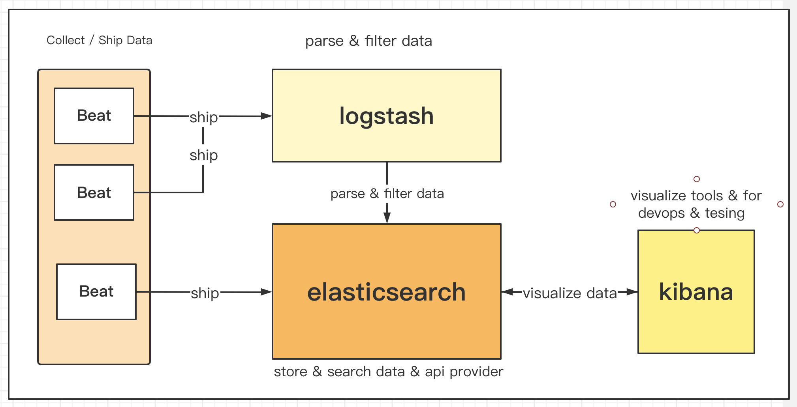

## ElasticSearch
### elasticsearch简介
* elasticsearch是一个基于Lucene库的分布式，支持多租户的全文搜索引擎，也是数据分析引擎。
* elasticsearch是由java开发实现的。
* elasticsearch提供了REST接口和JSON文档，可以被任何编程语言调用
* elasticsearch可以进行近实时搜索和分析任何类型的数据，无论是结构化数据，半结构化数据，非结构化数据。elasticsearch都可以高效地进行存储和快速搜索。
* 高性能，高可用（数据，服务），可水平扩展，易用
* 支持不同节点类型

### elasticsearch的应用场景

* 在应用程序或网站上添加搜索功能

* 存储和分析日志、指标和安全事件数据

* 使用机器学习来实时自动建模数据的行为

* 使用Elasticsearch作为存储引擎来自动化业务工作流

* 使用Elasticsearch作为地理信息系统(GIS)管理、集成和分析空间信息

* 使用Elasticsearch作为生物信息学研究工具存储和处理遗传数据

### elasticsearch家族

#### elasticsearch的生态圈

* `logstash和beats`用于数据抓取
* `elasticsearch`用于数据的存储，分析，计算
* `kibana`用于数据可视化
* `x-pack`主要是商业用途，如安全，监控，告警，图查询，机器学习等。

#### logstash

##### 简介

* 开源的服务端数据处理管道，支持从不同来源采集数据，转换数据，并将数据发送到不同的存储库中。
* 最初用于日志的采集和处理。

##### 特性

* 实时解析和转换数据
* 可扩展
  * 支持200多个插件（日志，数据库，Arcsigh，Netflow）
* 可靠性，安全性
  * logstash会通过持久化队列来保证至少将运行中的事件送达一次
  * 数据传输加密
* 监控

#### kibana

##### 简介

* Kiwi fruit + Banana
* 数据可视化工具，帮助用户解开对数据的任何疑问
* 基于Logstash的工具



Beats层主要负责收集数据，可以直接存储到elastic search，也可以交给logstash进行解析过滤等处理操作，再存储到elastic search，elasticsearch就是存储引擎，提供api用于搜索数据，分析数据等操作，kibana与elasticsearch进行可视化交互。

### elasticsearch的基本概念

#### Document

* elasticsearch是面向document的，document是一个可被索引的基础信息单元
* document会被序列化成json格式，保存在elasticsearch中
  * json对象由字段（field）组成
  * 每个字段都有对应的字段类型，如：字符串/数值/布尔/日期/二进制/范围类型
  * json文档，格式灵活，不需要预先定义格式
  * 字段类型可以指定或者通过elasticsearch自动推算
  * 支持数据，支持嵌套json
* 每个document都有一个unique id
  * 可以自己指定id
  * elasticsearch自动生成

##### Document MetaData

```json
{
  "_index" : "movies",
  "_type" : "_doc",
  "_id" : "37475",
  "_score" : 1.0,
  "_source" : {
    "genre" : [
      "Drama"
    ],
    "id" : "37475",
    "year" : 2005,
    "title" : "Unfinished Life, An",
    "@version" : "1"
  }
}
```

document metaData主要用于标注文档的相关信息

* _index: document所属的index
* _type: document所属的type，现基本都为`_doc`
* _id: document unique id
* _source: json文档内容
* @version: document version
* _score: 相关性打分

#### Index

* index是document的容器，是一类document的结合
* 每个索引都有自己的mapping定义，用于定义包含的文档的字段名和字段类型
* 索引中的数据分散在Shard上，可以通过setting定义不同的数据分布

```json
// index settings
{
    "settings":
    {
        "index":
        {
            "creation_date": "1624690171977",
            "number_of_shards": "1",
            "number_of_replicas": "1",
            "uuid": "HqFyAwvOQ8Ctfwy7Cbwz-A",
            "version":
            {
                "created": "7090299"
            },
            "provided_name": "movies"
        }
    }
}


// index mapping
{
  "mappings": {
    "_doc": {
      "properties": {
        "@version": {
          "type": "text",
          "fields": {
            "keyword": {
              "type": "keyword",
              "ignore_above": 256
            }
          }
        },
        "genre": {
          "type": "text",
          "fields": {
            "keyword": {
              "type": "keyword",
              "ignore_above": 256
            }
          }
        },
        "id": {
          "type": "text",
          "fields": {
            "keyword": {
              "type": "keyword",
              "ignore_above": 256
            }
          }
        },
        "title": {
          "type": "text",
          "fields": {
            "keyword": {
              "type": "keyword",
              "ignore_above": 256
            }
          }
        },
        "year": {
          "type": "long"
        }
      }
    }
  }
}
```

#### Type

在一个索引中，你可以定义一种或多种类型。一个类型是你的索引的一个逻辑上的分类/分区，其语义完全由你来定。通常，会为具有一组相同字段的文档定义一个类型。比如说，我们假设你运营一个博客平台 并且将你所有的数据存储到一个索引中。在这个索引中，你可以为用户数据定义一个类型，为博客数据定义另一个类型，当然，也可以为评论数据定义另一个类型。

需要注意的是：

1. 在7.0之前，一个index可以设置多个types
2. 6.0开始，Type已经被Deprecated。7.0开始，一个索引只能创建一个Type - `_doc`
3. 8.0将会被彻底被废弃

#### Cluster

* 一个elasticsearch集群就是由一个或多个节点组织在一起， 它们共同持有你全部的数据， 并一起提供索引和搜索功能。 
* 一个集群由一个唯一的名字标识， 这个名字默认就是“elasticsearch”。 不同的集群通过不同的名字来区分，可以通过配置文件修改，也可以在启动命令行中加上`-E cluster.name=es_demo`进行指定。

* 保证了系统的高可用性
  * 服务高可用：允许有节点停止服务
  * 数据高可用：部分节点丢失，也不会丢失数据
* 扩展性
  * 请求量/数据的不断增长（将数据分布到所有节点上）
  * 水平扩展，增加节点，节点可以通过指定某个集群的名字，来加入这个集群
* 集群的状态：
  * `Green` - Shard & Replica都正常分配
  * `Yellow` - Shard全部正常分配，Replica未能正常分配。
  * `Red` - 有Shard未能正常分配，例如当服务器的磁盘容量超过了85%时，去创建了一个新的索引。

```shell
# 查看集群状态
curl -i http://192.168.0.41:9200/_cluster/health
```

```json
{
    "cluster_name": "es_demo",
    "status": "yellow",
    "timed_out": false,
    "number_of_nodes": 1,
    "number_of_data_nodes": 1,
    "active_primary_shards": 7,
    "active_shards": 7,
    "relocating_shards": 0,
    "initializing_shards": 0,
    "unassigned_shards": 1,
    "delayed_unassigned_shards": 0,
    "number_of_pending_tasks": 0,
    "number_of_in_flight_fetch": 0,
    "task_max_waiting_in_queue_millis": 0,
    "active_shards_percent_as_number": 87.5
}
```

#### Node

* 节点是一个elasticsearch实例，其本质也是一个java进程，一台服务器上可以运行多个elasticsearch进程，通过修改port，可以实现，但是生产环境一般建议一台机器上只运行一个elasticsearch实例。
* 每个节点都有名字，通过配置文件配置，或者启动的时候在命令行中加上`-E node.name=node1`指定
* 每个节点在启动后，会分配一个unique id,保存在data目录下。
* 节点的分类有很多，不同的节点类型都有着不同的作用。
  * master node & master-eligible node
  * data node & coordinating node
  * Hot & warm node
  * machine learning node
  * tribe node
* 开发环境中一个节点可以承担多个角色，但是在生产环境中，应该设置单一的角色节点(dedicated node)

| 节点类型             | 配置参数    | 默认值                                                       |
| -------------------- | ----------- | ------------------------------------------------------------ |
| master-eligible node | node.master | true                                                         |
| data node            | node.data   | true                                                         |
| ingest               | node.ingest | true                                                         |
| coordinating only    | 无          | 每个节点默认都是coordinating node。设置其他类型全部为false。 |
| machine learning     | node.ml     | true(enable x-pack)                                          |

##### Master Node & Master-eligible Nodes

* 每个节点启动后，默认就是一个master eligible node。可以通过配置文件设置`node.master: false`禁止。
* master eligible node 可以参加选主流程，成为master node。
* 当第一个节点启动的时候，它会将自己选举成master node。
* 每个node上都保存了集群的状态，只有master node才能修改集群的状态信息
  * cluster state，维护了一个集群中的必要信息
    * 所有的node信息
    * 所有的索引和其相关的mapping与setting信息
    * 分片的路由信息
  * 任意节点都能修改信息会导致数据的不一致性

##### Data Node & Coordinating Node

* 可以保存数据的节点，叫做data node。负责保存分片数据，在数据扩展上起到了至关重要的作用。
* Coordinating node负责接受client的请求，将请求分发到合适的节点，最终把结果汇集到一起。
* 每个节点默认都起到了coordinating node的职责。

##### Hot & Warm Node

* 不同硬件配置的data node，可以用来实现hot & warm架构，降低集群部署的成本。

##### Machine Learning Node

* 负责跑ml的job，用来做异常检测。

##### Tribe Node

* Tribe node 连接到不同的es集群，并且支持将这个集群当成一个独立的集群处理。

#### Shard & Replica

* Shard，用于解决数据水平扩展的问题。通过分片，可以将数据分布到集群内的所有节点上。
  * 一个分片是一个运行的lucene的实例
  * 分片数在索引创建的时候通过`number_of_shards`指定，后续不允许修改，除非reindex
* Replica，用于解决数据高可用的问题，是分片的拷贝。
  * Replica数可以动态调整，通过`number_of_replicas`指定
  * 增加replica，还可以在一定程度上提高服务的高可用性。
* 对于生产环境中的分片的设定，需要提前做好容量规划
  * 分片数设置的过小
    * 导致后续无法增加节点实现水平扩展
    * 单个分片的数据量太大，导致数据重新分配耗时。
  * 分片数设置的过大，默认主分片设置成1，解决了over-sharding的问题
    * 影响搜索结果的相关性打分，影响统计结果的准确性。
    * 单个节点上过多的分片，会导致资源的浪费，同时也会影响性能。

#### elasticsearch vs rdbms

| RDBMS  | ElasticSearch |
| ------ | ------------- |
| Table  | Index         |
| Row    | Document      |
| Column | Field         |
| Schema | Mapping       |
| SQL    | DSL           |

elasticsearch高性能的全文检索，不支持事务，不支持JOIN
