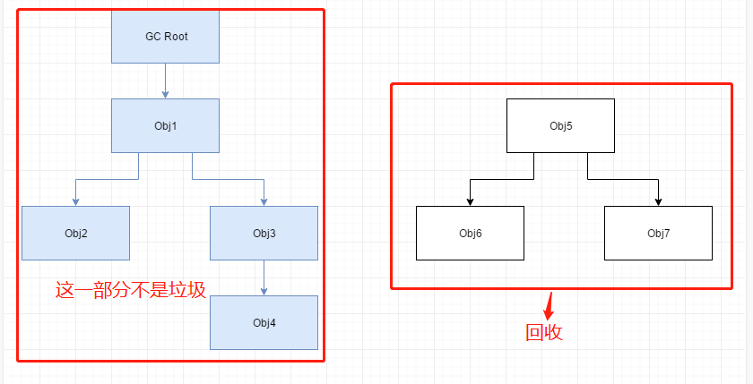
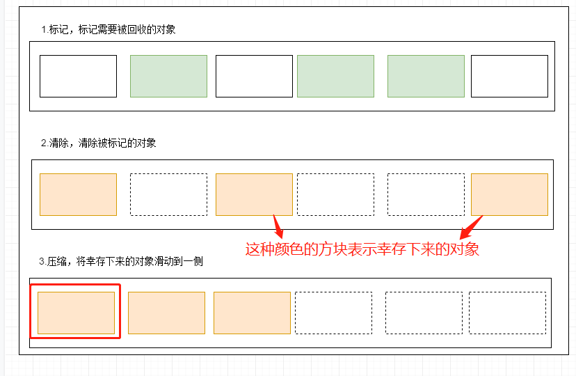

## 回收的是java内存区域的哪些区域


程序计数器，虚拟机栈，本地方法栈是线程私有的，生命周期与线程的生命周期息息相关，**当方法结束或者线程结束时，内存自然也跟着回收了**，所以三个区域一定不会发生垃圾回收

java堆，方法区是垃圾回收的主要区域。

## 如何判断对象为垃圾回收对象
### 引用计数算法

**解释：**

在对象中添加一个引用计数器，当有地方引用这个对象的时候，引用计数器的值+1，当引用失效的时候，计数器的值-1；任何时刻计数器为0的对象就是不可能再被使用的。
**缺点：**

* 计数器维护起来比较麻烦
* 循环引用无法解决

```java
public class TestGc{
    public Object instance = null;
    private static final int _1MB = 1024 * 1024;
    
    private byte[] bigSize = new byte[2 * _1MB];
    
    public static void test(){
        TestGc a = new TestGc();
        TestGc b = new TestGc();
        a.instance = b;
        b.instance = a;
        a = null;
        b = null;
        System.gc();
    }
}
```
### 可达性分析算法
java是通过可达性分析算法来判断对象是否存活。
以gcroot对象为起点，作为一条引用链的链头，如果当一个对象到gcroot没有任何引用链的话，则说明此对象是不可用的，可以被回收。



可以作为gcroot对象的有：

* 虚拟机栈 局部变量表
* 方法区中的静态属性**引用**的对象
* 方法区中的常量**引用**的对象
* 本地方法栈中所**引用**的对象

### 方法区的垃圾回收

回收的两部分内容：

1. 废弃的常量：例如“java”，但是当前系统又没有任何一个字符串对象的值是java，没有字符串对象引用常量池中的"java"常量
2. 不再使用的类型
   - 该类所有的实例都已经被回收，也就是java堆中不存在该类的任何实例。
   - 加载该类的类加载器已经被回收，这个条件除非是经过精心设计的可替换类加载的场景，jsp等，否则很难达成。
   - 该类对应的java.lang.Class对象没有在任何地方被引用，无法在任何地方通过反射访问该类的方法。

## 垃圾回收算法

### 标记-清除算法
首先标记出所有需要回收的对象，在标记完成后统一回收所有被标记的对象。


缺点：

* 效率问题
* 空间问题-会产生大量不连续的内存碎片，空间碎片太多可能导致以后在程序运行过程中需要分配较大的对象时，无法找到足够的连续的内存空间而不得不提前触发一次垃圾回收操作。

### 标记-整理算法

为了解决标记-清除算法会产生大量不连续的内存碎片的问题，对标记-清除算法做了优化，多了一步压缩。



### **<font color="red">复制算法</font>**

作用于新生代，将内存分为一块较大的Eden空间和两块较小的Survivor空间，比例为8:1:1。

每次使用Eden和其中一块Survivor。当回收的时候将Eden和Survivor中还存活着的对象一次性地复制到另外一块Survivor空间上，最后清理掉Eden和刚才用过的Survivor空间，当Survivor空间不够用时，需要依赖老年代进行分配担保。


**绿色方块为幸存对象**

eden和from survivor区里的幸存对象复制到to survivor区，并且清除需要回收的对象。此时之前的to survivor区变成了from survivor区。from survivor区变成了to survivor区，**谁空谁是to**。

**注：当幸存对象经过15次GC还未被回收，那么该对象进入老年代。**

**缺点：**

**内存缩小为原来的一半。**

**在对象存活率较高时就需要进行较多的复制操作，效率将会变低。**

### 分代收集算法

根据对象存活周期的不同将内存划分为几块。

* 新生代-----每次垃圾收集时都发现有大批对象死去，只有少数存活，那就选用复制算法，只需要付出少量存活对象的复制成本，就可以完成收集。
* 老年代-----因为对象存活率高，没有额外空间对它进行分配担保，就必须使用“标记-清理”或者“标记-整理”算法进行回收。
