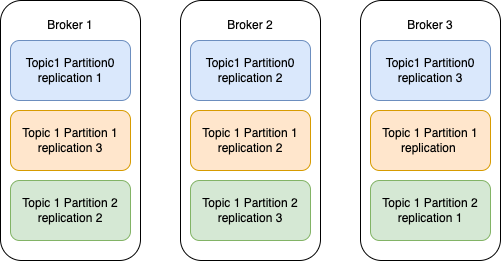
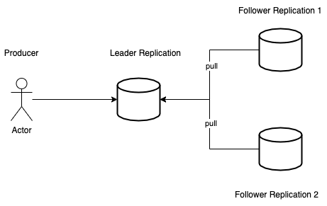
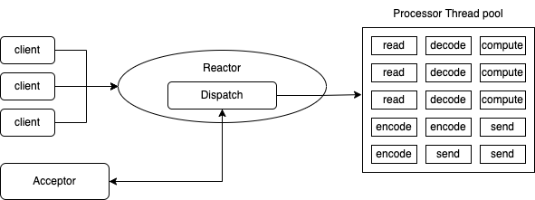
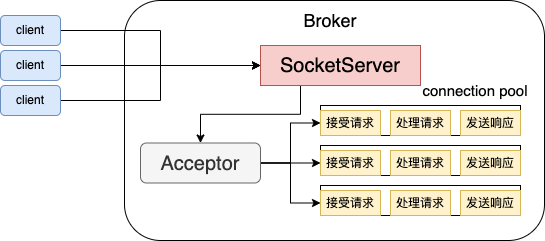

## kafka broker
### zk存储的kafka信息
1. `/brokers/ids/[]`: 记录有哪些broker。
2. `/brokers/topics/[topic_name]/partitions/[]`:记录谁是leader，有哪些服务器可用
3. `/controller`:辅助选举Leader


### kafka broker工作流程
1. broker启动后在zk中注册，但是如果zk中已经存在相同的broker id，启动会报错。
2. 哪个broker最先被注册谁就是controller, controller负责监听brokers节点，并决定leader的选举。
    * 选举规则：在isr中存活为前提，按照AR中排在前面的优先。例如：ar[1,0,2], isr[2,0],那么leader的选举就会按照[0,2]轮询
3. controller选举完成后，会将节点的信息上传到zk：/brokers/topics/[topic_name]/partitions/0/state中。主要更新leader，isr等信息。
4. 其他 contorller 从 zk 同步相关信息。
5. 如果集群中有broker挂了，leader controller会监听到节点信息的变化，会从topic里获取到isr信息，选举新的leader，再更新leader和isr。

### kafka controller
哪个broker最先被注册谁就是controller,它会在zk里创建一个/controller的znode，其余的broker在创建的时候，也会尝试去创建这个节点，但是会收到这个节点已经存在的异常，表示已经存在控制节点。其他broker会在控制节点上创建zk watch对象。这样其余的broker也能收到这个节点的变更通知。
如果leader controller挂了，其余broker会根据俄watch对象得知controller节点没了，就会尝试让自己成为controller node,只要一个broker创建成功就行。
epoch来避免脑裂问题。


### broker参数

### kafka副本
Replication的好处？
1. **提供数据冗余。**即使系统部分组件失效，系统依然能够继续运转，因而增加了整体可用性以及数据持久性。
2. **提供高伸缩性。**支持横向扩展，能够通过增加机器的方式来提升性能，进而提高读操作吞吐量。
3. **改善数据局部性。**允许将数据放入与用户地理位置相近的地方，从而降低系统延时。
kafka replication只能享受到副本机制带来的第1个好处，也就是提供数据冗余实现高可用性和高持久性。topic -> partition -> replication。副本的本质就是一个只能追加写消息的提交日志，这些副本分散保存在不同的broker上，从而能够对抗部分broker宕机带来的数据不可用。


如何保证副本中所有的数据都是一致的呢？
leader-based副本机制

1. leader replica和follower replica。
2. kafka中follower replica不对外提供服务，唯一的任务就是从leader follower异步拉取消息，并写入到自己的提交日志中，从而实现与leader replica的同步。
3. 当leader replica挂掉了，kafka会从zk中能够实时感知到，并重新选举leader replica。而老的leader replica只能作为follower replica加入到集群中。
4. follwer replica是不对外提供服务的，所以不能享受2和3的好处。

为什么kafka要设计follwer replica是不对外提供服务的？
1. 方便实现“read-your-writes”，使用producer api向kafka成功写入消息后，consumer api就能立刻读取到刚才生产的消息。
2. 方便实现单调读（Monotonic Reads）。对于一个消费者用户而言，在多次消费消息时，它不会看到某条消息一会儿存在一会儿不存在。
3. In-sync-Replicas(ISR)
Follwer Replica异步拉取Leader Replica中的数据，既然是异步，就存在不可能与Leader实时同步的风险。那怎么才算同步。
ISR中的副本都是与Leader同步的副本，相反，不在ISR中的Follower Replica就被认为是与Leader不同步，那么到底什么Replica能够进入到ISR中呢？
ISR中天然包含了Leader Replica。
`replica.lag.time.max.ms`。这个参数的含义是Follower Replca能够落后Leader Replica的最长时间间隔，当前默认值是10s。只要一个Follower Replica落后Leader Replica的时间不超过10s，那么kafka就认为该Foller Replica与Leader Replica是同步的。如果超过这个时间，ISR集合会将replica踢出ISR。但是如果该replica慢慢地追上了Leader的进度，那么它是能够重新被加回ISR的。ISR是一个动态调整的整合，而非静态不变的。

Unclean Leader Election
ISR为空，怎么选举新的Leader
kafka把所有不在ISR中的存活副本都称为非同步副本。通常来说，非同步副本落后Leader太多，因此，如果选择这些副本作为新Leader，就可能出现数据的丢失。在kafka中，选举这种副本的过程被称为unclean领导者选举。Broker参数`unclean.leader.election.enable`控制是否允许unclean领导者选举。
开启unclean领导者选举可能会造成数据丢失，但好处是，它使得分区Leader副本一直存在，不至于停止对外提供服务，因此提升了高可用性。反之，禁止unclean领导者选举的好处在于维护了数据一致性，避免了消息丢失，但牺牲了高可用性。
c(consistency),a(availability)p(partition tolerance)
建议不要开启。

### 处理请求
broker的大部分工作室处理客户端、分区副本和控制器发送给分区首领的请求。kafka提供了一个二进制协议（基于TCP），指定了请求消息的格式以及broker如何对请求作出响应--包括成功处理请求或在处理请求过程中遇到错误。客户端发起连接并发送请求，broker处理请求并作出响应。broker按照请求到达的顺序来处理它们--这种顺序保证让kafka具有了消息队列的特性，同时保证保存的消息也是有序的。

所有的请求消息都包含一个标准消息头：
* Request type:也就是API key
* Request version:(broker可以处理不同版本的客户端请求，并根据客户端版本作出不同的响应)
* Correlation ID:一个具有唯一性的数字，用于标识请求消息，同时也会出现在响应消息和错误日志里（用于诊断问题）
* Client ID:用于标识发送请求的客户端

broker会在它所监听的每一个端口上运行一个Acceptor线程，这个线程会创建一个连接，并把它交给processor线程去处理。processor线程（也被叫做网络线程）的数量是可以配置的。网络线程负责从客户端获取请求消息，把它们放进请求队列，然后从响应队列获取响应消息，把它们发送给客户端。
请求消息被放到请求队列后，IO线程会负责处理它们。

1. 顺序处理请求
```java
while(true){
    Request request = accept(connection);
    handle(request);
}
```
吞吐量差，适用于请求发送非常不频繁的系统
2. 每个请求使用单独线程处理
```java
while(true){
    Request request = accept(connection);
    Thread t = new Thread(() -> {
        handle(request);
    });
    t.start();
}
```
3. reactor模式
reactor模式是事件驱动架构的一种实现方式，特别适合应用于处理多个客户端并发向服务器端发送请求的场景。

acceptor线程只是用于请求分发，不涉及具体的逻辑处理，非常轻量级，因此有很高的吞吐量表现。

`num.network.threads`用于调整该网络线程池的线程数，默认值是3，表示每台Broker启动时会创建3个网络线程，专门处理客户端发送的请求。
Acceptor线程采用轮询的方式将入站请求公平地发到所有网络线程中。这种轮询策略编写简单，同时也避免了请求处理的倾斜，有利于实现较为公平的请求处理调度。

* `num.io.threads`控制了这个IO线程池中的线程数，目前该参数默认值是8，表示每台Broker启动后自动创建8个IO线程处理请求。
* 请求队列是所有网络线程共享的，而响应队列则是每个网络线程专属的。
* 图中有一个叫 Purgatory 的组件，这是 Kafka 中著名的“炼狱”组件。它是用来缓存延时请求（Delayed Request）的。所谓延时请求，就是那些一时未满足条件不能立刻处理的请求。比如设置了 acks=all 的 PRODUCE 请求，一旦设置了 acks=all，那么该请求就必须等待 ISR 中所有副本都接收了消息后才能返回，此时处理该请求的 IO 线程就必须等待其他 Broker 的写入结果。当请求不能立刻处理时，它就会暂存在 Purgatory 中。稍后一旦满足了完成条件，IO 线程会继续处理该请求，并将 Response 放入对应网络线程的响应队列中。
* 控制类请求和数据类请求分离
produce和fetch这类请求称为数据类请求。把 LeaderAndIsr、StopReplica 这类请求称为控制类请求。
控制类请求有这样一种能力：它可以直接令数据类请求失效！
假设我们有个主题只有 1 个分区，该分区配置了两个副本，其中 Leader 副本保存在 Broker 0 上，Follower 副本保存在 Broker 1 上。
假设 Broker 0 这台机器积压了很多的 PRODUCE 请求，此时你如果使用 Kafka 命令强制将该主题分区的 Leader、Follower 角色互换，那么 Kafka 内部的控制器组件（Controller）会发送 LeaderAndIsr 请求给 Broker 0，显式地告诉它，当前它不再是 Leader，而是 Follower 了，而 Broker 1 上的 Follower 副本因为被选为新的 Leader，因此停止向 Broker 0 拉取消息。
这时，一个尴尬的场面就出现了：如果刚才积压的 PRODUCE 请求都设置了 acks=all，那么这些在 LeaderAndIsr 发送之前的请求就都无法正常完成了。就像前面说的，它们会被暂存在 Purgatory 中不断重试，直到最终请求超时返回给客户端。
设想一下，如果 Kafka 能够优先处理 LeaderAndIsr 请求，Broker 0 就会立刻抛出 NOT_LEADER_FOR_PARTITION 异常，快速地标识这些积压 PRODUCE 请求已失败，这样客户端不用等到 Purgatory 中的请求超时就能立刻感知，从而降低了请求的处理时间。即使 acks 不是 all，积压的 PRODUCE 请求能够成功写入 Leader 副本的日志，但处理 LeaderAndIsr 之后，Broker 0 上的 Leader 变为了 Follower 副本，也要执行显式的日志截断（Log Truncation，即原 Leader 副本成为 Follower 后，会将之前写入但未提交的消息全部删除），依然做了很多无用功。
再举一个例子，同样是在积压大量数据类请求的 Broker 上，当你删除主题的时候，Kafka 控制器（我会在专栏后面的内容中专门介绍它）向该 Broker 发送 StopReplica 请求。如果该请求不能及时处理，主题删除操作会一直 hang 住，从而增加了删除主题的延时。
基于这些问题，社区于 2.3 版本正式实现了数据类请求和控制类请求的分离。其实，在社区推出方案之前，我自己尝试过修改这个设计。当时我的想法是，在 Broker 中实现一个优先级队列，并赋予控制类请求更高的优先级。这是很自然的想法，所以我本以为社区也会这么实现的，但后来我这个方案被清晰地记录在“已拒绝方案”列表中。
究其原因，这个方案最大的问题在于，它无法处理请求队列已满的情形。当请求队列已经无法容纳任何新的请求时，纵然有优先级之分，它也无法处理新的控制类请求了。那么，社区是如何解决的呢？很简单，你可以再看一遍今天的第三张图，社区完全拷贝了这张图中的一套组件，实现了两类请求的分离。也就是说，Kafka Broker 启动后，会在后台分别创建两套网络线程池和 IO 线程池的组合，它们分别处理数据类请求和控制类请求。至于所用的 Socket 端口，自然是使用不同的端口了，你需要提供不同的 listeners 配置，显式地指定哪套端口用于处理哪类请求。


### 物理存储
Kafka 的基本存储单元是分区。
在创建主题时， Kafka首先会决定如何在 broker间分配分区。假设你有 6个 broker，打算 创建一个包含 10个分区的主题，并且复制系数为 3。那么 Kafka就会有 30个分区副本， 它们可以被分配给 6个 broker。在进行分区分配时，我们要达到如下的目标。
在 broker 间平均地分布分区副本。对于我们的例子来说，就是要保证每个 broker可以 分到 5个副本。
确保每个分区的每个副本分布在不同的 broker上。假设分区 0的首领副本在 broker2上， 那么可以把跟随者副本放在 brok巳r 3 和 broker 4 上，但不能放在 broker 2 上，也不能两 个都放在 broker3上。
如果为 broker指定了机架信息，那么尽可能把每个分区的副本分配到不同机架的 broker
上。这样做是为了保证一个机架的不可用不会导致整体的分区不可用。
为了实现这个目标，我们先随机选择一个 broker (假设是 4)，然后使用轮询的方式给每 个 broker分配分区来确定首领分区的位置。于是，首领分区 0 会在 broker 4 上，首领分区 l 会在 broker 5 上，首领分区 2 会在 broker O 上(只有 6 个 broker)，并以此类推。然后， 我们从分区首领开始，依次分配跟随者副本。如果分区 0 的首领在 broker 4 上，那么它的 第一个跟随者副本会在 broker 5 上，第二个跟随者副本会在 broker O上。分区 l 的首领在 broker5上，那么它的第一个跟随者副本在 brokerO上，第二个跟随者副本在 brokerl上。
如果配置了机架信息，那么就不是按照数字顺序来选择 broker 了，而是按照交替机架的方式 来选择 broker。假设 brokerO、 broker l和 broker2放置在同一个机架上， broker3、 broker4 和 broker 5分别放置在其他不同的中几架上。我们不是按照从 0到 5的顺序来选择 broker，而 是按照 0, 3, 1, 4, 2, 5 的顺序来选择，这样每个相邻的 broker都在不同的机架上(如 图 5-5所示)。于是，如果分区 0的首领在 broker4上，那么第一个跟随者副本会在 broker2上， 这两个 broker在不同的机架上。如果第一个机架下线，还有其他副本仍然活跃着，所以分区 仍然可用。这对所有副本来说都是一样的，因此在机架下线时仍然能够保证可用性。