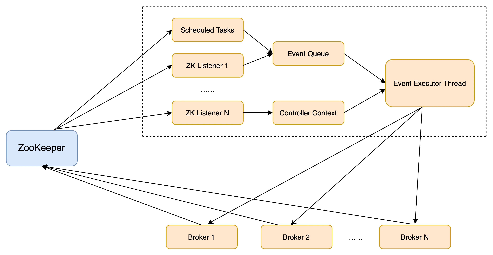

# Kafka Controller

控制器组件（Controller），是 Apache Kafka 的核心组件。它的主要作用是在 Apache ZooKeeper 的帮助下管理和协调整个 Kafka 集群。

在Kafka集群中任意一个Broker都有机会被选举为Controller。

在kafka集群中任意时刻只能有一个Broker可以作为Controller。

## 如何选举成为Controller

Broker 在启动时，会尝试去 ZooKeeper 中创建 /controller 节点。Kafka 当前选举控制器的规则是：第一个成功创建 /controller 节点的 Broker 会被指定为控制器。

## Controller的作用

* 主题管理（创建，删除，增加分区）
  * `kafka-topics.sh`
* 分区重分配
  * `kafka-reassign-partitions.sh`
* Preferred 领导者选举
* 集群成员管理（新增 Broker、Broker 主动关闭、Broker 宕机）
  * Watch
  * ZNode
* 数据服务
  * 主题信息
  * 分区信息
  * Broker信息

## Controller的故障转移

在 Kafka 集群运行过程中，只能有一台 Broker 充当控制器的角色，那么这就存在单点失效（Single Point of Failure）的风险，需要为控制器提供故障转移功能，也就是说所谓的 Failover。

假设四台Broker机器组成kafka集群，id 0 ~ 3，Broker 0 是控制器。

1. 当 Broker 0 宕机后，ZooKeeper 通过 Watch 机制感知到并删除了 /controller 临时节点。
2. 所有存活的 Broker 开始竞选新的控制器身份。Broker 3 最终赢得了选举，成功地在 ZooKeeper 上重建了 /controller 节点。
3. Broker 3 会从 ZooKeeper 中读取集群元数据信息，并初始化到自己的缓存中。

## Controller实现原理

旧版本：使用多线程方案的缺点

* 需要创建很多专属线程，例如Socket链接，监控ZNode的线程，Watch机制回调。

* 需要维持线程安全

新版本：单线程加事件队列的方案，将之前同步操作 ZooKeeper 全部改为异步操作。

