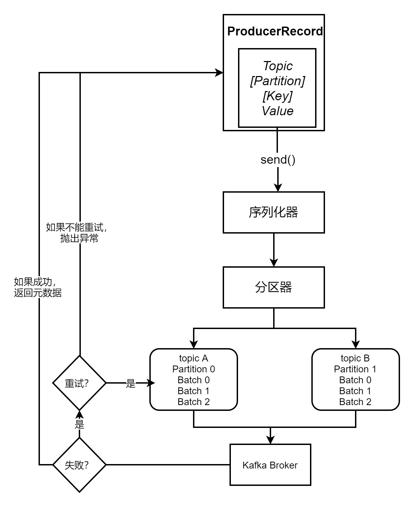
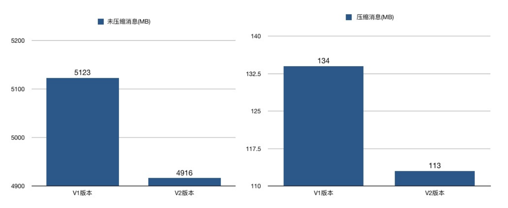
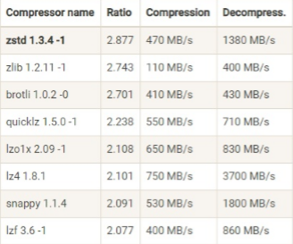

### 生产者概览

1、Kafka生产者会将消息封装成一个 **ProducerRecord** 向 kafka集群中的某个 topic 发送消息；

2、发送的消息首先会经过序列化器进行**序列化**，以便在网络中传输；

3、发送的消息需要经过分区器来决定该消息会分发到 topic 对应的 partition，当然如果指定了**分区**，那么就不需要分区器了；

4、这个时候消息离开生产者开始往kafka集群指定的 topic 和 partition 发送；

5、如果写入成功，kafka集群会回应 生产者一个 RecordMetaData 的消息，如果失败会根据配置的允许失败次数进行重试，如果还是失败，那么消息写入失败，并告诉生产者。

三种发送消息的方式：

1. 发送并忘记(fire and forget)
2. 同步发送
3. 异步发送

### 生产者的配置

1. ack
2. buffer.memory
3. compression.type
4. retries
5. batch.size
6. linger.ms
7. client.id
8. max.in.flight.requests.per.connection
9. timeout.ms/request.timeout.ms/metadata.fetch.timeout.ms
10. max.block.ms
11. max.request.size
12. receive.buffer.bytes
13. send.buffer.bytes

### 序列化器

http://www.justdojava.com/2019/08/16/kafka-serialization/

### 分区

topic-partition-message

分区是实现负载均衡和高吞吐量的关键

分区策略：

1. 轮询

2. 随机

3. key-ordering

   可以根据key指定分区，实现消息有序性

4. 按地理位置

kafka默认分区策略：如果有key，默认使用key-ordering，如果无key，默认使用轮询

### 压缩策略

#### 如何压缩

目前Kafka共有两大类消息格式，社区分别称之为**V1版本和V2版本**

V2版本是Kafka 0.11.0.0中正式引入的

不论是哪个版本，Kafka的消息层次都分为两层：消息集合（message set）以及消息（message）

一个消息集合中包含若干条日志项（record item），而日志项才是真正封装消息的地方

Kafka底层的消息日志由一系列消息集合日志项组成

Kafka通常不会直接操作具体的一条条消息，它总是在消息集合这个层面上进行写入操作

#### 为什么要引入V2版本？ 

V2版本主要是针对V1版本的一些弊端做了修正

其中之一的改动就是：V2版本把消息的公共部分抽取出来放到外层消息集合里面，这样就不用每条消息都保存这些信息了

举个例子：

在V1版本中，每条消息都需要执行CRC校验，但有些情况下消息的CRC值是会发生变化的，比如在Broker端可能会对消息时间戳字段进行更新，那么重新计算之后的CRC值也会相应更新；

再比如Broker端在执行消息格式转换时（主要是为了兼容老版本客户端程序），也会带来CRC值的变化

鉴于这些情况，再对每条消息都执行CRC校验就有点没必要了，不仅浪费空间还耽误CPU时间，因此在V2版本中，消息的CRC校验工作就被移到了消息集合这一层

V2版本还有一个和压缩息息相关的改进，就是保存压缩消息的方法发生了变化

之前V1版本中保存压缩消息的方法是把多条消息进行压缩然后保存到外层消息的消息体字段中；而V2版本的做法是对整个消息集合进行压缩，显然后者应该比前者有更好的压缩效果

做个简单的测试，结果显示，在相同条件下，不论是否启用压缩，V2版本都比V1版本节省磁盘空间

当启用压缩时，这种节省空间的效果更加明显，如下图所示

#### 压缩算法

压缩比：LZ4 > GZIP > Snappy
吞吐量：LZ4 > Snappy > GZIP

参考：

https://www.cnblogs.com/huxi2b/p/10330607.html

#### 压缩时机和解压缩时机

在Kafka中，压缩可能发生在两个地方：生产者端和Broker端

Producer和Broker都可以指定`compression.type`配置的值，如果两边不一致，就有可能出现压缩冲突，有两种情况：

* Broker端指定了和Producer端不同的压缩算法

  Producer端指定了压缩算法为GZIP，Broker端指定了压缩算法为Snappy，在这种情况下Broker接收到GZIP压缩的消息后，只能先解压缩然后使用Snappy重新压缩一遍。可一旦在Broker端设置了不同的compression.type值，就要小心了，因为可能会发生预料之外的压缩/解压缩操作，通常表现为Broker端CPU使用率飙升

* Broker端发生了消息格式转换

  消息格式转换主要是为了兼容老版本的消费者程序，在一个 Kafka 集群中通常同时保存多种版本的消息格式（V1/V2）。Broker 端会对新版本消息执行向老版本格式的转换，该过程中会涉及消息的解压缩和重新压缩。消息格式转换对性能的影响很大，除了增加额外的压缩和解压缩操作之外，还会让 Kafka 丧失其优秀的 Zero Copy特性。因此，一定要保证消息格式的统一。
  Zero Copy：数据在磁盘和网络进行传输时，避免昂贵的内核态数据拷贝，从而实现快速的数据传输。

有压缩必有解压缩，通常来说解压缩发生在Consumer程序中，也就是说Producer发送压缩消息到Broker后， Broker会将消息原样保存起来。当Consumer程序请求这部分消息时，Broker依然原样发送出去，当消息到达Consumer端后，由Consumer自行解压缩还原成之前的消息。

那么有个问题，Consumer在解压缩的时候，它怎么知道这些消息是用何种压缩算法压缩的呢？

Kafka会**将启用了哪种压缩算法封装进消息集合中**，这样当Consumer读取到消息集合时，它自然就知道了这些消息使用的是哪种压缩算法

除了在Consumer端解压缩，Broker端也会进行解压缩，这和前面提到消息格式转换时发生的解压缩是不同的场景

每个压缩过的消息集合在Broker端写入时都要发生解压缩操作，目的就是为了对消息执行各种验证，这种解压缩对Broker端性能是有一定影响的，特别是对CPU的使用率而言。