# Kafka架构

# Kafka生产者分区

提供负载均衡的能力，或者说对数据进行分区的主要原因，就是为了实现系统的高伸缩性（Scalability）。

分区策略：

1. 轮询
2. 随机
3. Hash(Key)
4. 基于地理位置
5. 自定义

# Kafka消息格式

BatchRecords是Kafka数据的存储单元，一个BatchRecords中包含多个Record（即我们通常说的一条消息）

其中BatchRecords里的主要字段有：

1. CRC校验码(旧版本存放在Recode里)
2. magic：可以用于拓展存储一些信息
3. attributes：控制是否使用压缩算法等

# Kafka消息压缩算法

2.1.0之前，kafka仅支持GZIP、Snappy 和 LZ4。从 2.1.0 开始，Kafka 正式支持 Zstandard 算法（简写为 zstd）。

如何选用主要看压缩比和压缩 / 解压缩吞吐量。

* 在吞吐量方面：LZ4 > Snappy > zstd 和 GZIP；
* 在压缩比方面，zstd > LZ4 > GZIP > Snappy。
* 在物理资源方面，使用 Snappy 算法占用的网络带宽最多，zstd 最少；
* 在 CPU 使用率方面，在压缩时 Snappy 算法使用的 CPU 较多一些，而在解压缩时 GZIP 算法则可能使用更多的 CPU。

# 如何确保数据不会丢失（可靠性）

1. 生产者不要调用代码`producer.send(msg)`，使用`producer.send(msg, callback)`，利用callback机制来确认消息是否已经成功提交。
2. 配置生产者的参数，设置`acks=all`，确保所有副本都接收到了消息。
3. `retries > 0`
4. `unclean.leader.election.enable = false`。不能让落后Leader太多消息的Broker称为Leader
5. `replication.factor >= 3`
6. `min.insync.replicas > 1`
7. 推荐`replication.factor = min.insync.replicas + 1`
8. `enable.auto.commit = false`,手动提交。

# kafka拦截器

Kafka 拦截器分为生产者拦截器和消费者拦截器。

* 生产者拦截器允许你在发送消息前以及消息提交成功后植入你的拦截器逻辑；`org.apache.kafka.clients.producer.ProducerInterceptor`
* 消费者拦截器支持在消费消息前以及提交位移后编写特定逻辑。`org.apache.kafka.clients.consumer.ConsumerInterceptor `

Kafka 拦截器可以应用于包括客户端监控、端到端系统性能检测、消息审计等多种功能在内的场景.

# 如何确保数据的一致性（kafka主从复制原理）

# Kafka Leader选取机制

# 什么是消费者组

Consumer Group 是 Kafka 提供的可扩展且具有容错性的消费者机制。

* Consumer Group 下可以有一个或多个 Consumer 实例。这里的实例可以是一个单独的进程，也可以是同一进程下的线程。在实际场景中，使用进程更为常见一些。
* Group ID 是一个字符串，在一个 Kafka 集群中，它标识唯一的一个 Consumer Group。
* Consumer Group 下所有实例订阅的主题的单个分区，只能分配给组内的某个 Consumer 实例消费。这个分区当然也可以被其他的 Group 消费。

Coordinator，它专门为 Consumer Group 服务，负责为 Group 执行 Rebalance 以及提供位移管理和组成员管理等。

# Coordinator

目前，Kafka 为某个 Consumer Group 确定 Coordinator 所在的 Broker 的算法有 2 个步骤。

第 1 步：确定由位移主题的哪个分区来保存该 Group 数据：partitionId=Math.abs(groupId.hashCode() % offsetsTopicPartitionCount)。

第 2 步：找出该分区 Leader 副本所在的 Broker，该 Broker 即为对应的 Coordinator。

# 消费者订阅主题分区分配策略

* Range分配策略 
* RoundRobin策略
* Sticky分配策略

# rebalance触发条件

Rebalance 就是让一个 Consumer Group 下所有的 Consumer 实例就如何消费订阅主题的所有分区达成共识的过程。

* 组成员数发生变更。比如有新的 Consumer 实例加入组或者离开组，抑或是有 Consumer 实例崩溃被“踢出”组。
* 订阅主题数发生变更。Consumer Group 可以使用正则表达式的方式订阅主题，比如 consumer.subscribe(Pattern.compile("t.*c")) 就表明该 Group 订阅所有以字母 t 开头、字母 c 结尾的主题。在 Consumer Group 的运行过程中，你新创建了一个满足这样条件的主题，那么该 Group 就会发生 Rebalance。
* 订阅主题的分区数发生变更。Kafka 当前只能允许增加一个主题的分区数。当分区数增加时，就会触发订阅该主题的所有 Group 开启 Rebalance。

# Rebalance 的弊端

Rebalance 影响 Consumer 端 TPS。在 Rebalance 期间，Consumer 会停下手头的事情，什么也干不了。

Rebalance 很慢。如果你的 Group 下成员很多，就一定会有这样的痛点。

Rebalance 效率不高。当前 Kafka 的设计机制决定了每次 Rebalance 时，Group 下的所有成员都要参与进来，而且通常不会考虑局部性原理，但局部性原理对提升系统性能是特别重要的。

# Consumer Set消息格式

1. 用于保存 Consumer Group 信息的消息。
2. 用于删除 Group 过期位移甚至是删除 Group 的消息。tombstone 消息，即墓碑消息，也称 delete mark。
3. `<Group ID,主题，分区>`

如果是自动提交位移，可能会无限往consumer set里插入位移数据。

Kafka 使用 Compact 策略来删除位移主题中的过期消息，避免该主题无限期膨胀。

Kafka 提供了专门的后台线程定期地巡检待 Compact 的主题，看看是否存在满足条件的可删除数据。

# 如何避免rebalance

* 非必要 Rebalance 是因为未能及时发送心跳，导致 Consumer 被“踢出”Group 而引发的。

  * session.timeout.ms = 6s

  * heartbeat.interval.ms = 2s
  * session.timeout.ms >= 3 * heartbeat.interval.ms

* Consumer 消费时间过长导致的

  * max.poll.interval.ms

* GC 参数

# 消费者组状态机

| 状态                | 含义                                                         |
| ------------------- | ------------------------------------------------------------ |
| Empty               | 组内没有任何成员，但消费者组可能存在已提交的位移数据，而且并未过期 |
| Dead                | 组内没有任何成员，但消费者组的元数据已经在Cooridinator端被删除 |
| PerparingRebalance  | 消费者组准备rebalance，此时所有组员都要重新请求加入消费者组  |
| CompletingRebalance | 所有组员都已经加入到了消费者组，正在等待分配方案             |
| Stable              | 消费者组完成rebalance，进入稳定状态，此时消费者组可以正常消费消息 |




# rebalance全流程解析

Rebalance对应两个步骤：

1. 成员加入 - JoinGroup请求.第一个发送 JoinGroup 请求的成员自动成为领导者。领导者消费者的任务是收集所有成员的订阅信息，然后根据这些信息，制定具体的分区消费分配方案。



2. Leader分配方案 - SyncGroup请求


LeaveGroup请求

# ISR、OSR、AR、LEO、HW、LSO、LW

# 如何确保消费顺序

# 事务

* 最多一次（at most once）：

  * 消息可能会丢失，但绝不会被重复发送。
  * kafka去掉重试

* 至少一次（at least once）：

  * 消息不会丢失，但有可能被重复发送。
  * kafka默认保证这个
  * 如果生产者提交了消息，但是出现了网络抖动，没有及时应答，客户端不确定到底有没有发送成功，又重试了一次。

* 精确一次（exactly once）：

  * 消息不会丢失，也不会被重复发送。
  * 幂等和事务

* 幂等性producer

  * enable.idempotence = true
  * 只能保证单分区内单会话内幂等

* 事务型producer

  * enable.idempotence = true

  * Producer 端参数 transactional. id

  * ```java
    producer.initTransactions();
    try {
                producer.beginTransaction();
                producer.send(record1);
                producer.send(record2);
                producer.commitTransaction();
    } catch (KafkaException e) {
                producer.abortTransaction();
    }
    ```

  * kafka目前支持两种隔离级别(isolation.level)

    * read_uncommitted：这是默认值，
    * read_committed

  * 如果开启了事务型producer，建议事务隔离级别是读提交。

# Commit Offset

Consumer 可以为分配给它的每个分区提交各自的位移数据，这个过程就叫做位移提交。

位移提交有两种方式

* 自动提交：
  * `enable.auto.commit=true`
  * `auto.commit.interval.ms`控制自动提交的频率
  * rebalance可能会引起数据重复校服。
* 手动提交：
  * `enable.auto.commit=false`
  * `consumer.commitSync()`阻塞，另外如果提前提交位移数据，也会造成数据重复消费。
  * `consumer.commitAsync()`，异步，非阻塞操作，但是出现问题时它不会自动重试。
  * 如果是手动提交，我们需要将 commitSync 和 commitAsync 组合使用才能达到最理想的效果
    * 我们可以利用 commitSync 的自动重试来规避那些瞬时错误，比如网络的瞬时抖动，Broker 端 GC 等。因为这些问题都是短暂的，自动重试通常都会成功，因此，我们不想自己重试，而是希望 Kafka Consumer 帮我们做这件事。
    * 我们不希望程序总处于阻塞状态，影响 TPS。
  * `commitSync(Map<TopicPartition, OffsetAndMetadata>)`
  * `commitAsync(Map<TopicPartition, OffsetAndMetadata>)`

commit offset最佳代码实现模版

```java
try {
  while(true) {
		ConsumerRecords records = consumer.poll(Duration.ofSeconds(1)); 
    for (ConsumerRecord record: records) { 		
      process(record); // 处理消息                                                                                             
      offsets.put(new TopicPartition(record.topic(), record.partition()), new OffsetAndMetadata(record.offset() + 1));
      if（count % 100 == 0）                                                                                                               					consumer.commitAsync(offsets, null); // 回调处理逻辑是null                                                                                                                                                                                                                   
      count++;                                                                                                                	}
} catch(Exception e) {
  handle(e); // 处理异常
} finally {
  try {
    consumer.commitSync(); // 最后一次提交使用同步阻塞式提交
  } finally {
    consumer.close();
  }
}
```

CommitFailedException异常发生的场景

1. commit offset中出现异常都抛出该异常，比如当消息处理的总时间超过预设的 max.poll.interval.ms 参数值时。
2. 应用中同时出现了设置相同 group.id 值的消费者组程序和独立消费者程序，独立消费者程序在手动提交位移时，Kafka 就会立即抛出 CommitFailedException 异常。

CommitFailedException预防的4种方式

1. 提高处理消费数据的速率
2. 增加 Consumer 端允许下游系统消费一批消息的最大时长。提高max.poll.interval.ms的值
3. 减少下游系统一次性消费的消息总数。减少max.poll.records的值
4. 多线程消费

# Kafka Producer 是如何动态感知主题分区数变化的（Coordinator）

# Kafka 是如何实现高吞吐率的

Producer:

* `batch.size`
* `linger.ms`
* `compression.type`
* `RecordAccumulator`

# Controller

控制器组件（Controller），是 Apache Kafka 的核心组件。它的主要作用是在 Apache ZooKeeper 的帮助下管理和协调整个 Kafka 集群。

第一个成功创建 /controller 节点的 Broker 会被指定为控制器。

# Kafka动态参数

* read-only。被标记为 read-only 的参数和原来的参数行为一样，只有重启 Broker，才能令修改生效。
* per-broker。被标记为 per-broker 的参数属于动态参数，修改它之后，只会在对应的 Broker 上生效。
* cluster-wide。被标记为 cluster-wide 的参数也属于动态参数，修改它之后，会在整个集群范围内生效，也就是说，对所有 Broker 都生效。你也可以为具体的 Broker 修改 cluster-wide 参数。
* Kafka 将动态 Broker 参数保存在 ZooKeeper 中

**使用场景：**

* 动态调整 Broker 端各种线程池大小，实时应对突发流量。
* 动态调整 Broker 端连接信息或安全配置信息。
* 动态更新 SSL Keystore 有效期。
* 动态调整 Broker 端 Compact 操作性能。
* 实时变更 JMX 指标收集器 (JMX Metrics Reporter)。

# Zookeeper在Kafka中作用