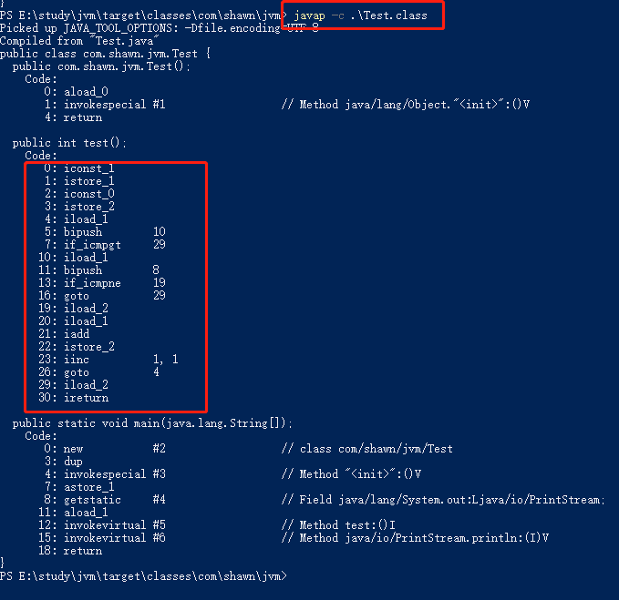

# java内存区域

### jvm内存区域图：


### 程序计数器

**特点：**

* 较小的内存空间
* 当前线程所执行的字节码的行号指示器，用于选取下一条需要执行的字节码指令。分支，循环，跳转，异常处理，线程恢复等基础功能都需要依赖这个计数器来完成。
* 线程私有。
* 没有规定任何`OutOfMemoryError`情况的内存区域

**案例：**

```java
	public int test(){
		int i = 1;
		int sum = 0;
		while (i <= 10){
			if(i == 8){
				break;
			}
			sum += i;
			i++;
		}
		return sum;
	}

	public static void main(String[] args) {
		Test test = new Test();
		System.out.println(test.test());
	}
```



`iconst`：将常量值进栈

`istore`: 将一个数值从操作数栈存储到局部变量表

`iload`:压入操作数栈

`bipush`：将`int ,float,String`常量值推送到栈顶

`iadd ` : 加

`imul` :乘

`goto`:跳转

`if_icmpne`：比较栈顶两int型数值大小，当结果不等于0时跳转

详情请看：

https://docs.oracle.com/javase/specs/jvms/se8/html/index.html

### java虚拟机栈

**特点：**

* 线程私有
* java方法执行的时候，会创建一个栈帧
* 异常：StackOverflowError，OutOfMemoryError`unable to create new native thread`

**栈帧：**

* 局部变量表
  * 基本数据类型
  * 对象引用
  * returnAddress
  * long,double会占用两个局部变量空间（slot）
* 操作数栈
* 动态链接
* 方法出口

### 本地方法栈：

与虚拟机栈非常相似，区别不过就是虚拟机栈执行的是java方法，而本地方法栈则是执行的native方法。

### java堆

**特点：**

* 线程共享
* 存放的是对象实例以及数组
* GC主要区域
* 三个部分：
  * 新生代(Eden,FromSurvivor, ToSurvivor)
  * 老年代
  * 永久代
* OOM: java heap space

逻辑上有三个部分：新生区（young），养老区(Old  Tenure)，永久区（Perm）java8以后称永久区为元空间

物理上只有两个部分：新生区（young），养老区(Old  Tenure)，元空间在本地内存中，不在JVM中！

GC的主要区域是young,old。

具体放到垃圾回收那一部分来说明

### 方法区

方法区又被称为非堆（`Non-Heap`）

通过jdk工具`jconsole`可以了解：


**特点：**

* 线程共享
* 存储类信息，常量，静态变量，即时编译器后的代码
* 运行时常量池，用于存放各种字面量和符号引用

>类信息：类的版本，字段，方法，接口和父类等信息。
>
>字面量：String a = "b"，基本类型的常量(final修饰的变量)。
>
>符号引用：类的全限定名，字段名称及其描述符，方法名及其描述符。

在HotSpot虚拟机、java7版本中已经将永久代的静态变量和运行时常量池转移到了堆中，其余则存储在jvm的非堆内存中。java8使用元空间代替之前的永久代。存储位置为本地内存。

**为什么使用元空间代替永久代？**

官方解释：

1. 融合HotSpot与JRockit而做出的努力，JRockit没有永久代。
2. oom,指定的PermGen区的大小为8M，由于PermGen中类的元数据信息在每次FullGC的时候可能被收集，回收率都偏低；
3. PermGen分配多大的空间很难确定，依赖很多因素：jvm加载的class总数，常量池大小，方法大小等。

### 直接内存

特点：

1. Direct Memory并不是运行时数据区的一部分，也不是java虚拟机规范定义的内存区域。
2. OOM
3. NIO，使用一种基于Channel和Buffer的IO方式，可以使用native方法直接分配直接内存，然后通过一个存储在`DirectByteBuffer`的对象中。
4. -XX:MaxDireceMemory