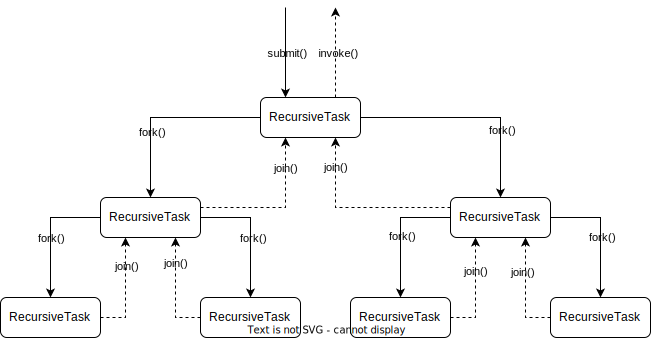
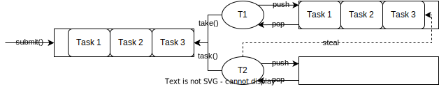

对于简单的并行任务，我们可以通过`ThreadPool+Future`的方案来解决；如果任务之间有聚合关系，无论是`AND`聚合还是`OR`聚合，都可以通过`CompletableFutrue`来解决；如果想要不阻塞获取线程执行结果，则可以通过`CompletionService`来解决；在编程领域，还有另外一种任务模型，一个大任务分割成若干个小任务，最终汇总每个小任务的结果得到这个大任务的结果，则需要使用`Fork/Join`框架来解决。

# Fork/Join框架简介

`Fork/Join`框架是`java concurrency sdk`中的一种并行计算框架，主要采用分治算法思想，将一个大任务拆分为多个小任务来异步执行。

其中`Fork`对应的是分治任务模型里的任务分解，`Join`则对应着结果合并

`Fork/Join`框架主要包含三个部分：

* 任务对象：`ForkJoinTask`
  * `ForkJoinTask`是一个抽象类，其核心方法为`fork()/join()`。
  * `fork()`方法会异步执行一个子任务，`join()`方法会阻塞当前线程来等待子任务的执行结果。
  * `ForkJoinTask`的子类很多，包括 `RecursiveTask(compute() 有返回),RecursiveAction(compute() 无返回)`。
* 执行`Fork/join`任务的线程：`ForkJoinWorkerThread`。
* 线程池：`ForkJoinPool`。

示例：

```java
public class ForkJoinDemo {

  public static void main(String[] args) {
    ForkJoinPool pool = ForkJoinPool.commonPool();
    Long result = pool.invoke(new Fibonacci(30));
    System.out.println(result);
    System.out.println(fibonacci(30));
  }

  public static long fibonacci(long num) {
    if (num <= 1) return num;
    else return fibonacci(num - 1) + fibonacci(num - 2);
  }

  static class Fibonacci extends RecursiveTask<Long> {

    private final long num;

    Fibonacci(long num) {
      this.num = num;
    }

    public long getNum() {
      return num;
    }

    @Override
    protected Long compute() {
      if (num <= 1) return num;
      Fibonacci f1 = new Fibonacci(num - 1);
      // 创建子任务
      f1.fork();
      Fibonacci f2 = new Fibonacci(num - 2);
      // 等待子任务结果，并合并结果
      return f2.compute() + f1.join();
    }
  }
}


```

# Fork/Join框架核心思想

## 分治算法(Divide-And-Conquer)

ForkJoinPool基于分治算法，将大任务不断拆分下去，每个子任务再拆分一半，直到达到最阈值设定的任务粒度为止，并且把任务放到不同的队列里面，然后从最底层的任务开始执行计算，并且往上一层合并结果。这样用相对少的线程处理大量的任务，可以更好的利用系统资源，尽可能的使用所有的计算能力来提升应用性能。



## 工作窃取算法(Work-Stealing)

如果工作线程对应的任务队列空了，是不是就没活儿干了呢？不是，`ForkJoinPool`支持一种叫做“任务窃取”的机制，如果工作线程空闲了，那它就可以窃取其他工作任务队列里的任务。

一个大任务，会被划分为多个子任务，这些子任务又会被划分到不同的执行队列中，等待执行。

`ForkJoin`框架会为每个执行队列创建一个执行线程`ForkJoinWorkerThread`，假设线程1的任务队列已经为空，但是线程2的任务队列还有任务等待被执行，那么线程1可以窃取到线程2里的任务来执行。

为了减少窃取任务时线程1和被窃取任务线程2之间的发生竞争，窃取任务的线程1会从队列的尾部获取任务执行，被窃取任务线程2会从队列的头部获取任务执行。




# Fork/Join框架源码解析

注意：下面所有的代码均来自于JDK11。

## ForkJoinPool

### 核心属性

在java并发工具包中，我们能看到大量的位运算来表示线程运行时参数的操作。

**`ForkJoinPool and WorkQueue`共享的常量：**

```java
// Constants shared across ForkJoinPool and WorkQueue

// Bounds
static final int SWIDTH       = 16;            // 工作线程驻留任务队列索引位
static final int SMASK        = 0xffff;        // 低16位掩码
static final int MAX_CAP      = 0x7fff;        // 工作线程最大容量
static final int SQMASK       = 0x007e;        // workQueues 数组最多64个槽位

// Masks and units for WorkQueue.phase and ctl sp subfield
static final int UNSIGNALLED  = 1 << 31;       // 工作线程需要唤醒信号
static final int SS_SEQ       = 1 << 16;       // 防止 ABA 问题的版本号
static final int QLOCK        = 1;             // 队列锁

// Mode bits and sentinels, some also used in WorkQueue id and.source fields
static final int OWNED        = 1;             // 任务队列拥有所有者
static final int FIFO         = 1 << 16;       // 任务队列先进先出访问策略
static final int SHUTDOWN     = 1 << 18;       // 线程池正在关闭
static final int TERMINATED   = 1 << 19;       // 线程池已经终止
static final int STOP         = 1 << 31;       // 线程池正在停止
static final int QUIET        = 1 << 30;       // 任务队列处于静止状态
static final int DORMANT      = QUIET | UNSIGNALLED; // 任务队列处于静止状态 && 驻留线程已经阻塞、需要唤醒信号

static final int INITIAL_QUEUE_CAPACITY = 1 << 13; // 任务窃取队列初始容量

static final int MAXIMUM_QUEUE_CAPACITY = 1 << 26; // 64M 任务窃取队列最大容量
```

**`ForkJoinPool`静态字段和常量：**

```java
// 默认的工作线程工厂
public static final ForkJoinWorkerThreadFactory
        defaultForkJoinWorkerThreadFactory;
// Common (static) pool. 通用 ForkJoinPool
static final ForkJoinPool common;

// 通用线程池的并行度    
static final int COMMON_PARALLELISM;

// 通用线程池最大补偿的工作线程数
private static final int COMMON_MAX_SPARES;

// 创建workerNamePrefix(工作线程名称前缀)时的序号
private static int poolNumberSequence;

// 默认的工作线程超时时间，以毫秒为单位，即 60 秒
private static final long DEFAULT_KEEPALIVE = 60_000L;

// Undershoot tolerance for idle timeouts【超时微调】
private static final long TIMEOUT_SLOP = 20L;
```

`ForkJoinPool`线程池和工作线程相关的参数：

```java
// 低位和高位掩码
private static final long SP_MASK    = 0xffffffffL;
private static final long UC_MASK    = ~SP_MASK;

// 活跃线程数
private static final int  RC_SHIFT   = 48;
private static final long RC_UNIT    = 0x0001L << RC_SHIFT; // 活跃线程数增量
private static final long RC_MASK    = 0xffffL << RC_SHIFT; // 活跃线程数掩码

// 工作线程数
private static final int  TC_SHIFT   = 32;
private static final long TC_UNIT    = 0x0001L << TC_SHIFT; //工作线程数增量
private static final long TC_MASK    = 0xffffL << TC_SHIFT; //掩码
private static final long ADD_WORKER = 0x0001L << (TC_SHIFT + 15); // sign 创建工作线程标志
```

说明: ForkJoinPool 的内部状态都是通过一个64位的 long 型 变量ctl来存储，它由四个16位的子域组成:

* RC: 正在运行的工作者线程数 - parallelism.
  * 高16位
  * RC为负数：表示运行中的工作者线程不够 
* TC: 正在运行的工作者线程数 + 阻塞等待的工作者线程数 - parallelism
  * 中高16位
  * TC为负数：表示总的工作者线程不够
* SS: 版本号 + 最近阻塞的线程状态
  * 中低16位
  * sp != 0：表示有工作者线程在阻塞等待
* ID: 最近阻塞的工作者线程所在的工作队列索引
  * 低16位

`ForkJoinPool`其余实例变量

```java
// 工作窃取任务总数
volatile long stealCount;            // collects worker nsteals
// 工作队列线程空闲存活的时间
final long keepAlive;                // milliseconds before dropping if idle
// 下一个工作队列索引
int indexSeed;                       // next worker index
// 最大最小线程数
final int bounds;                    // min, max threads packed as shorts
/**
* runstate：第 18、19、30、31 位
* queue mode：第 16 位
* parallelism：1-15 位，最大并行度为 1<<15-1
*/
volatile int mode;                   // parallelism, runstate, queue mode
// 已经注册的工作队列
WorkQueue[] workQueues;              // main registry
// 工作者线程名称前缀，同时作为创建工作队列时的 synchronized 锁
final String workerNamePrefix;       // for worker thread string; sync lock 
// 工作线程工厂
final ForkJoinWorkerThreadFactory factory;
// 异常处理器
final UncaughtExceptionHandler ueh;  // per-worker UEH
// 线程池饱和断言
final Predicate<? super ForkJoinPool> saturate;

// 核心控制变量
@jdk.internal.vm.annotation.Contended("fjpctl") // segregate
  volatile long ctl;                   // main pool control
```

**`ForkJoinPool.WorkQueue`中的变量**：

```java
// 上一次窃取的工作队列 ID 或哨兵值
volatile int source;       // source queue id, or sentinel
int id;                    // pool index, mode, tag
// 执行 poll 操作的索引
int base;                  // index of next slot for poll
// 执行 push 操作的索引
int top;                   // index of next slot for push
/**
*	值为负数：
*		1）(任务队列的 ID +累计版本号) | UNSIGNALLED
*		2）DORMANT：任务队列处于静止状态 && 驻留线程已经阻塞、需要唤醒信号
*	0：队列未锁定
*	1：队列被锁定
*/
volatile int phase;        // versioned, negative: queued, 1: locked
// 队列进入静止状态时的控制变量值，可能包含前一个静止的任务队列信息
int stackPred;             // pool stack (ctl) predecessor link
// 工作者线程窃取的任务数
int nsteals;               // number of steals
// 底层存储 ForkJoinTask 的数组
ForkJoinTask<?>[] array;   // the queued tasks; power of 2 size
// 任务队列所在的线程池
final ForkJoinPool pool;   // the containing pool (may be null)
// 工作队列驻留的工作者线程，共享提交队列为 null 
final ForkJoinWorkerThread owner; // owning thread or null if shared
```

### 构造器

```java
public ForkJoinPool(int parallelism,
                    ForkJoinWorkerThreadFactory factory,
                    UncaughtExceptionHandler handler,
                    boolean asyncMode,
                    int corePoolSize,
                    int maximumPoolSize,
                    int minimumRunnable,
                    Predicate<? super ForkJoinPool> saturate,
                    long keepAliveTime,
                    TimeUnit unit) {
    // check, encode, pack parameters
    if (parallelism <= 0 || parallelism > MAX_CAP ||
        maximumPoolSize < parallelism || keepAliveTime <= 0L)
        throw new IllegalArgumentException();
    if (factory == null)
        throw new NullPointerException();
    // 计算超时时间
    long ms = Math.max(unit.toMillis(keepAliveTime), TIMEOUT_SLOP);
    // 核心工作者线程数
    int corep = Math.min(Math.max(corePoolSize, parallelism), MAX_CAP);
    // 计算 ctl
    long c = ((((long)(-corep)       << TC_SHIFT) & TC_MASK) |
              (((long)(-parallelism) << RC_SHIFT) & RC_MASK));
    // 计算 mode
    int m = parallelism | (asyncMode ? FIFO : 0);
    int maxSpares = Math.min(maximumPoolSize, MAX_CAP) - parallelism;
    // 最小可用工作者线程数
    int minAvail = Math.min(Math.max(minimumRunnable, 0), MAX_CAP);
    int b = ((minAvail - parallelism) & SMASK) | (maxSpares << SWIDTH);
  
  	// 初始工作队列的数量
    int n = (parallelism > 1) ? parallelism - 1 : 1; // at least 2 slots
    n |= n >>> 1; n |= n >>> 2; n |= n >>> 4; n |= n >>> 8; n |= n >>> 16;
    n = (n + 1) << 1; // power of two, including space for submission queues

    // 线程池前缀
    this.workerNamePrefix = "ForkJoinPool-" + nextPoolId() + "-worker-";
    this.workQueues = new WorkQueue[n];
    this.factory = factory;
    this.ueh = handler;
    this.saturate = saturate;
    this.keepAlive = ms;
    this.bounds = b;
    this.mode = m;
    this.ctl = c;
    checkPermission();
}
```

* `parallelism`：`ForkJoinPool` 的并行度

* `factory`：工作者线程工厂
* `handler`：每个工作者线程的异常处理器
* `asyncMode`：工作队列的任务处理模式，默认是` false【FILO】`，消息模式下可以指定为 `FIFO`
* `corePoolSize`：核心工作者线程数，默认等于 `parallelism`
* `maximumPoolSize`：最大工作者线程数
* `minimumRunnable`：最小可用工作者线程数
* `saturate`：当线程池尝试创建 > `maximumPoolSize` 的工作者线程时，目标任务将被拒绝，如果饱和断言返回 true，则该任务将继续执行
* `keepAliveTime`：工作线程的空闲超时时间
* `unit`：`keepAliveTime` 的时间单位

### submit流程



`ForkJoinPool`提交任务的核心代码如下：

```java
private <T> ForkJoinTask<T> externalSubmit(ForkJoinTask<T> task) {
        Thread t; ForkJoinWorkerThread w; WorkQueue q;
  if (task == null)
    throw new NullPointerException();
  // 当前线程就是一个ForkJoin类型的线程，直接调用该线程的队列进行push, 说明是内部分裂开的任务,直接入队当前线程的队列
  if (((t = Thread.currentThread()) instanceof ForkJoinWorkerThread) &&
      (w = (ForkJoinWorkerThread)t).pool == this &&
      (q = w.workQueue) != null)
    q.push(task);
  else
    // 提交任务
    externalPush(task);
  return task;
}

final void externalPush(ForkJoinTask<?> task) {
  int r;                                // initialize caller's probe
  // 随机初始化调用线程的探针值，用于计算WorkQueue索引
  if ((r = ThreadLocalRandom.getProbe()) == 0) {
    ThreadLocalRandom.localInit();
    r = ThreadLocalRandom.getProbe();
  }
  for (;;) {
    WorkQueue q;
    int md = mode, n;
    WorkQueue[] ws = workQueues;
    // 线程池关闭或者任务队列为空 则直接拒绝
    if ((md & SHUTDOWN) != 0 || ws == null || (n = ws.length) <= 0)
      throw new RejectedExecutionException();
    // 该位置为空. 新建一个工作队列，加锁入队.
    else if ((q = ws[(n - 1) & r & SQMASK]) == null) { // add queue
      int qid = (r | QUIET) & ~(FIFO | OWNED);
      Object lock = workerNamePrefix;
      // 新建一个工作队列
      ForkJoinTask<?>[] qa =
        new ForkJoinTask<?>[INITIAL_QUEUE_CAPACITY];
      q = new WorkQueue(this, null);
      q.array = qa;
      q.id = qid;
      q.source = QUIET;
      if (lock != null) {     // unless disabled, lock pool to install
        synchronized (lock) {
          WorkQueue[] vs; int i, vn;
          if ((vs = workQueues) != null && (vn = vs.length) > 0 &&
              vs[i = qid & (vn - 1) & SQMASK] == null)
            vs[i] = q;  // else another thread already installed
        }
      }
    }
    // 如果工作队列的当前位置在忙，重新随机一个位置.
    else if (!q.tryLockPhase()) // move if busy
      r = ThreadLocalRandom.advanceProbe(r);
    else {
      // 该位置不为空,且不忙,就唤醒工作线程了.
      if (q.lockedPush(task))
        signalWork();
      return;
    }
  }
}

final void signalWork() {
  for (;;) {
    long c; int sp; WorkQueue[] ws; int i; WorkQueue v;
    if ((c = ctl) >= 0L)                      // enough workers
      break;
    else if ((sp = (int)c) == 0) {            // no idle workers
      if ((c & ADD_WORKER) != 0L)           // too few workers
        // 工作线程太少，尝试创建新的工作线程
        tryAddWorker(c);
      break;
    }
    else if ((ws = workQueues) == null)
      break;                                // unstarted/terminated
    else if (ws.length <= (i = sp & SMASK))
      break;                                // terminated
    else if ((v = ws[i]) == null)
      break;                                // terminating
    else {
      int np = sp & ~UNSIGNALLED;
      int vp = v.phase;
      long nc = (v.stackPred & SP_MASK) | (UC_MASK & (c + RC_UNIT));
      Thread vt = v.owner;
      if (sp == vp && CTL.compareAndSet(this, c, nc)) {
        v.phase = np;
        if (vt != null && v.source < 0)
          LockSupport.unpark(vt);
        break;
      }
    }
  }
}

private void tryAddWorker(long c) {
  do {
    long nc = ((RC_MASK & (c + RC_UNIT)) |
               (TC_MASK & (c + TC_UNIT)));
    if (ctl == c && CTL.compareAndSet(this, c, nc)) {
      createWorker();
      break;
    }
  } while (((c = ctl) & ADD_WORKER) != 0L && (int)c == 0);
}

private boolean createWorker() {
  ForkJoinWorkerThreadFactory fac = factory;
  Throwable ex = null;
  ForkJoinWorkerThread wt = null;
  try {
    if (fac != null && (wt = fac.newThread(this)) != null) {
      wt.start();
      return true;
    }
  } catch (Throwable rex) {
    ex = rex;
  }
  // 线程创建失败处理
  deregisterWorker(wt, ex);
  return false;
}
```

## ForkJoinTask

### fork()

```java
public final ForkJoinTask<V> fork() {
    Thread t;
    // 当前线程是ForkJoinWorkerThread，直接调用该线程的队列进行push, 说明是内部拆分的子任务,直接入队当前线程的队列
    if ((t = Thread.currentThread()) instanceof ForkJoinWorkerThread)
        ((ForkJoinWorkerThread)t).workQueue.push(this);
    else
        // 提交到一个随机的等待队列中(外部任务)
        ForkJoinPool.common.externalPush(this);
    return this;
}
```

### join()



```java
public final V join() {
    int s;
    // 阻塞等待任务执行结束，如果发生异常，则将抛出 RuntimeException。
    if (((s = doJoin()) & ABNORMAL) != 0)
        reportException(s);
    // 执行成功，返回结果
    return getRawResult();
}
```

任务状态有四种：

* DONE：任务执行结束
* ABNORMAL：任务异常结束，或者取消
* THROWN：异常被存储
* SIGNAL：信号

**doJoin()**

```java
private int doJoin() {
  int s; Thread t; ForkJoinWorkerThread wt; ForkJoinPool.WorkQueue w;
  return (s = status) < 0 ? s :
  ((t = Thread.currentThread()) instanceof ForkJoinWorkerThread) ?
    (w = (wt = (ForkJoinWorkerThread)t).workQueue).
    tryUnpush(this) && (s = doExec()) < 0 ? s :
  wt.pool.awaitJoin(w, this, 0L) :
  externalAwaitDone();
}
```

* `(s = status) < 0`，如果任务已经完成，则直接返回其状态
* 如果当前线程是`ForkJoinWorkerThread`，则尝试从工作队列顶部拉取此任务，并在当前线程中执行此任务，调用`doExec()`方法。
  * 如果执行成功则返回任务状态
  * 拉取任务失败或者执行任务失败，则表示目标任务不在顶部、或其他的工作者线程窃取了此任务在执行，则等待任务完成，调用` wt.pool.awaitJoin(w, this, 0L)`。
* 如果当前线程不是`ForkJoinWorkerThread`，则阻塞等待任务完成。

**doExec()**

```java
final int doExec() {
    int s; boolean completed;
    // 任务未完成
    if ((s = status) >= 0) {
        try {
            // 执行任务
            completed = exec();
        } catch (Throwable rex) {
            completed = false;
            // 设置异常状态
            s = setExceptionalCompletion(rex);
        }
        if (completed)
            // 如果任务正常结束，则标记已完成
            s = setDone();
    }
    return s;
}
```

**externalAwaitDone()**

```java
// 阻塞一个非工作者线程，直到任务完成
private int externalAwaitDone() {
    int s = tryExternalHelp();
    // 任务未完成 && 写入唤醒标记
    if (s >= 0 && (s = (int)STATUS.getAndBitwiseOr(this, SIGNAL)) >= 0) {
        boolean interrupted = false;
        synchronized (this) {
            for (;;) {
                // 任务未完成
                if ((s = status) >= 0) {
                    try {
                        // 阻塞等待任务执行结束
                        wait(0L);
                    } catch (InterruptedException ie) {
                        interrupted = true;
                    }
                }
                else {
                    // 任务执行结束，唤醒其他线程继续执行
                    notifyAll();
                    break;
                }
            }
        }
        if (interrupted)
            Thread.currentThread().interrupt();
    }
    return s;
}
```

## ForkJoinWorkerThread

### 构造器

```java
protected ForkJoinWorkerThread(ForkJoinPool pool) {
    // Use a placeholder until a useful name can be set in registerWorker
    super("aForkJoinWorkerThread");
    this.pool = pool;
    this.workQueue = pool.registerWorker(this);
}
```

可以看到 ForkJoinWorkerThread 在构造时首先调用父类 Thread 的方法，然后为工作线程注册pool和workQueue，而workQueue的注册任务由ForkJoinPool.registerWorker来完成。

### run()

```java
public void run() {
  if (workQueue.array == null) { // only run once
    Throwable exception = null;
    try {
      // 前置钩子
      onStart();
      // 运行工作队列
      pool.runWorker(workQueue);
    } catch (Throwable ex) {
      exception = ex;
    } finally {
      try {
        // 后置钩子
        onTermination(exception);
      } catch (Throwable ex) {
        if (exception == null)
          exception = ex;
      } finally {
        // 注销工作者
        pool.deregisterWorker(this, exception);
      }
    }
  }
}
```

# 经典案例

模拟MapReduce统计单词数量

我们可以先用二分法递归地将一个文件拆分成更小的文件，直到文件里只有一行数据，然后统计这一行数据里单词的数量，最后再逐级汇总结果。

```java
static void main(String[] args){
  String[] fc = {"hello world",
          "hello me",
          "hello fork",
          "hello join",
          "fork join in world"};
  // 创建 ForkJoin 线程池    
  ForkJoinPool fjp = 
      new ForkJoinPool(3);
  // 创建任务    
  MR mr = new MR(
      fc, 0, fc.length);  
  // 启动任务    
  Map<String, Long> result = 
      fjp.invoke(mr);
  // 输出结果    
  result.forEach((k, v)->
    System.out.println(k+":"+v));
}
//MR 模拟类
static class MR extends 
  RecursiveTask<Map<String, Long>> {
  private String[] fc;
  private int start, end;
  // 构造函数
  MR(String[] fc, int fr, int to){
    this.fc = fc;
    this.start = fr;
    this.end = to;
  }
  @Override protected 
  Map<String, Long> compute(){
    if (end - start == 1) {
      return calc(fc[start]);
    } else {
      int mid = (start+end)/2;
      MR mr1 = new MR(
          fc, start, mid);
      mr1.fork();
      MR mr2 = new MR(
          fc, mid, end);
      // 计算子任务，并返回合并的结果    
      return merge(mr2.compute(),
          mr1.join());
    }
  }
  // 合并结果
  private Map<String, Long> merge(
      Map<String, Long> r1, 
      Map<String, Long> r2) {
    Map<String, Long> result = 
        new HashMap<>();
    result.putAll(r1);
    // 合并结果
    r2.forEach((k, v) -> {
      Long c = result.get(k);
      if (c != null)
        result.put(k, c+v);
      else 
        result.put(k, v);
    });
    return result;
  }
  // 统计单词数量
  private Map<String, Long> 
      calc(String line) {
    Map<String, Long> result =
        new HashMap<>();
    // 分割单词    
    String [] words = 
        line.split("\\s+");
    // 统计单词数量    
    for (String w : words) {
      Long v = result.get(w);
      if (v != null) 
        result.put(w, v+1);
      else
        result.put(w, 1L);
    }
    return result;
  }
}

```

