[java线程-如何获取到线程执行的结果](./future.md)一文中讲解了Future的用法和实现原理，Future主要用于获取线程执行的结果，那么如何根据线程的执行结果执行下一步动作呢？Future的另一个实现类CompletableFuture能够优雅的解决异步化问题。

<!--more-->

# CompletableFuture

`CompletableFuture`是java8新增的，这个类实现了两个接口，一个是`Future`接口，一个是`CompletionStage`接口。

`CompletableFuture`提供了非常强大的`Future`的扩展功能，可以帮助我们简化异步编程的复杂性，提供了函数式编程的能力，可以通过回调的方式处理计算结果，并且提供了转换和组合`CompletableFuture`的方法。

`CompletableFuture`被设计在Java中进行异步编程。异步编程意味着在主线程之外创建一个独立的线程，与主线程分隔开，并在上面运行一个非阻塞的任务，然后**通知**主线程进展，成功或者失败。

通过这种方式，你的主线程不用为了任务的完成而阻塞/等待，你可以用主线程去并行执行其他的任务。 使用这种并行方式，极大地提升了程序的表现。

## CompletionStage

`CompletionStage`是java8新增的接口，用于异步执行中的阶段处理。`CompletionStage`定义了一组接口用于在一个阶段执行结束之后，要么继续执行下一个阶段，要么对结果进行转换产生新的结果等等，一般来说要执行下一个阶段都需要上一个阶段正常完成，当然这个类也提供了对异常结果的处理接口。

任务与任务之间是有联系关系的，比如串行关系，并行关系，AND，OR等关系。




### 描述串行关系

CompletionStage 接口里面描述串行关系，主要是 thenApply、thenAccept、thenRun 和 thenCompose 这四个系列的接口。

```java
public <U> CompletionStage<U> thenApply(Function<? super T,? extends U> fn);
public <U> CompletionStage<U> thenApplyAsync(Function<? super T,? extends U> fn);
public <U> CompletionStage<U> thenApplyAsync(Function<? super T,? extends U> fn, 
                                             Executor executor);
public CompletionStage<Void> thenAccept(Consumer<? super T> action);
public CompletionStage<Void> thenAcceptAsync(Consumer<? super T> action);
public CompletionStage<Void> thenAcceptAsync(Consumer<? super T> action, 
                                             Executor executor);
public CompletionStage<Void> thenRun(Runnable action);
public CompletionStage<Void> thenRunAsync(Runnable action);
public CompletionStage<Void> thenRunAsync(Runnable action, 
                                          Executor executor);
public <U> CompletionStage<U> thenCompose(Function<? super T, ? extends CompletionStage<U>> fn);
public <U> CompletionStage<U> thenComposeAsync(Function<? super T, ? extends CompletionStage<U>> fn);
public <U> CompletionStage<U> thenComposeAsync(Function<? super T, ? extends CompletionStage<U>> fn,
                                               Executor executor);
```

* `thenApply`系列方法，入参类型是接口 `Function<T, R>`，这个接口里与`CompletionStage`相关的方法是 `R apply(T t)`，这个方法既能接收参数也支持返回值，所以 `thenApply` 系列方法返回的是`CompletionStage<R>`。
* `thenAccept`系列方法，入参类型是接口`Consumer<T>`，这个接口里与`CompletionStage`相关的方法是`void accept(T t)`，这个方法虽然支持参数，但却不支持回值，所以`thenAccept`系列方法返回的是`CompletionStage<Void>`。
* `thenRun`系列方法，入参类型是接口`Runnable`，`Runnable`既不能接收参数也不支持返回值，所以`thenRun`系列方法返回的是`CompletionStage<Void>`。
* `thenCompose`系列方法，这个系列的方法会新创建出一个子流程，最终结果和`thenApply`系列是相同的。
* 这些方法里面`Async`代表的是异步执行` fn`、`consumer`或者`action`。

```java
// 描述串行关系
// 期待输出
// hello world
// Hello CompletableFuture
private static void serial() throws Exception {
  CompletableFuture<Void> t1 =
    CompletableFuture.supplyAsync(() -> "Hello")
    .thenApply(s -> s + " World")
    .thenApply(String::toLowerCase)
    .thenAccept(System.out::println);

  CompletableFuture<Void> t2 =
    CompletableFuture.supplyAsync(() -> "Hello")
    .thenCompose(s -> CompletableFuture.supplyAsync(() -> s + " CompuletableFuture"))
    .thenAccept(System.out::println);

  t1.thenRun(() -> t2.join());
  t1.join();
}
```

### 描述AND聚合关系

CompletionStage 接口里面描述AND聚合关系，主要是 thenCombine、thenAcceptBoth、runAfterBoth 这三个系列的接口。

```java
public <U,V> CompletionStage<V> thenCombine (CompletionStage<? extends U> other, 
                                             BiFunction<? super T,? super U,? extends V> fn);
public <U,V> CompletionStage<V> thenCombineAsync(CompletionStage<? extends U> other,
                                                 BiFunction<? super T,? super U,? extends V> fn);
public <U,V> CompletionStage<V> thenCombineAsync(CompletionStage<? extends U> other,
                                                 BiFunction<? super T,? super U,? extends V> fn,
                                                 Executor executor);
public <U> CompletionStage<Void> thenAcceptBoth(CompletionStage<? extends U> other, 
                                                BiConsumer<? super T, ? super U> action);
public <U> CompletionStage<Void> thenAcceptBothAsync(CompletionStage<? extends U> other,
                                                     BiConsumer<? super T, ? super U> action);
public <U> CompletionStage<Void> thenAcceptBothAsync(CompletionStage<? extends U> other,
                                                     BiConsumer<? super T, ? super U> action,
                                                     Executor executor);
public CompletionStage<Void> runAfterBoth(CompletionStage<?> other,
                                              Runnable action);
public CompletionStage<Void> runAfterBothAsync(CompletionStage<?> other,
                                                   Runnable action);
```

* `thenAcceptBoth`系列方法，入参包括`CompletionStage`以及`BiConsumer<T,U>`，这一组函数是用来接受两个`CompletableFuture`的返回值，并将其组合到一起。
* `thenCombine`系列方法，与`thenAcceotBoth`类似，与`thenAcceptBoth`不同的是，`thenCombine`将两个任务结果合并后会返回一个全新的值作为出参。
* `runAfterBoth`系列方法，入参类型为`CompletionStage<?>`和`Runnable`

```java
/*
hello world
Hello CompuletableFuture
thenCombine end
thenAcceptBoth end
runAfterBoth end
*/
private static void and() throws Exception {
  CompletableFuture<Void> t1 =
      CompletableFuture.supplyAsync(() -> "Hello")
          .thenApply(s -> s + " World")
          .thenApply(String::toLowerCase)
          .thenAccept(System.out::println);

  CompletableFuture<Void> t2 =
      CompletableFuture.supplyAsync(() -> "Hello")
          .thenCompose(s -> CompletableFuture.supplyAsync(() -> s + " CompuletableFuture"))
          .thenAccept(System.out::println);

  CompletableFuture<String> t3 = t1.thenCombine(t2, (__, s) -> "end");
  t3.thenAccept(s -> System.out.println("thenCombine " + s));
  t3.join();

  CompletableFuture<Void> t4 =
      t1.thenAcceptBoth(t2, (__, s) -> System.out.println("thenAcceptBoth end"));
  t4.join();

  CompletableFuture<Void> t5 = t1.runAfterBoth(t2, () -> System.out.println("runAfterBoth end"));
  t5.join();
}
```

### 描述OR聚合关系

CompletionStage 接口里面描述OR聚合关系，主要是 applyToEither、acceptEither和runAfterEither系列的接口。

```java
public <U> CompletionStage<U> applyToEither(CompletionStage<? extends T> other,
                                            Function<? super T, U> fn);
public <U> CompletionStage<U> applyToEitherAsync(CompletionStage<? extends T> other,
                                                 Function<? super T, U> fn);

public <U> CompletionStage<U> applyToEitherAsync(CompletionStage<? extends T> other,
                                                 Function<? super T, U> fn,
                                                 Executor executor);

public CompletionStage<Void> acceptEither(CompletionStage<? extends T> other,
                                          Consumer<? super T> action);

public CompletionStage<Void> acceptEitherAsync(CompletionStage<? extends T> other,
                                               Consumer<? super T> action);

public CompletionStage<Void> acceptEitherAsync(CompletionStage<? extends T> other,
                                               Consumer<? super T> action,
                                               Executor executor);

public CompletionStage<Void> runAfterEither(CompletionStage<?> other,
                                            Runnable action);

public CompletionStage<Void> runAfterEitherAsync(CompletionStage<?> other,
                                                 Runnable action);

public CompletionStage<Void> runAfterEitherAsync(CompletionStage<?> other,
                                                 Runnable action,
                                                 Executor executor);
```

* applyToEither系列方法，入参类型为`CompletionStage`和`Function`
* acceptEither系列方法，入参类型为`CompletionStage`和`Consumer`
* runAfterEither系列方法，入参类型为`CompletionStage`和`Runnable`

```java
private static void or() {
  CompletableFuture<Void> t1 =
      CompletableFuture.runAsync(
          () -> {
            try {
              TimeUnit.SECONDS.sleep(10);
              System.out.println("t1");
            } catch (Exception e) {
              throw new RuntimeException(e);
            }
          });

  CompletableFuture<Void> t2 =
      CompletableFuture.runAsync(
          () -> {
            try {
              TimeUnit.SECONDS.sleep(200);
              System.out.println("t2");
            } catch (Exception e) {
              throw new RuntimeException(e);
            }
          });

  CompletableFuture<String> t3 = t1.applyToEither(t2, s -> "applyToEither end");
  t3.thenAccept(System.out::println);
  t3.join();

  CompletableFuture<Void> t4 = t1.acceptEither(t2, s -> System.out.println("acceptEither end"));
  t4.join();

  CompletableFuture<Void> t5 =
      t1.runAfterEither(t2, () -> System.out.println("runAfterEither end"));
  t5.join();
}
```

### 描述异常关系

虽然fn、consumer、action它们的核心方法都**不允许抛出可检查异常，但是却无法限制它们抛出运行时异常。**

```java
public CompletionStage<T> exceptionally(Function<Throwable, ? extends T> fn);

public CompletionStage<T> whenComplete(BiConsumer<? super T, ? super Throwable> action);
public CompletionStage<T> whenCompleteAsync(BiConsumer<? super T, ? super Throwable> action);
public CompletionStage<T> whenCompleteAsync(BiConsumer<? super T, ? super Throwable> action,
                                            Executor executor);

public <U> CompletionStage<U> handle(BiFunction<? super T, Throwable, ? extends U> fn);
public <U> CompletionStage<U> handleAsync(BiFunction<? super T, Throwable, ? extends U> fn);
public <U> CompletionStage<U> handleAsync(BiFunction<? super T, Throwable, ? extends U> fn,
                                          Executor executor);
```

* `exceptionally`系列方法，入参类型为`Function<Throwable, T>`。
* `whenComplete`系列方法，入参类型为`BiConsumer<T, Throwable>`。
* `handle`系列方法，入参类型为`BiFunction<T, Throwable, U>`。

```java
private static void exception() {
  int i = 0;
  CompletableFuture<String> t1 =
      CompletableFuture.supplyAsync(
          () -> {
            System.out.println("t1");
            if (i > 0) {
              return "t1";
            }
            throw new RuntimeException("error");
          });

  //    CompletableFuture<Void> t2 =
  //        t1.exceptionally(e -> e.getMessage())
  //            .thenAccept(System.out::println)
  //            .thenRun(() -> System.out.println("exceptionally end"));
  //    t2.join();

  //    CompletableFuture<String> t3 =
  //        t1.whenComplete(
  //                (s, e) -> {
  //                  if (e != null) {
  //                    System.out.println(e.getMessage());
  //                  } else {
  //                    System.out.println(s);
  //                  }
  //                });
  //    t3.join();

  CompletableFuture<Void> t4 =
      t1.handle(
              (s, e) -> {
                if (e != null) {
                  return e.getMessage();
                }
                return s;
              })
          .thenAccept(System.out::println);
  t4.join();
}
```

### 其余API

**allOf()** 与**anyOf()** 也是一对孪生兄弟，当我们需要对**多个Future**的运行进行组织时，就可以考虑使用它们：

- **allOf()** ：给定一组任务，等待**所有任务**执行结束；
- **anyOf()** ：给定一组任务，等待**其中任一**任务执行结束。

```java
private static void all() {
  long startTime = System.currentTimeMillis();
  CompletableFuture<Void> t1 =
      CompletableFuture.runAsync(
          () -> {
            try {
              TimeUnit.SECONDS.sleep(5);
              System.out.println("t1");
            } catch (Exception e) {
              throw new RuntimeException(e);
            }
          });

  CompletableFuture<Void> t2 =
      CompletableFuture.runAsync(
          () -> {
            try {
              TimeUnit.SECONDS.sleep(15);
              System.out.println("t2");
            } catch (Exception e) {
              throw new RuntimeException(e);
            }
          });
  CompletableFuture<Void> t3 =
      CompletableFuture.allOf(t1, t2)
          .thenRun(
              () ->
                  System.out.println(
                      "all end cost " + (System.currentTimeMillis() - startTime) + " ms."));
  t3.join();
}

private static void any() {
  long startTime = System.currentTimeMillis();
  CompletableFuture<Void> t1 =
      CompletableFuture.runAsync(
          () -> {
            try {
              TimeUnit.SECONDS.sleep(5);
              System.out.println("t1");
            } catch (Exception e) {
              throw new RuntimeException(e);
            }
          });

  CompletableFuture<Void> t2 =
      CompletableFuture.runAsync(
          () -> {
            try {
              TimeUnit.SECONDS.sleep(15);
              System.out.println("t2");
            } catch (Exception e) {
              throw new RuntimeException(e);
            }
          });

  CompletableFuture<Void> t3 =
      CompletableFuture.anyOf(t1, t2)
          .thenRun(
              () ->
                  System.out.println(
                      "all end cost " + (System.currentTimeMillis() - startTime) + " ms."));
  t3.join();
}
```

## 经典案例

利用CompletableFuture来实现烧水泡茶程序，来自极客时间-java并发编程课程的案例

分工：

* 任务1负责洗水壶，烧开水。

* 任务2负责洗茶壶，洗茶杯，拿茶叶。
* 任务1和任务2并行。

* 任务1和任务3都完成后，启动任务三泡茶。


```java
// 任务 1：洗水壶 -> 烧开水
CompletableFuture<Void> f1 = 
  CompletableFuture.runAsync(()->{
  System.out.println("T1: 洗水壶...");
  sleep(1, TimeUnit.SECONDS);

  System.out.println("T1: 烧开水...");
  sleep(15, TimeUnit.SECONDS);
});
// 任务 2：洗茶壶 -> 洗茶杯 -> 拿茶叶
CompletableFuture<String> f2 = 
  CompletableFuture.supplyAsync(()->{
  System.out.println("T2: 洗茶壶...");
  sleep(1, TimeUnit.SECONDS);

  System.out.println("T2: 洗茶杯...");
  sleep(2, TimeUnit.SECONDS);

  System.out.println("T2: 拿茶叶...");
  sleep(1, TimeUnit.SECONDS);
  return " 龙井 ";
});
// 任务 3：任务 1 和任务 2 完成后执行：泡茶
CompletableFuture<String> f3 = 
  f1.thenCombine(f2, (__, tf)->{
    System.out.println("T1: 拿到茶叶:" + tf);
    System.out.println("T1: 泡茶...");
    return " 上茶:" + tf;
  });
// 等待任务 3 执行结果
System.out.println(f3.join());

void sleep(int t, TimeUnit u) {
  try {
    u.sleep(t);
  }catch(InterruptedException e){}
}
// 一次执行结果：
T1: 洗水壶...
T2: 洗茶壶...
T1: 烧开水...
T2: 洗茶杯...
T2: 拿茶叶...
T1: 拿到茶叶: 龙井
T1: 泡茶...
上茶: 龙井

```
