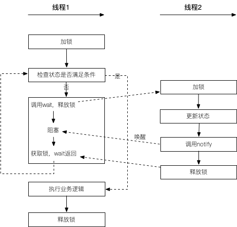

前几篇文章，主要讨论了一下关于互斥的相关内容，例如synchronized、Lock、CAS、原子类，累加器等。未来的几篇文章将讨论线程同步，例如condition、信号量、CountDownLatch、CyclicBarrier等。

<!--more-->

# 线程同步与线程互斥的区别

互斥与同步是多线程需要解决的两大核心问题。互斥通过互斥锁来解决问题，同步则是通过同步工具来解决。

互斥是一种**间接制约关系**，是指系统中的某些共享资源，一次只允许一个线程访问。当一个线程正在访问该临界资源时，其它线程必须等待。

**同步**，又称**直接制约关系**，是指多个线程（或进程）为了合作完成任务，必须严格按照规定的某种先后次序来运行。

# 如何实现一个BlockingQueue

如果有线程需要在某些“条件”满足后才接着后续操作，要如何实现？

例如：设计一个阻塞队列，当队列元素为空的时候，不允许读取线程读取，当队列元素满的时候，不允许写入线程写入。

要实现这样的功能，需要**一个完整的等待-通知机制：线程首先获取互斥锁，当线程要求的条件不满足时，释放互斥锁，进入等待状态；当要求的条件满足时，通知等待的线程，重新获取互斥锁。**

在java中可以通过这么几种方式来实现

1. `synchronized + loop`
2. `synchronized + wait + notifyAll`
3. `Condition`
4. `Semaphore`

其中1不常用，2和3都可以称之为条件变量，4为信号量，本篇文章主要讲解条件变量的实现方式。

## Synchronized + Look实现BlockingQueue

```java
public class BlockingQueueWithLoop implements Queue {

  private int[] elements;
  private int head;
  private int tail;
  private volatile int size; // 队列元素个数

  public BlockingQueueWithLoop() {
    this(10);
  }

  public BlockingQueueWithLoop(int capacity) {
    this.elements = new int[capacity];
    this.head = 0;
    this.tail = 0;
    this.size = 0;
  }

  @Override
  public void put(int e) throws InterruptedException {
    while (size == elements.length) {} // 使用自旋锁，等待队列不满
    synchronized (this) {
      if(size == elements.length){ // 双重检索
        return;
      }
      elements[tail] = e;
      tail++;
      if (tail == elements.length) {
        tail = 0;
      }
      size++;
    }
  }

  @Override
  public int take() throws InterruptedException {
    while (true) {
      while (size <= 0) {} // 使用自旋锁，等待队列不为空

      synchronized (this) { // 队列不为空，需要加锁
        if (size > 0) {     // 双重检索
          int e = elements[head];
          head++;
          if (head == elements.length) {
            head = 0;
          }
          size--;
          return e;
        }
      }
    }
  }

  @Override
  public synchronized int size() {
    return size;
  }

  @Override
  public synchronized boolean isEmpty() {
    return size == 0;
  }
}
```

我们通过使用自旋来等待队列满足（为空，为满）的条件。

需要注意的是，当自旋检测到队列不满足条件之后，为了保证后续操作线程安全，我们需要对其进行加锁。

在加锁之后，我们需要再次检查队列是否满足条件（为空？为满）。这有点类似线程安全单例类中的双重检测。这样做的原因是，多个线程有可能同时执行`put()/take()`函数，并且同时检测到队列不满足条件，于是，它们依次获取锁然后从队列中操作数据，如果不在获取锁之后重新检测，那么就有可能导致数组访问越界或者其他未知问题。

当然，我们也无法将自旋逻辑放如synchronized代码块中，如果这样做的话，那么可能会导致死锁。

## 条件变量实现BlockingQueue

自旋并不会让线程进入阻塞状态。如果线程将一直执行while循环，白白浪费CPU资源，甚至会让CPU使用率达到100%。

为了减少对CPU资源的浪费，我们可以在while循环中调用sleep()函数，让线程睡眠一小段时间。但这样会导致性能下降，如果sleep一段时间，不能立刻获取到队列的状态，导致响应不及时。

所以我们需要另外一套方案来实现阻塞队列，那就是通过条件变量来解决浪费CPU资源和响应不及时这两个问题。

java对于条件变量的实现有两种：

1. Object.wait()/Object.notify()/Object.notifyAll()
2. ReentrantLock.Condition

### Object.wait()/notifyAll()/notify()

首先java内置的条件变量，是使用Object类上的wait/notify/notifyAll方法实现的。

```java
public class Object {
  public final void wait() throws InterruptedException;
  public final native void wait(long timeoutMillis) throws InterruptedException;
  public final void wait(long timeoutMillis, int nanos) throws InterruptedException 
    
  public final native void notify();
  public final native void notifyAll();
}
```

说明：

1. 线程调用`wait()`，线程状态会进入`WAITING`状态。
2. 线程调用`wait(long timeoutMillis)`，线程状态会进入`TIMED_WAITING`状态，等待时间超过了预设的超时时间。
3. 其余线程调用`notify()/notifyAll()`唤醒此线程。
4. 线程被中断，调用`wait()/wait(long timeout)`会抛出`InterruptedException`异常。

```java
public class BlockingQueueWithSync implements Queue {

  private int[] elements;
  private int head;
  private int tail;
  private volatile int size; // 队列元素个数

  public BlockingQueueWithSync() {
    this(10);
  }

  public BlockingQueueWithSync(int capacity) {
    this.elements = new int[capacity];
    this.head = 0;
    this.tail = 0;
    this.size = 0;
  }

  @Override
  public synchronized void put(int e) throws InterruptedException {
    // 当队列满的时候阻塞
    while (size == elements.length) {
      this.wait();
    }
    elements[tail] = e;
    tail++;
    if (tail == elements.length) {
      tail = 0;
    }
    size++;
    // 通知其他线程有数据了
    this.notifyAll();
  }

  @Override
  public synchronized int take() throws InterruptedException {
    // 当队列空的时候阻塞
    while (isEmpty()) {
      this.wait();
    }
    int e = elements[head];
    if (++head == elements.length) {
      head = 0;
    }
    --size;
    // 通知其他线程，暂无数据
    this.notifyAll();
    return e;
  }

  @Override
  public synchronized int size() {
    return size;
  }

  @Override
  public synchronized boolean isEmpty() {
    return size == 0;
  }
}
```

如图所示，`wait()`和`notify()`的工作流程如下：



需要注意的是：

1. `wait()`和`notify()`都是Object类里的方法，原则上是可以单独调用的，但是会配合状态联合调用
2. 在调用`wait()`和`notify()`的时候，需要加锁，因为状态的检查和业务逻辑执行构成一组复合操作，如果不加锁就会出现线程不安全的问题。
3. 当状态不满足条件的时候，会调用wait方法，进入等待队列等待被唤醒，此时需要释放锁，否则其他线程将无法获取到锁，也就无法更新状态。
4. 当等待中的线程被唤醒时，必须再次竞争获取到锁的机会，需要再次检查状态是否满足条件。
5. while循环是为了避免线程被假唤醒。

`wait()`和`notify()`实现原理如下：

```c++
// ObjectMonitor.cpp
void ObjectMonitor::wait(jlong millis, bool interruptible, TRAPS) {}
void ObjectMonitor::notify(TRAPS) {}
void ObjectMonitor::notifyAll(TRAPS) {}
```

* 当某个线程调用`wait()`函数时，线程会将自己放入`_WaitSet`中，并释放持有的锁，调用`park()`阻塞自己。

* 当其他线程调用`notify()`
  * 如果`_EntryList`或者`_cxq`不为空时，那么它会从`_WaitSet`取出一个线程放入`_EntryList`中，让其排队等待锁。
  * 如果`_EntryList`或者`_cxq`均为空时，那么它会从`_WaitSet`取出一个线程直接调用这个线程的`unpark()`方法取消其阻塞状态，让其去竞争锁。
* 当调用了`wait()`的线程再次获取到锁的时候，会从`wait()`中返回，继续检查状态是否满足条件，如果不满足则继续执行上述两步，如果满足了，则执行业务逻辑。
* `notify()`和`notifyAll()`的区别在于`notifyAll()`会将`_WaitSet`中所有线程取出来放入`_EntryList`中，让他们一起竞争锁。

### ReentrantLock+Condition实现方式

```java
public class BlockingQueueWithCondition implements Queue {

  private int[] elements;
  private int head;
  private int tail;
  private volatile int size; // 队列元素个数
  private final ReentrantLock lock = new ReentrantLock();
  private final Condition notEmpty = lock.newCondition();
  private final Condition notFull = lock.newCondition();

  public BlockingQueueWithCondition() {
    this(10);
  }

  public BlockingQueueWithCondition(int capacity) {
    this.elements = new int[capacity];
    this.head = 0;
    this.tail = 0;
    this.size = 0;
  }

  @Override
  public void put(int e) throws InterruptedException {
    lock.lockInterruptibly();
    try {
      while (size == elements.length) {
        notFull.await();
      }
      elements[tail] = e;
      tail++;
      if (tail == elements.length) {
        tail = 0;
      }
      size++;
      notEmpty.signalAll();
    } finally {
      lock.unlock();
    }
  }

  @Override
  public int take() throws InterruptedException {
    lock.lockInterruptibly();
    try {
      while (isEmpty()) {
        notEmpty.await();
      }
      int e = elements[head];
      if (++head == elements.length) {
        head = 0;
      }
      --size;
      notFull.signalAll();
      return e;
    } finally {
      lock.unlock();
    }
  }

  @Override
  public int size() {
    try {
      lock.lock();
      return size;
    } finally {
      lock.unlock();
    }
  }

  @Override
  public boolean isEmpty() {
    try {
      lock.lock();
      return size == 0;
    } finally {
      lock.unlock();
    }
  }
}
```

`Condition`是java SDK里提供的一种条件变量实现方式，其原理与`Object#wait()`以及`Object#notify()`类似

```java
// java.util.concurrent.locks.Condition
public interface Condition {
    void await() throws InterruptedException;
    void awaitUninterruptibly();
    long awaitNanos(long nanosTimeout) throws InterruptedException;
    boolean await(long time, TimeUnit unit) throws InterruptedException;
    boolean awaitUntil(Date deadline) throws InterruptedException;
    void signal();
    void signalAll();
}
```

`Condition`里的`awaitXXX(XXX)`方法基本等同于`Object#wait()`，但是比`Object#wait()`提供了更多的等待形式。例如：

1. `Condition#awaitUninterruptibly()`，表示此方法执行中，不可以被中断。
2. `Condition#awaitNanos(long nanosTimeout)`，表示等待超过nanosTimeout纳秒时，函数返回，返回值为等待时间。
3. `Condition#await(long time, TimeUnit unit)`，跟`awaitNanos`类似。
4. `Condition#awaitUntil(Date deadline)`，表示等待到某个时间点deadline，函数返回，返回值如果为false则表示已经超时，返回值如果为true，则表示线程被中断或者被唤醒。

`Condition`里的`signalXXX()`方法基本等同于`Object#notify()/notifyAll()`。

