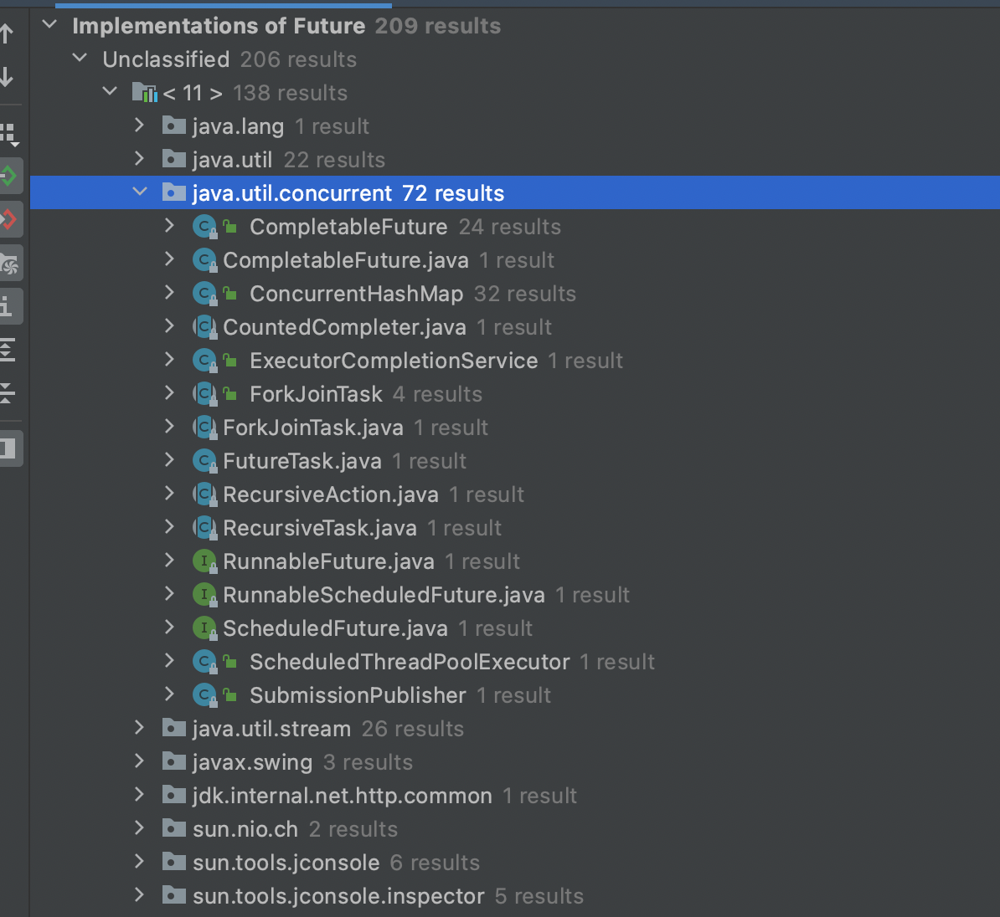
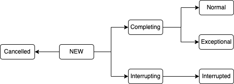

# 为什么要使用Future

线程获取到运行结果有几种方式

```java
public class Sum {
  private Sum(){}
  public static int sum(int n){
    int sum = 0;
    for (int i = 0; i < n; i++) {
      sum += n;
    }
    return sum;
  }
}
```

**Thread.sleep()**

```java
private static int sum_sleep = 0;
Thread thread = new Thread(() -> sum_sleep = Sum.sum(100));
thread.start();
TimeUnit.SECONDS.sleep(1);
System.out.printf("get result by thread.sleep: %d\n", sum_sleep);
```

使用`sleep()`方法获取，这种方法，有不可控性，也许`sleep`1秒钟，但是线程还没有执行完成，可能会导致获取到的结果不准确。

**Thread.join()**

```java
private static int sum_join = 0;
Thread thread = new Thread(() -> sum_join = Sum.sum(100));
thread.start();
thread.join();
System.out.printf("get result by thread.join: %d\n", sum_join);
```

**循环**

```java
private static int sum_loop = 0;
private static volatile boolean flag;

Thread thread = new Thread(() -> {
  sum_loop = Sum.sum(100);
  flag = true;
});
thread.start();
int i = 0;
while (!flag) {
  i++;
}
System.out.printf("get result by loopLock: %d\n", sum_loop);
```

**notifyAll() / wait()**

```java
private static class NotifyAndWaitTest {

    private Integer sum = null;

    private synchronized void sum_wait_notify() {
      sum = Sum.sum(100);
      notifyAll();
    }

    private synchronized Integer getSum() {
      while (sum == null) {
        try {
          wait();
        } catch (Exception e) {
          e.printStackTrace();
        }
      }
      return sum;
    }
}
private static void getResultByNotifyAndWait() throws Exception {
    NotifyAndWaitTest test = new NotifyAndWaitTest();
    new Thread(test::sum_wait_notify).start();
    System.out.printf("get result by NotifyAndWait: %d\n", test.getSum());
}
```

**Lock & Condition**

```java
private static class LockAndConditionTest {

    private Integer sum = null;
    private final Lock lock = new ReentrantLock();
    private final Condition condition = lock.newCondition();

    public void sum() {
      try {
        lock.lock();
        sum = Sum.sum(100);
        condition.signalAll();
      } catch (Exception e) {
        e.printStackTrace();
      } finally {
        lock.unlock();
      }
    }

    public Integer getSum() {
      try {
        lock.lock();
        while (Objects.isNull(sum)) {
          try {
            condition.await();
          } catch (Exception e) {
            throw new RuntimeException(e);
          }
        }
      } catch (Exception e) {
        e.printStackTrace();
      } finally {
        lock.unlock();
      }
      return sum;
    }
}

private static void getResultByLockAndCondition() throws Exception {
  LockAndConditionTest test = new LockAndConditionTest();
  new Thread(test::sum).start();
  System.out.printf("get result by lock and condition: %d\n", test.getSum());
}
```

**BlockingQueue**

```java
BlockingQueue<Integer> queue = new ArrayBlockingQueue<>(1);
new Thread(() -> queue.offer(Sum.sum(100))).start();
System.out.printf("get result by blocking queue: %d\n", queue.take());
```

**CountDownLatch**

```java
private static int sum_countDownLatch = 0;

private static void getResultByCountDownLatch() {
  CountDownLatch latch = new CountDownLatch(1);

  new Thread(
          () -> {
            sum_countDownLatch = Sum.sum(100);
            latch.countDown();
          })
      .start();
  try {
    latch.await();
  } catch (Exception e) {
    e.printStackTrace();
  }
  System.out.printf("get result by countDownLatch: %d\n", sum_countDownLatch);
}
```

**CyclicBarrier**

```java
private static int sum_cyclicBarrier = 0;

private static void getResultByCycleBarrier() {
  CyclicBarrier cyclicBarrier = new CyclicBarrier(2);
  new Thread(
    () -> {
      sum_cyclicBarrier = Sum.sum(100);
      try {
        cyclicBarrier.await();
      } catch (Exception e) {
        e.printStackTrace();
      }
    })
    .start();
  try {
    cyclicBarrier.await();
  } catch (Exception e) {
    e.printStackTrace();
  }
  System.out.printf("get result by cyclicBarrier: %d\n", sum_cyclicBarrier);
}
```

**Semaphore**

```java
private static int sum_semaphore = 0;
private static void getResultBySemaphore() {
  Semaphore semaphore = new Semaphore(0);
  new Thread(
    () -> {
      sum_semaphore = Sum.sum(100);
      semaphore.release();
    })
    .start();

  try {
    semaphore.acquire();
    System.out.printf("get result by semaphore: %d\n", sum_semaphore);
  } catch (InterruptedException e) {
    e.printStackTrace();
  }
}
```

上一篇我们讲了线程池，利用`ThreadPoolExecutor`的`execute(Runnable command)`方法，利用这个方法虽说可以提交任务，但是却没有办法获取任务执行结果。另外，上述介绍的几个获取到执行结果的方式，也不是很优雅，不是最佳实践。那么我们如果需要获取任务的执行结果，可以使用`submit()`方法和`Future`工具类来实现。`Future`方便的用于异步结果的获取， 本文将会通过具体的例子讲解如何使用`Future`。

`Future`最主要的作用是，比如当做比较耗时运算的时候，如果我们一直在原地等待方法返回，显然是不明智的，整体程序的运行效率会大大降低。我们可以把运算的过程放到子线程去执行，再通过`Future`去控制子线程执行的计算过程，最后获取到计算结果。这样一来就可以把整个程序的运行效率提高，是一种异步的思想。

# 如何使用Future

要想使用`Future`首先得先了解一下`Callable`。`Callable` 接口相比于 `Runnable` 的一大优势是可以有返回结果，那这个返回结果怎么获取呢？就可以用 `Future` 类的 get 方法来获取 。因此，`Future` 相当于一个存储器，它存储了 `Callable` 的` call `方法的任务结果。

一般情况下，`Future，Callable，ExecutorService`是一起使用的，`ExecutorService`里相关的代码如下：

```java
// 提交 Runnable 任务
// 由于Runnable接口的run方法没有返回值，所以，Future仅仅是用来断言任务已经结束，有点类似join();
Future<?> submit(Runnable task);
// 提交 Callable 任务
// Callable里的call方法是有返回值的，所以这个方法返回的Future对象可以通过调用其get()方法来获取任务的执
//行结果。
<T> Future<T> submit(Callable<T> task);
// 提交 Runnable 任务及结果引用  
// Future的返回值就是传给submit()方法的参数result。
<T> Future<T> submit(Runnable task, T result);
```

具体使用方法如下：

```java
ExecutorService executor = Executors.newCachedThreadPool();
Future<Integer> future = executor.submit(() -> Sum.sum(100));

System.out.printf("get result by Callable + Future: %d\n", future.get());
executor.shutdown();
```

# Future实现原理

## Future基本概述

`Future`接口5个方法：

```java
// 取消任务
boolean cancel(boolean mayInterruptIfRunning);
// 判断任务是否已取消  
boolean isCancelled();
// 判断任务是否已结束
boolean isDone();
// 获得任务执行结果 阻塞，被调用时，如果任务还没有执行完，那么调用get()方法的线程会阻塞。直到任务执行完
// 才会被唤醒
get();
// 获得任务执行结果，支持超时
get(long timeout, TimeUnit unit);

```

- `cancel(boolean mayInterruptIfRunning)`：
  - 用来取消异步任务的执行。
  - 如果异步任务已经完成或者已经被取消，或者由于某些原因不能取消，则会返回`false`。
  - 如果任务还没有被执行，则会返回`true`并且异步任务不会被执行。
  - 如果任务已经开始执行了但是还没有执行完成，若`mayInterruptIfRunning`为`true`，则会立即中断执行任务的线程并返回`true`，若`mayInterruptIfRunning`为`false`，则会返回`true`且不会中断任务执行线程。
- `isCanceled()`：
  - 判断任务是否被取消。
  - 如果任务在结束(正常执行结束或者执行异常结束)前被取消则返回`true`，否则返回`false`。
- `isDone()`：
  - ·判断任务是否已经完成，如果完成则返回`true`，否则返回`false`。
  - 任务执行过程中发生异常、任务被取消也属于任务已完成，也会返回`true`。
- `get()`：
  - 获取任务执行结果，如果任务还没完成则会阻塞等待直到任务执行完成。
  - 如果任务被取消则会抛出`CancellationException`异常。
  - 如果任务执行过程发生异常则会抛出`ExecutionException`异常。
  - 如果阻塞等待过程中被中断则会抛出`InterruptedException`异常。
- `get(long timeout,Timeunit unit)`:
  - 带超时时间的`get()`版本，上面讲述的`get()`方法，同样适用这里。
  - 如果阻塞等待过程中超时则会抛出`TimeoutException`异常。

使用IDEA，查看`Future`的实现类其实有很多，比如`FutureTask，ForkJoinTask，CompletableFuture`等，其余基本是继承了`ForkJoinTask`实现的内部类。



本篇文章主要讲解`FutureTask`的实现原理

## FutureTask基本概述

`FutureTask` 为 `Future` 提供了基础实现，如获取任务执行结果`(get)`和取消任务`(cancel)`等。如果任务尚未完成，获取任务执行结果时将会阻塞。一旦执行结束，任务就不能被重启或取消(除非使用`runAndReset`执行计算)。`FutureTask` 常用来封装 `Callable` 和 `Runnable`，也可以作为一个任务提交到线程池中执行。除了作为一个独立的类之外，此类也提供了一些功能性函数供我们创建自定义 `task` 类使用。FutureTask 的线程安全由`CAS`来保证。

```java
// 创建 FutureTask
FutureTask<Integer> futureTask = new FutureTask<>(()-> 1+2);
// 创建线程池
ExecutorService es = Executors.newCachedThreadPool();
// 提交 FutureTask 
es.submit(futureTask);
// 获取计算结果
Integer result = futureTask.get();

```

```java
// 创建 FutureTask
FutureTask<Integer> futureTask
  = new FutureTask<>(()-> 1+2);
// 创建并启动线程
Thread T1 = new Thread(futureTask);
T1.start();
// 获取计算结果
Integer result = futureTask.get();

```

`FutureTask`可以很容易获取子线程的执行结果。

## FutureTask实现原理

### 构造函数

```java
public FutureTask(Callable<V> callable) {
  if (callable == null)
    throw new NullPointerException();
  this.callable = callable;
  this.state = NEW;       // ensure visibility of callable
}

public FutureTask(Runnable runnable, V result) {
  this.callable = Executors.callable(runnable, result);
  this.state = NEW;       // ensure visibility of callable
}
```

`FutureTask`提供了两个构造器

* `Callable`接口有返回，将`callable`赋值给`this.callable`。

* `Runnable`接口无返回，如果想要获取到执行结果，需要传`V result`给`FutureTask`，`FutureTask`将`Runnable`和`result`封装成`Callable`，再将`callable`赋值给`this.callable`。
* 状态初始化状态为`NEW`

`FutureTask`**内置状态**有：

```java
private volatile int state; // 可见性
private static final int NEW          = 0;
private static final int COMPLETING   = 1;
private static final int NORMAL       = 2;
private static final int EXCEPTIONAL  = 3;
private static final int CANCELLED    = 4;
private static final int INTERRUPTING = 5;
private static final int INTERRUPTED  = 6;
```

- NEW 初始状态
- COMPLETING 任务已经执行完(正常或者异常)，准备赋值结果，但是这个状态会时间会比较短，属于中间状态。
- NORMAL 任务已经**正常**执行完，并已将任务返回值赋值到结果
- EXCEPTIONAL 任务执行失败，并将异常赋值到结果
- CANCELLED 取消
- INTERRUPTING 准备尝试中断执行任务的线程
- INTERRUPTED 对执行任务的线程进行中断(未必中断到)

**状态转换**：



### run()执行流程

```java
public void run() {
    if (state != NEW ||
        !RUNNER.compareAndSet(this, null, Thread.currentThread()))
        return;
    try {
        Callable<V> c = callable;
        if (c != null && state == NEW) {
            V result;
            boolean ran;
            try {
                result = c.call();
                ran = true;
            } catch (Throwable ex) {
                result = null;
                ran = false;
                setException(ex);
            }
            if (ran)
                set(result);
        }
    } finally {
        // runner must be non-null until state is settled to
        // prevent concurrent calls to run()
        runner = null;
        // state must be re-read after nulling runner to prevent
        // leaked interrupts
        int s = state;
        if (s >= INTERRUPTING)
            handlePossibleCancellationInterrupt(s);
    }
}
```

### get()执行流程

```java
public V get() throws InterruptedException, ExecutionException {
    int s = state;
    if (s <= COMPLETING)
        s = awaitDone(false, 0L);
    return report(s);
}
```

### cancel()执行流程

```java
public boolean cancel(boolean mayInterruptIfRunning) {
    if (!(state == NEW && STATE.compareAndSet
          (this, NEW, mayInterruptIfRunning ? INTERRUPTING : CANCELLED)))
        return false;
    try {    // in case call to interrupt throws exception
        if (mayInterruptIfRunning) {
            try {
                Thread t = runner;
                if (t != null)
                    t.interrupt();
            } finally { // final state
                STATE.setRelease(this, INTERRUPTED);
            }
        }
    } finally {
        finishCompletion();
    }
    return true;
}
```

# 经典案例

烧水泡茶：


并发编程可以总结为三个核心问题：分工，同步和互斥。编写并发程序，首先要做分工。

1. T1负责洗水壶，烧开水，泡茶这三道工序
2. T2负责洗茶壶，洗茶杯，拿茶叶三道工序。
3. T1在执行泡茶这道工序需要等到T2完成拿茶叶的工作。（join,countDownLatch，阻塞队列都可以完成）


```java
// 创建任务 T2 的 FutureTask
FutureTask<String> ft2
  = new FutureTask<>(new T2Task());
// 创建任务 T1 的 FutureTask
FutureTask<String> ft1
  = new FutureTask<>(new T1Task(ft2));
// 线程 T1 执行任务 ft1
Thread T1 = new Thread(ft1);
T1.start();
// 线程 T2 执行任务 ft2
Thread T2 = new Thread(ft2);
T2.start();
// 等待线程 T1 执行结果
System.out.println(ft1.get());

// T1Task 需要执行的任务：
// 洗水壶、烧开水、泡茶
class T1Task implements Callable<String>{
  FutureTask<String> ft2;
  // T1 任务需要 T2 任务的 FutureTask
  T1Task(FutureTask<String> ft2){
    this.ft2 = ft2;
  }
  @Override
  String call() throws Exception {
    System.out.println("T1: 洗水壶...");
    TimeUnit.SECONDS.sleep(1);
    
    System.out.println("T1: 烧开水...");
    TimeUnit.SECONDS.sleep(15);
    // 获取 T2 线程的茶叶  
    String tf = ft2.get();
    System.out.println("T1: 拿到茶叶:"+tf);

    System.out.println("T1: 泡茶...");
    return " 上茶:" + tf;
  }
}
// T2Task 需要执行的任务:
// 洗茶壶、洗茶杯、拿茶叶
class T2Task implements Callable<String> {
  @Override
  String call() throws Exception {
    System.out.println("T2: 洗茶壶...");
    TimeUnit.SECONDS.sleep(1);

    System.out.println("T2: 洗茶杯...");
    TimeUnit.SECONDS.sleep(2);

    System.out.println("T2: 拿茶叶...");
    TimeUnit.SECONDS.sleep(1);
    return " 龙井 ";
  }
}
// 一次执行结果：
//T1: 洗水壶...
//T2: 洗茶壶...
//T1: 烧开水...
//T2: 洗茶杯...
//T2: 拿茶叶...
//T1: 拿到茶叶: 龙井
//T1: 泡茶...
//上茶: 龙井

```

