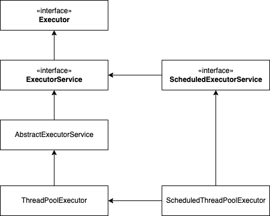
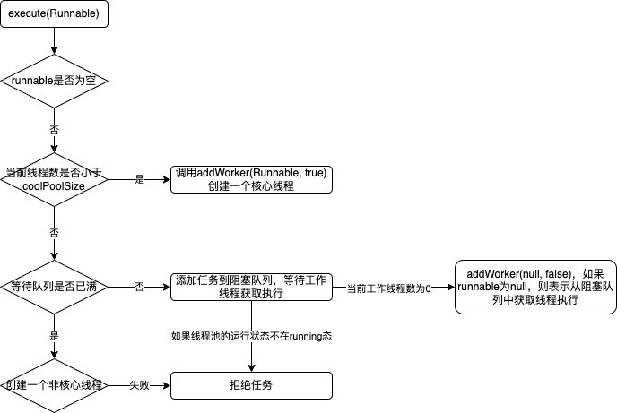
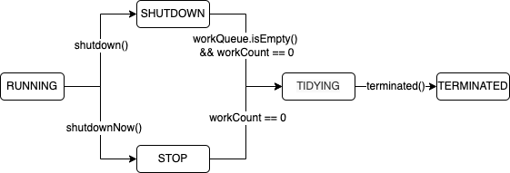
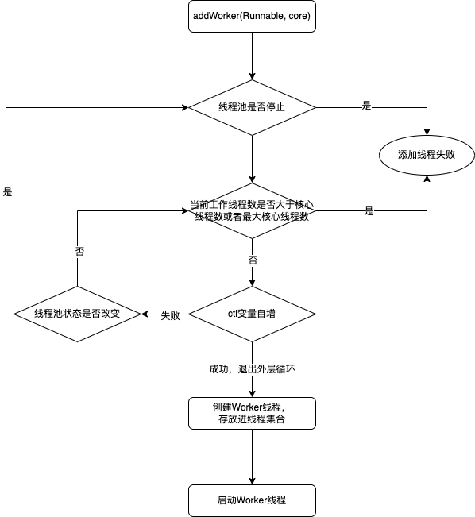
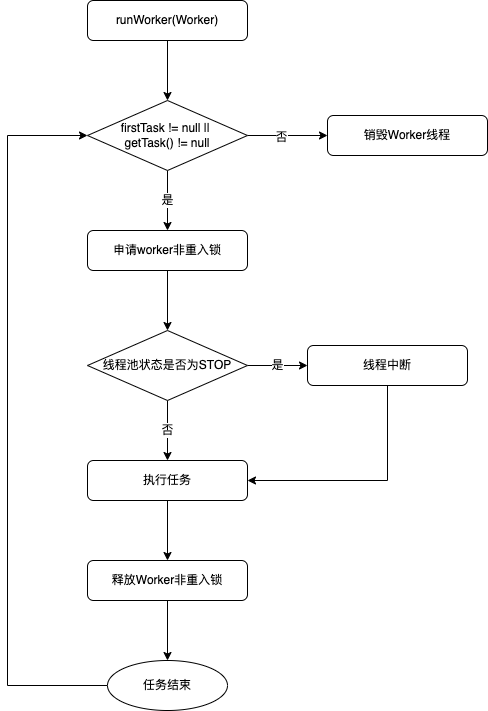
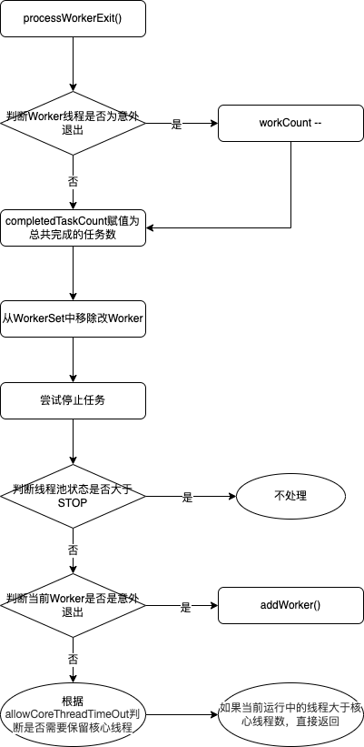

java框架中例如Tomcat、Dubbo等都离不开线程池，这些框架用到线程的地方，都会用线程池来负责。我们在使用这些框架的时候，会设置线程池参数，用于提高性能。那么开多少线程合适？今天我们将围绕这个问题来学习一下线程池。

<!--more-->

# 为什么使用线程池

平常我们使用java线程的时候，都是直接创建一个`Thread`对象，java线程的创建和销毁都会涉及到`Thread`对象的创建和销毁，线程切换等问题。创建`Thread`对象，仅仅是在 JVM 的堆里分配一块内存而已；而创建一个线程，却需要调用操作系统内核的 API，然后操作系统要为线程分配一系列的资源，这个成本就很高了。所以线程是一个重量级的对象，应该避免频繁创建和销毁。

一般可以通过“池化”思想来解决上述的问题，而JDK中提供的线程池实现是基于ThreadPoolExecutor。

使用线程池可以带来一系列好处：

- **降低资源消耗**：通过池化技术重复利用已创建的线程，降低线程创建和销毁造成的损耗。
- **提高响应速度**：任务到达时，无需等待线程创建即可立即执行。
- **提高线程的可管理性**：线程是稀缺资源，如果无限制创建，不仅会消耗系统资源，还会因为线程的不合理分布导致资源调度失衡，降低系统的稳定性。使用线程池可以进行统一的分配、调优和监控。
- **提供更多更强大的功能**：线程池具备可拓展性，允许开发人员向其中增加更多的功能。比如延时定时线程池ScheduledThreadPoolExecutor，就允许任务延期执行或定期执行。

# 线程池核心设计与实现

## 总体设计



* 顶层接口是`Executor`，`java.util.concurrent.Executor#execute`，用户只需提供`Runnable`对象，将任务的运行逻辑提交到执行器(`Executor`)中，由`Executor`框架完成线程的调配和任务的执行部分。
* `ExecutorService`接口扩展了`Executor`并增加了一些能力：
  * 扩充执行任务的能力，通过调用`submit()`或者`invokeAll()`方法可以为一个或一批异步任务生成Future的方法；
  * 提供了管控线程池的方法，比如调用`shutdown()`等方法停止线程池的运行。
* `AbstractExecutorService`则是上层的抽象类，将执行任务的流程串联了起来，保证下层的实现只需关注一个执行任务的方法即可。
* 具体实现类是`ThreadPoolExecutor`，`ThreadPoolExecutor`将会一方面维护自身的生命周期，另一方面同时管理线程和任务，使两者良好的结合从而执行并行任务。
* `ScheduledThreadPoolExecutor`又扩展了`ThreadPoolExecutor`和`ScheduledExecutorService`接口，增加了调度能力，使任务可以延时定时执行。
* 另外还有一个提供了线程池创建的工厂方法的类`Executors`，用来创建线程池。

本章主要说明ThreadPoolExecutor的实现原理，ScheduledThreadPoolExecutor下篇会讨论。

## ThreadPoolExecutor实现原理

### ThreadPoolExecutor构造参数说明

```java
ThreadPoolExecutor(
  int corePoolSize,
  int maximumPoolSize,
  long keepAliveTime,
  TimeUnit unit,
  BlockingQueue<Runnable> workQueue,
  ThreadFactory threadFactory,
  RejectedExecutionHandler handler) 

```

* **corePoolSize**:表示线程池保有的最小线程数。核心线程数，这些核心线程一旦被创建，就不会被销毁。相反，如果是非核心线程，等任务执行完并长时间未被使用则会被销毁。

* **maximumPoolSize**：表示线程池创建的最大线程数。

* **keepAliveTime&unit**：一个线程如果在一段时间内，都没有执行任务，说明很闲，keepAliveTime和unit就是用来定义这个一段时间的参数。也就是说，如果线程已经空闲了keepAliveTime和unit这么久了，而且线程数大于corePoolSize，那么这个空闲线程就要被回收。

* **workQueue**：用来存储任务，当有新的任务请求线程处理时，如果核心线程池已满，那么新来的任务会加入workQueue队列中，workQueue是一个阻塞队列。

* **threadFactory**：通过这个参数可以自定义如何创建线程。

* **handler**:通过这个参数可以自定义任务的拒绝策略。如果线程池中所有的线程都在忙碌，并且工作队列也满了（前提是工作队列是有界队列），那么此时提交任务，线程池就会拒绝接收。至于拒绝的策略，可以通过这个参数来指定

  ThreadPoolExecutor已经提供了四种策略。

  1. CallerRunsPolicy:提交任务的线程自己去执行该任务。
  2. AbortPolicy:默认的拒绝策略，会throws RejectedExecutionException.
  3. DiscardPolicy:直接丢弃任务，没有任何异常输出。
  4. DiscardOldestPolicy:丢弃最老的任务，其实就是把最早进入工作队列的任务丢弃，然后把新任务加入到工作队列。

### ThreadPoolExecutor执行流程

```java
public void execute(Runnable command) {
    if (command == null)
        throw new NullPointerException();
    int c = ctl.get();
    if (workerCountOf(c) < corePoolSize) {
        if (addWorker(command, true))
            return;
        c = ctl.get();
    }
    if (isRunning(c) && workQueue.offer(command)) {
        int recheck = ctl.get();
        if (! isRunning(recheck) && remove(command))
            reject(command);
        else if (workerCountOf(recheck) == 0)
            addWorker(null, false);
    }
    else if (!addWorker(command, false))
        reject(command);
}
```

1. 首先检测线程池运行状态，如果不是RUNNING，则直接拒绝，线程池要保证在RUNNING的状态下执行任务。
2. 如果workerCount < corePoolSize，则创建并启动一个线程来执行新提交的任务。
3. 如果workerCount >= corePoolSize，且线程池内的阻塞队列未满，则将任务添加到该阻塞队列中。
4. 如果workerCount >= corePoolSize && workerCount < maximumPoolSize，且线程池内的阻塞队列已满，则创建并启动一个线程来执行新提交的任务。
5. 如果workerCount >= maximumPoolSize，并且线程池内的阻塞队列已满, 则根据拒绝策略来处理该任务, 默认的处理方式是直接抛异常。



### 线程池运行状态

线程池的运行状态，由线程池内部维护，线程池内部使用`AtomicInteger`变量，用于维护运行状态`runState`和工作线程数`workerCount`，高3位保存`runState`，低29位保存`workerCount`，两个变量之间互不干扰。用一个变量去存储两个值，可避免在做相关决策时，出现不一致的情况，不必为了维护两者的一致，而占用锁资源。

```java
private final AtomicInteger ctl = new AtomicInteger(ctlOf(RUNNING, 0));

// COUNT_BITS=29,（对于int长度为32来说）表示线程数量的字节位数
private static final int COUNT_BITS = Integer.SIZE - 3;
// 状态掩码，高三位是1，低29位全是0，可以通过 ctl&COUNT_MASK 运算来获取线程池状态
private static final int COUNT_MASK = (1 << COUNT_BITS) - 1;


private static final int RUNNING    = -1 << COUNT_BITS; // 111 00000 00000000 00000000 00000000;
private static final int SHUTDOWN   =  0 << COUNT_BITS; // 000 00000 00000000 00000000 00000000; 
private static final int STOP       =  1 << COUNT_BITS; // 001 00000 00000000 00000000 00000000;
private static final int TIDYING    =  2 << COUNT_BITS; // 010 00000 00000000 00000000 00000000;
private static final int TERMINATED =  3 << COUNT_BITS; // 011 00000 00000000 00000000 00000000;

// 计算当前运行状态
private static int runStateOf(int c)     { return c & ~COUNT_MASK; }
// 计算当前线程数量
private static int workerCountOf(int c)  { return c & COUNT_MASK; }
//通过状态和线程数生成ctl
private static int ctlOf(int rs, int wc) { return rs | wc; }
```

| 状态       | 描述                                                         |
| ---------- | ------------------------------------------------------------ |
| RUNNING    | 能接受新的任务，也能处理阻塞队列中的任务                     |
| SHUTDOWN   | 关闭状态，不能接受新的任务，只能处理阻塞队列中的任务         |
| STOP       | 不能接受新的任务，也不能处理阻塞队列中的任务，会中断正在处理任务的线程 |
| TIDYING    | 所有任务都停止了，workerCount为0                             |
| TERMINATED | 在执行terminated()方法会进入到这个状态                       |

状态转移：



### 阻塞队列

再介绍线程池总体设计的时候，说过线程池的设计，采用的都是生产者 - 消费者模式，其实现主要就是通过`BlockingQueue`来实现的，目的是将任务和线程两者解耦，阻塞队列缓存任务，工作线程从阻塞队列中获取任务。

使用不同的队列可以实现不一样的任务存取策略。在这里，我们可以再介绍下阻塞队列的成员：

| 阻塞队列                | 描述                                                         |
| ----------------------- | ------------------------------------------------------------ |
| `ArrayBlockingQueue`    | 基于数组实现的有界队列，支持公平锁和非公平锁                 |
| `LinkedBlockingQueue`   | 基于链表实现的有界队列，队列大小默认为`Integer.MAX_VALUE`，所以默认创建该队列会有容量危险 |
| `PriorityBlockingQueue` | 支持优先级排序的无界队列，不能保证同优先级的顺序             |
| `DelayQueue`            | 基于`PriorityBlockingQueue`实现的延期队列，只有当延时期满了，才能从中取出元素 |
| `SynchronousQueue`      | 同步队列，不存储任何元素，调用一次`put()`就必须等待`take()`调用完。支持公平锁和非公平锁 |
| `LinkedTransferQueue`   | 基于链表实现的无界队列，多了`transfer()`和`tryTransfer()`方法 |
| `LinkedBlockingDeque`   | 基于双向链表实现的队列，多线程并发时，可以将锁的竞争最多降到一半 |

## Worker

### Worker整体设计

* `Worker`继承了`AQS`，使用AQS来实现独占锁这个功能。没有使用可重入锁ReentrantLock，而是使用AQS，为的就是实现不可重入的特性去反应线程现在的执行状态。

* `Worker`实现了`Runnable`接口，持有一个线程`thread`，一个初始化的任务`firstTask`。`thread`是在调用构造方法时通过`ThreadFactory`来创建的线程，可以用来执行任务；

```java
private final class Worker extends AbstractQueuedSynchronizer implements Runnable{
    final Thread thread;//Worker持有的线程
    Runnable firstTask;//初始化的任务，可以为null
  
    Worker(Runnable firstTask) {
      setState(-1); // inhibit interrupts until runWorker
      this.firstTask = firstTask;
      this.thread = getThreadFactory().newThread(this);
    }
  
    public void run() {
      runWorker(this);
    }
  
  // ...省略其余代码
}
```

### Worker如何添加任务

```java
private boolean addWorker(Runnable firstTask, boolean core) {
    retry:
    for (int c = ctl.get();;) {
        // Check if queue empty only if necessary.
        if (runStateAtLeast(c, SHUTDOWN)
            && (runStateAtLeast(c, STOP)
                || firstTask != null
                || workQueue.isEmpty()))
            return false;

        for (;;) {
            if (workerCountOf(c)
                >= ((core ? corePoolSize : maximumPoolSize) & COUNT_MASK))
                return false;
            if (compareAndIncrementWorkerCount(c))
                break retry;
            c = ctl.get();  // Re-read ctl
            if (runStateAtLeast(c, SHUTDOWN))
                continue retry;
            // else CAS failed due to workerCount change; retry inner loop
        }
    }

    boolean workerStarted = false;
    boolean workerAdded = false;
    Worker w = null;
    try {
        w = new Worker(firstTask);
        final Thread t = w.thread;
        if (t != null) {
            final ReentrantLock mainLock = this.mainLock;
            mainLock.lock();
            try {
                // Recheck while holding lock.
                // Back out on ThreadFactory failure or if
                // shut down before lock acquired.
                int c = ctl.get();

                if (isRunning(c) ||
                    (runStateLessThan(c, STOP) && firstTask == null)) {
                    if (t.getState() != Thread.State.NEW)
                        throw new IllegalThreadStateException();
                    workers.add(w);
                    workerAdded = true;
                    int s = workers.size();
                    if (s > largestPoolSize)
                        largestPoolSize = s;
                }
            } finally {
                mainLock.unlock();
            }
            if (workerAdded) {
                t.start();
                workerStarted = true;
            }
        }
    } finally {
        if (! workerStarted)
            addWorkerFailed(w);
    }
    return workerStarted;
}
```

`addWorker()`方法有两个参数：

* `firstTask`用它来保存传入的第一个任务，这个任务可以有也可以为`null`。如果这个值是非空的，那么线程就会在启动初期立即执行这个任务，也就对应核心线程创建时的情况；如果这个值是`null`，那么就需要创建一个线程去执行`workQueue`中的任务，也就是非核心线程的创建。
* `core`参数为`true`表示在新增线程时会判断当前活动线程数是否少于`corePoolSize`，`false`表示新增线程前需要判断当前活动线程数是否少于`maximumPoolSize`。

具体流程如下：




### Worker如何获取任务

任务的执行有两种可能：一种是任务直接由新创建的线程执行。另一种是线程从任务队列中获取任务然后执行，执行完任务的空闲线程会再次去从队列中申请任务再去执行。

第一种在上述`addWorker()`方法中，如果`firstTask`不为空的话，会直接运行。第二种`firstTask`为空，任务将从`workQueue`中获取，调用`getTask()`方法

```java
private Runnable getTask() {
        boolean timedOut = false; // Did the last poll() time out?

        for (;;) {
            int c = ctl.get();
            // Check if queue empty only if necessary.
            if (runStateAtLeast(c, SHUTDOWN)
                && (runStateAtLeast(c, STOP) || workQueue.isEmpty())) {
                decrementWorkerCount();
                return null;
            }
            int wc = workerCountOf(c);
            // Are workers subject to culling?
            boolean timed = allowCoreThreadTimeOut || wc > corePoolSize;

            if ((wc > maximumPoolSize || (timed && timedOut))
                && (wc > 1 || workQueue.isEmpty())) {
                if (compareAndDecrementWorkerCount(c))
                    return null;
                continue;
            }
            try {
                Runnable r = timed ?
                    workQueue.poll(keepAliveTime, TimeUnit.NANOSECONDS) :
                    workQueue.take();
                if (r != null)
                    return r;
                timedOut = true;
            } catch (InterruptedException retry) {
                timedOut = false;
            }
        }
    }
```

具体流程：

执行流程.png)

### Worker如何运行任务

```java
// java.util.concurrent.ThreadPoolExecutor#runWorker
final void runWorker(Worker w) {
  Thread wt = Thread.currentThread();
  Runnable task = w.firstTask;
  w.firstTask = null;
  w.unlock(); // allow interrupts
  boolean completedAbruptly = true;
  try {
    while (task != null || (task = getTask()) != null) {
      w.lock();
      // If pool is stopping, ensure thread is interrupted;
      // if not, ensure thread is not interrupted.  This
      // requires a recheck in second case to deal with
      // shutdownNow race while clearing interrupt
      if ((runStateAtLeast(ctl.get(), STOP) ||
           (Thread.interrupted() &&
            runStateAtLeast(ctl.get(), STOP))) &&
          !wt.isInterrupted())
        wt.interrupt();
      try {
        beforeExecute(wt, task);
        try {
          task.run();
          afterExecute(task, null);
        } catch (Throwable ex) {
          afterExecute(task, ex);
          throw ex;
        }
      } finally {
        task = null;
        w.completedTasks++;
        w.unlock();
      }
    }
    completedAbruptly = false;
  } finally {
    processWorkerExit(w, completedAbruptly);
  }
}
```

具体流程：



1. while循环不断地通过getTask()方法获取任务。  
2. 如果线程池正在停止，那么要保证当前线程是中断状态，否则要保证当前线程不是中断状态。 
3. 执行任务。 
4. 如果getTask结果为null则跳出循环，执行processWorkerExit()方法，销毁线程。

### Worker线程如何回收

线程的销毁依赖JVM自动的回收，但线程池中核心线程是不能被jvm回收的，所以当线程池决定哪些线程需要回收时，只需要将其引用消除即可。Worker被创建出来后，就会不断地进行轮询，然后获取任务去执行，核心线程可以无限等待获取任务，非核心线程要限时获取任务。当Worker无法获取到任务，也就是获取的任务为空时，循环会结束，Worker会主动消除自身在线程池内的引用。

其主要逻辑在`processWorkerExit()`方法中

```java
private void processWorkerExit(Worker w, boolean completedAbruptly) {
    if (completedAbruptly) // If abrupt, then workerCount wasn't adjusted
        decrementWorkerCount();

    final ReentrantLock mainLock = this.mainLock;
    mainLock.lock();
    try {
        completedTaskCount += w.completedTasks;
        workers.remove(w);
    } finally {
        mainLock.unlock();
    }

    tryTerminate();

    int c = ctl.get();
    if (runStateLessThan(c, STOP)) {
        if (!completedAbruptly) {
            int min = allowCoreThreadTimeOut ? 0 : corePoolSize;
            if (min == 0 && ! workQueue.isEmpty())
                min = 1;
            if (workerCountOf(c) >= min)
                return; // replacement not needed
        }
        addWorker(null, false);
    }
}
```

具体流程：



# 使用线程池最佳实践

## Executors

考虑到ThreadPoolExecutor的构造函数实现有些复杂，所以java提供了一个线程池的静态工厂类，Executors，利用Executors可以快速创建线程池。但是大厂都不建议使用Executors，原因：Executors的很多方法默认使用的是无参构造的LinkedBlockQueue，默认大小为`Integer.MAX_VALUE`，高负载情况下，队列很容易导致OOM。而OOM了就会导致所有请求都无法处理。**强烈建议使用ArrayBlockingQueue有界队列。**

使用有界队列，当任务过多时，线程池会触发执行拒绝策略，线程池默认的拒绝策略会throw RejectedExecutionException这个运行时异常，所以开发人员很容易忽略，因此默认拒绝策略需要慎重使用。如果线程处理的任务非常重要，建议自定义拒绝策略，实际开发中，自定义拒绝策略往往和降级策略配合使用。

下面介绍常用的方法：

### newFixedThreadPool()

* newFixedThreadPool()函数用来创建大小固定的线程池。
* ThreadPoolExecutor中的maximumPoolSize跟corePoolSize相等，因此，线程池中的线程都是核心线程，一旦创建便不会销毁。
* workQueue为LinkedBlockingQueue，默认大小为Integer.MAX_VALUE，大小非常大，相当于无界阻塞队列。任务可以无限的往workQueue中提交，永远都不会触发拒绝策略。

```java
public static ExecutorService newFixedThreadPool(int nThreads) {
  return new ThreadPoolExecutor(nThreads, nThreads,
                                0L, TimeUnit.MILLISECONDS,
                                new LinkedBlockingQueue<Runnable>());
}
```

### newSingleThreadExecutor()

* newSingleThreadExecutor()函数用来创建单线程执行器。
* ThreadPoolExecutor中的maximumPoolSize跟corePoolSize都等于1。
* workQueue同样是大小为Integer.MAX_VALUE的LinkedBlockingQueue。

```java
public static ExecutorService newSingleThreadExecutor() {
    return new FinalizableDelegatedExecutorService
        (new ThreadPoolExecutor(1, 1,
                                0L, TimeUnit.MILLISECONDS,
                                new LinkedBlockingQueue<Runnable>()));
}
```

### newCachedThreadPool()

* newCachedThreadPool()函数创建的线程池只包含非核心线程，线程空闲60秒以上便会销毁。
* workQueue是SynchronousQueue类型的，而SynchronousQueue是长度为0的阻塞队列，所以，workQueue不存储任何等待执行的任务。
  * 如果线程池内存在空闲线程，那么新提交的任务会被空闲线程执行
  * 如果线程池内没有空闲线程，那么线程池会创建新的线程来执行新提交的任务。
* 线程池大小为Integer.MAX_VALUE，因此，线程池中创建的线程个数可以非常多。

```java
public static ExecutorService newCachedThreadPool() {
    return new ThreadPoolExecutor(0, Integer.MAX_VALUE,
                                  60L, TimeUnit.SECONDS,
                                  new SynchronousQueue<Runnable>());
}
```

## 异常捕获

使用线程池，还需要注意异常处理的问题，通过ThreadPoolExecutor对象的execute()方法执行任务时，如果在任务执行期间出现运行时异常，会导致任务的线程终止，但是你却获取不到任何通知，这会让你误以为任务都执行得很正常。虽说线程池提供了很多用于异常处理的方法，但是最稳妥和简单的方案还是捕获异常信息，并按需处理。

## 配置线程池参数

从任务的优先级，任务的执行时间长短，任务的性质(CPU密集/ IO密集)，任务的依赖关系这四个角度来分析。并且近可能地使用有界的工作队列。

性质不同的任务可用使用不同规模的线程池分开处理:

- CPU密集型: 尽可能少的线程，Ncpu+1
- IO密集型: 尽可能多的线程, Ncpu*2，比如数据库连接池
- 混合型: CPU密集型的任务与IO密集型任务的执行时间差别较小，拆分为两个线程池；否则没有必要拆分。

参考动态参数化https://github.com/shawn-happy/dynamic-threadpool

# 参考文档

[美团线程池](https://tech.meituan.com/2020/04/02/java-pooling-pratice-in-meituan.html)

